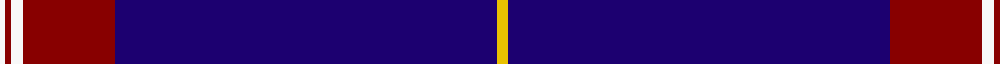
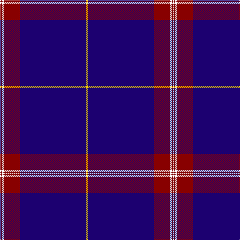

**Bands:** [WRWRBY](/stripes/wrwrby/) · **Stripes:** [W R W R DB LY](/stripes/stripes6/) W R W R DB LY

This was sourced from register-of-tartans.  It is a [6 band tartan](/bands/bands6/).

Original link https://www.tartanregister.gov.uk/tartanDetails.aspx?ref=750

## Attestations

This cloth appears in 2 source records; the oldest owns this page.

- 01/09/2005 — Coogan (Personal) (register-of-tartans, [record](https://www.tartanregister.gov.uk/tartanDetails.aspx?ref=750))
- 2005 September — Coogan (Personal) (tartans-authority, [record](http://www.tartansauthority.com/tartan-ferret/display/6782/))

## Register references

External register numbers recorded for this tartan.

- Scottish Register of Tartans: [750](https://www.tartanregister.gov.uk/tartanDetails.aspx?ref=750)
- Scottish Tartans Authority (ITI): 6782

## Thread count
W/2 DR2 W4 DR32 DB132 Y/4

## Palette
Each colour and its ΔE from the base-6 reference it is a variant of.

| Colour | Shade | Base | ΔE (OKLab) |
|---|---|---|---|
| DB | <code style="background-color:#1C0070;">#1C0070</code> `#1C0070` | B <code style="background-color:#2A418A;">#2A418A</code> | 0.14 |
| DR | <code style="background-color:#880000;">#880000</code> `#880000` | R <code style="background-color:#CC0000;">#CC0000</code> | 0.15 |
| W | <code style="background-color:#F8F8F8;">#F8F8F8</code> `#F8F8F8` | W <code style="background-color:#F7F7F7;">#F7F7F7</code> | 0.00 |
| Y | <code style="background-color:#E8C000;">#E8C000</code> `#E8C000` | Y <code style="background-color:#F2BF00;">#F2BF00</code> | 0.02 |

# Sample pattern

## Nearest tartans

The nearest existing variants by ΔTartan distance.

1. [Cougan Irish Personal Tartan Tartan Number: 6782. Earliest known date: 2005 September Designed by Douglas Gregor of Tartanweb as a personal tartan for Margot Coogan of County Laois, Ireland. The colours reflect those in the Cougan coat of arms - deep red representing the red cross in the shield and the white lines representing the three silver oak leaves. See products available Copyright © Blair Urquhart, Comrie, 2015](/setts/s10/db66r16w2r1w1r1w2r16db66ly2~x2/) — ΔT 1.15
1. [United States (Corporate)](/setts/s9/b7db5w6db5r7db2b2db70w2/) — ΔT 1.31
1. [Balmer (Personal)](/setts/s6/ly2r5ly2r5db49w2~x2/) — ΔT 1.45
1. [RAAF](/setts/s9/db66w2db10w2db10w2db12r3t24~x2/) — ΔT 1.47
1. [Nunavut Territory (District)](/setts/s7/db60w1ly4k4w1lp8w2~x2/) — ΔT 1.49
1. [Hong Kong St Andrew's Society](/setts/s6/db75k4r25db6k6w2~x2/) — ΔT 1.59
1. [Tyneside Blue, North Tyneside Pipe Band](/setts/s7/db62k22w3k2w2k3r1~x2/) — ΔT 1.61
1. [Auchtermuchty Tartan Army (Corp)](/setts/s6/db80r7w1r7ly20db15~x2/) — ΔT 1.61
1. [United States](/setts/s9/db7k5lr6k5r7k2db2k70lr2/) — ΔT 1.63
1. [Duke of York (Royal)](/setts/s8/db61r6w2r8lo2db3lo2db15~x2/) — ΔT 1.66

## Neighbour map

Every grey dot is one of 14313 variants placed by the first two principal components of the ΔTartan feature space (44% of its variance). Red is this tartan; blue dots are its nearest — click one to open its page.

<svg viewBox="0 0 640 380" role="img" style="max-width:100%;height:auto;border:1px solid #e0e0e0;border-radius:4px;display:block" xmlns="http://www.w3.org/2000/svg"><image href="/nn/cloud.v1.png" width="640" height="380"/><a href="/setts/s10/db66r16w2r1w1r1w2r16db66ly2~x2/"><circle cx="546.7" cy="114.9" r="4" fill="#3465a4"><title>Cougan Irish Personal Tartan Tartan Number: 6782. Earliest known date: 2005 September Designed by Douglas Gregor of Tartanweb as a personal tartan for Margot Coogan of County Laois, Ireland. The colours reflect those in the Cougan coat of arms - deep red representing the red cross in the shield and the white lines representing the three silver oak leaves. See products available Copyright © Blair Urquhart, Comrie, 2015</title></circle></a><a href="/setts/s9/b7db5w6db5r7db2b2db70w2/"><circle cx="525.8" cy="108.1" r="4" fill="#3465a4"><title>United States (Corporate)</title></circle></a><a href="/setts/s6/ly2r5ly2r5db49w2~x2/"><circle cx="509.0" cy="140.8" r="4" fill="#3465a4"><title>Balmer (Personal)</title></circle></a><a href="/setts/s9/db66w2db10w2db10w2db12r3t24~x2/"><circle cx="495.0" cy="134.0" r="4" fill="#3465a4"><title>RAAF</title></circle></a><a href="/setts/s7/db60w1ly4k4w1lp8w2~x2/"><circle cx="497.9" cy="86.2" r="4" fill="#3465a4"><title>Nunavut Territory (District)</title></circle></a><a href="/setts/s6/db75k4r25db6k6w2~x2/"><circle cx="458.4" cy="142.4" r="4" fill="#3465a4"><title>Hong Kong St Andrew's Society</title></circle></a><a href="/setts/s7/db62k22w3k2w2k3r1~x2/"><circle cx="477.0" cy="126.8" r="4" fill="#3465a4"><title>Tyneside Blue, North Tyneside Pipe Band</title></circle></a><a href="/setts/s6/db80r7w1r7ly20db15~x2/"><circle cx="487.3" cy="125.4" r="4" fill="#3465a4"><title>Auchtermuchty Tartan Army (Corp)</title></circle></a><a href="/setts/s9/db7k5lr6k5r7k2db2k70lr2/"><circle cx="535.1" cy="120.9" r="4" fill="#3465a4"><title>United States</title></circle></a><a href="/setts/s8/db61r6w2r8lo2db3lo2db15~x2/"><circle cx="551.3" cy="141.9" r="4" fill="#3465a4"><title>Duke of York (Royal)</title></circle></a><circle cx="542.7" cy="123.3" r="5" fill="#c00000"/></svg>

ID: /setts/s6/ly2db66r16w2r1w1~x2/
