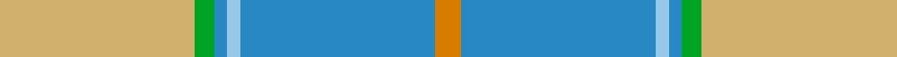

**Bands:** [YGBWBY](/stripes/ygbwby/) · **Stripes:** [LY G T LB T LO](/stripes/stripes6/) LY G T LB T LO

This was sourced from tartans-authority.  It is a [6 band tartan](/bands/bands6/).

Original link http://www.tartansauthority.com/tartan-ferret/display/7732/

## Also known as

This cloth is also recorded under:

- South Aiken Presbyterian Church

## Attestations

This cloth appears in 2 source records; the oldest owns this page.

- pre 2008 — South Aiken Presby Church (Corporate (tartans-authority, [record](http://www.tartansauthority.com/tartan-ferret/display/7732/))
- undated — South Aiken Presbyterian Church (register-of-tartans, [record](https://www.tartanregister.gov.uk/tartanDetails.aspx?ref=5716))

## Register references

External register numbers recorded for this tartan.

- Scottish Register of Tartans: [5716](https://www.tartanregister.gov.uk/tartanDetails.aspx?ref=5716)
- Scottish Tartans Authority (ITI): 7732

## Thread count
LG/60 G6 B4 LB4 B60 O/8

## Palette
Each colour and its ΔE from the base-6 reference it is a variant of.

| Colour | Shade | Base | ΔE (OKLab) |
|---|---|---|---|
| B | <code style="background-color:#2888C4;">#2888C4</code> `#2888C4` | B <code style="background-color:#2A418A;">#2A418A</code> | 0.21 |
| G | <code style="background-color:#00A424;">#00A424</code> `#00A424` | G <code style="background-color:#006100;">#006100</code> | 0.20 |
| LB | <code style="background-color:#98C8E8;">#98C8E8</code> `#98C8E8` | W <code style="background-color:#F7F7F7;">#F7F7F7</code> | 0.18 |
| LG | <code style="background-color:#D0B06C;">#D0B06C</code> `#D0B06C` | Y <code style="background-color:#F2BF00;">#F2BF00</code> | 0.09 |
| O | <code style="background-color:#D87C00;">#D87C00</code> `#D87C00` | Y <code style="background-color:#F2BF00;">#F2BF00</code> | 0.17 |

# Sample pattern

## Nearest tartans

The nearest existing variants by ΔTartan distance.

1. [Gift of Life Michigan](/setts/s7/r2lt1r1lt11lg16g1w1~x2/) — ΔT 1.13
1. [Royal Deeside (District)](/setts/s6/r4y2db4y35t27r3~x2/) — ΔT 1.48
1. [Irving of Glentulchan (Personal)](/setts/s6/r1lg9lr9k1lr1w1~x6/) — ΔT 1.54
1. [Postcode Lottery](/setts/s7/g3r1g12w4lb15ly1lb3~x4/) — ΔT 1.55
1. [Dama Classic (Fashion)](/setts/s8/lr30w3lr3w3lr12n30o3n5~x2/) — ΔT 1.60
1. [Johore](/setts/s8/o57w5g20o5lo10~x2/) — ΔT 1.64
1. [Allanton (Fashion)](/setts/s6/t4g16ly2db7t28w4~x2/) — ΔT 1.64
1. [Highlands Country Club (Corporate)](/setts/s7/g5lb15lb11lb2lb1lb1g4~x4/) — ΔT 1.67
1. [Organic](/setts/s9/y25p3y8p13ly8lr2ly11y2p3~x2/) — ΔT 1.68
1. [Hebridean Granite (Fashion)](/setts/s8/o3lr4o4k4o18k3n36w3~x2/) — ΔT 1.73

## Neighbour map

Every grey dot is one of 14299 variants placed by the first two principal components of the ΔTartan feature space (44% of its variance). Red is this tartan; blue dots are its nearest — click one to open its page.

<svg viewBox="0 0 640 380" role="img" style="max-width:100%;height:auto;border:1px solid #e0e0e0;border-radius:4px;display:block" xmlns="http://www.w3.org/2000/svg"><image href="/nn/cloud.v1.png" width="640" height="380"/><a href="/setts/s7/r2lt1r1lt11lg16g1w1~x2/"><circle cx="307.6" cy="154.4" r="4" fill="#3465a4"><title>Gift of Life Michigan</title></circle></a><a href="/setts/s6/r4y2db4y35t27r3~x2/"><circle cx="341.8" cy="186.8" r="4" fill="#3465a4"><title>Royal Deeside (District)</title></circle></a><a href="/setts/s6/r1lg9lr9k1lr1w1~x6/"><circle cx="299.5" cy="213.9" r="4" fill="#3465a4"><title>Irving of Glentulchan (Personal)</title></circle></a><a href="/setts/s7/g3r1g12w4lb15ly1lb3~x4/"><circle cx="258.9" cy="169.8" r="4" fill="#3465a4"><title>Postcode Lottery</title></circle></a><a href="/setts/s8/lr30w3lr3w3lr12n30o3n5~x2/"><circle cx="344.0" cy="207.7" r="4" fill="#3465a4"><title>Dama Classic (Fashion)</title></circle></a><a href="/setts/s8/o57w5g20o5lo10~x2/"><circle cx="329.3" cy="195.4" r="4" fill="#3465a4"><title>Johore</title></circle></a><a href="/setts/s6/t4g16ly2db7t28w4~x2/"><circle cx="281.5" cy="189.8" r="4" fill="#3465a4"><title>Allanton (Fashion)</title></circle></a><a href="/setts/s7/g5lb15lb11lb2lb1lb1g4~x4/"><circle cx="241.3" cy="191.3" r="4" fill="#3465a4"><title>Highlands Country Club (Corporate)</title></circle></a><a href="/setts/s9/y25p3y8p13ly8lr2ly11y2p3~x2/"><circle cx="269.8" cy="190.4" r="4" fill="#3465a4"><title>Organic</title></circle></a><a href="/setts/s8/o3lr4o4k4o18k3n36w3~x2/"><circle cx="291.6" cy="166.8" r="4" fill="#3465a4"><title>Hebridean Granite (Fashion)</title></circle></a><circle cx="305.2" cy="176.8" r="5" fill="#c00000"/></svg>

ID: /setts/s6/ly30g3t2lb2t30lo4~x2/
