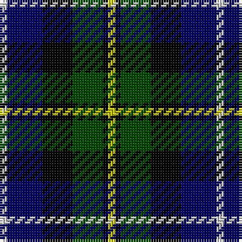

In pattern [WBKGKY](/stripes/wbkgky/).

This was sourced from weddslist.  It is a [6 stripe tartan](/stripes/stripes6/).

Original link http://www.weddslist.com/cgi-bin/tartans/pg.pl?source=rb

## Register references

External register numbers recorded for this tartan.

- Scottish Register of Tartans: [1166](https://www.tartanregister.gov.uk/tartanDetails.aspx?ref=1166)
- Scottish Register of Tartans: [1758](https://www.tartanregister.gov.uk/tartanDetails.aspx?ref=1758)
- Scottish Register of Tartans: [2307](https://www.tartanregister.gov.uk/tartanDetails.aspx?ref=2307)
- Scottish Register of Tartans: [2540](https://www.tartanregister.gov.uk/tartanDetails.aspx?ref=2540)
- Scottish Register of Tartans: [2666](https://www.tartanregister.gov.uk/tartanDetails.aspx?ref=2666)
- Scottish Register of Tartans: [2862](https://www.tartanregister.gov.uk/tartanDetails.aspx?ref=2862)
- Scottish Register of Tartans: [3808](https://www.tartanregister.gov.uk/tartanDetails.aspx?ref=3808)
- Scottish Register of Tartans: [982](https://www.tartanregister.gov.uk/tartanDetails.aspx?ref=982)
- Scottish Tartans Authority (ITI): 218
- Scottish Tartans World Register: 1010
- Scottish Tartans World Register: 1042
- Scottish Tartans World Register: 127
- Scottish Tartans World Register: 1585
- Scottish Tartans World Register: 218
- Scottish Tartans World Register: 2218
- Scottish Tartans World Register: 737
- Scottish Tartans World Register: 897

## Thread count
N/3 DB14 K12 G12 K2 Y/3

## Palette
Each colour and its ΔE from the base-6 reference it is a variant of.

| Colour | Shade | Base | ΔE (OKLab) |
|---|---|---|---|
| DB | <code style="background-color:#000064;">#000064</code> `#000064` | B <code style="background-color:#2A418A;">#2A418A</code> | 0.18 |
| G | <code style="background-color:#004C00;">#004C00</code> `#004C00` | G <code style="background-color:#006100;">#006100</code> | 0.07 |
| K | <code style="background-color:#000000;">#000000</code> `#000000` | K <code style="background-color:#000000;">#000000</code> | 0.00 |
| N | <code style="background-color:#D0D0D0;">#D0D0D0</code> `#D0D0D0` | W <code style="background-color:#F7F7F7;">#F7F7F7</code> | 0.12 |
| Y | <code style="background-color:#C8C800;">#C8C800</code> `#C8C800` | Y <code style="background-color:#F2BF00;">#F2BF00</code> | 0.07 |

# Sample pattern

## Nearest tartans

The nearest existing variants by ΔTartan distance.

1. [MacNiel of Barra](/setts/s6/lr3db14k12dg12k2ly3~x2/) — ΔT 0.45
1. [MacNiel of Barra](/setts/s6/lr3db14k12dg12k2ly3/) — ΔT 0.45
1. [Gaines Center for the Humanities](/setts/s6/r1k1g6k6db6lb1~x4/) — ΔT 0.47
1. [Leslie Hunting](/setts/s6/r2db8k8lb1dg8k1/) — ΔT 0.73
1. [Leslie, hunting](/setts/s6/r2db8k8w1g8k1~x2/) — ΔT 0.80
1. [Campbell Cawdor](/setts/s7/r2k1db8k8dg8k1lb2/) — ΔT 0.80
1. [Davidson of Tulloch](/setts/s5/r1db6k3dg6lb1/) — ΔT 0.81
1. [Hogarth, of Firhill](/setts/s7/b2g6ly1k6db6k1db1~x2/) — ΔT 0.81
1. [Herd](/setts/s6/dp4dg25k24w3db24w4~x2/) — ΔT 0.83
1. [Royal Highland](/setts/s6/lr4g17k17db17r3db3~x2/) — ΔT 0.84

## Neighbour map

Every grey dot is one of 14299 variants placed by the first two principal components of the ΔTartan feature space (44% of its variance). Red is this tartan; blue dots are its nearest — click one to open its page.

<svg viewBox="0 0 640 380" role="img" style="max-width:100%;height:auto;border:1px solid #e0e0e0;border-radius:4px;display:block" xmlns="http://www.w3.org/2000/svg"><image href="/nn/cloud.v1.png" width="640" height="380"/><a href="/setts/s6/lr3db14k12dg12k2ly3~x2/"><circle cx="100.4" cy="228.5" r="4" fill="#3465a4"><title>MacNiel of Barra</title></circle></a><a href="/setts/s6/lr3db14k12dg12k2ly3/"><circle cx="100.4" cy="228.5" r="4" fill="#3465a4"><title>MacNiel of Barra</title></circle></a><a href="/setts/s6/r1k1g6k6db6lb1~x4/"><circle cx="103.0" cy="222.6" r="4" fill="#3465a4"><title>Gaines Center for the Humanities</title></circle></a><a href="/setts/s6/r2db8k8lb1dg8k1/"><circle cx="124.9" cy="219.0" r="4" fill="#3465a4"><title>Leslie Hunting</title></circle></a><a href="/setts/s6/r2db8k8w1g8k1~x2/"><circle cx="107.6" cy="206.5" r="4" fill="#3465a4"><title>Leslie, hunting</title></circle></a><a href="/setts/s7/r2k1db8k8dg8k1lb2/"><circle cx="118.8" cy="204.8" r="4" fill="#3465a4"><title>Campbell Cawdor</title></circle></a><a href="/setts/s5/r1db6k3dg6lb1/"><circle cx="126.0" cy="241.9" r="4" fill="#3465a4"><title>Davidson of Tulloch</title></circle></a><a href="/setts/s7/b2g6ly1k6db6k1db1~x2/"><circle cx="83.2" cy="209.8" r="4" fill="#3465a4"><title>Hogarth, of Firhill</title></circle></a><a href="/setts/s6/dp4dg25k24w3db24w4~x2/"><circle cx="115.8" cy="217.3" r="4" fill="#3465a4"><title>Herd</title></circle></a><a href="/setts/s6/lr4g17k17db17r3db3~x2/"><circle cx="93.4" cy="223.9" r="4" fill="#3465a4"><title>Royal Highland</title></circle></a><circle cx="87.8" cy="222.1" r="5" fill="#c00000"/></svg>

ID: /setts/s6/ly3k2dg12k12db14lb3/
