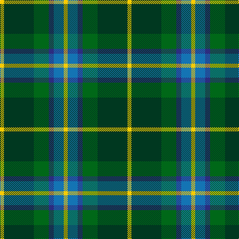

**Bands:** [YGGBBY](/stripes/yggbby/) · **Stripes:** [LY DG G DB B LY](/stripes/stripes6/) LY DG G DB B LY

This was sourced from tartans-authority.  It is a [6 band tartan](/bands/bands6/).

Original link http://www.tartansauthority.com/tartan-ferret/display/10711/

## Thread count
Y/8 DG60 G30 DB10 B20 Y/8

## Palette
Each colour and its ΔE from the base-6 reference it is a variant of.

| Colour | Shade | Base | ΔE (OKLab) |
|---|---|---|---|
| B | <code style="background-color:#1474B4;">#1474B4</code> `#1474B4` | B <code style="background-color:#2A418A;">#2A418A</code> | 0.15 |
| DB | <code style="background-color:#2C2C80;">#2C2C80</code> `#2C2C80` | B <code style="background-color:#2A418A;">#2A418A</code> | 0.06 |
| DG | <code style="background-color:#003820;">#003820</code> `#003820` | G <code style="background-color:#006100;">#006100</code> | 0.15 |
| G | <code style="background-color:#006818;">#006818</code> `#006818` | G <code style="background-color:#006100;">#006100</code> | 0.02 |
| Y | <code style="background-color:#FCCC00;">#FCCC00</code> `#FCCC00` | Y <code style="background-color:#F2BF00;">#F2BF00</code> | 0.04 |

# Sample pattern

## Nearest tartans

The nearest existing variants by ΔTartan distance.

1. [MPS Emerald Society NCLEES 2012](/setts/s6/ly4dg30g15db5t10ly4~x2/) — ΔT 0.18
1. [Lanarkshire](/setts/s6/g31ly4g6k19db18t9~x2/) — ΔT 0.86
1. [New Mexico](/setts/s7/g10db42r5dg42g42ly5g10/) — ΔT 0.90
1. [Dick (Personal)](/setts/s7/k5g30ly3b15k15b7w3~x2/) — ΔT 0.92
1. [Disciples of Christ Motorcycle Ministry (Switzerland)](/setts/s7/k22g21k5g12t12o3w4~x2/) — ΔT 0.97
1. [Gorman, George (Personal)](/setts/s6/g9g1p2g1db4r1~x12/) — ΔT 0.99
1. [MacLeod of Assynt](/setts/s6/r3k2g20k10b20ly2~x2/) — ΔT 1.02
1. [Turnbull, hunting](/setts/s5/r7ly3g28db28w3~x2/) — ΔT 1.03
1. [Royal College of Physicians (Corp)](/setts/s6/db18r3k9r3g23ly3~x2/) — ΔT 1.05
1. [Cultoquhey Hotel](/setts/s5/r3db22k11g32ly3~x2/) — ΔT 1.10

## Neighbour map

Every grey dot is one of 14299 variants placed by the first two principal components of the ΔTartan feature space (44% of its variance). Red is this tartan; blue dots are its nearest — click one to open its page.

<svg viewBox="0 0 640 380" role="img" style="max-width:100%;height:auto;border:1px solid #e0e0e0;border-radius:4px;display:block" xmlns="http://www.w3.org/2000/svg"><image href="/nn/cloud.v1.png" width="640" height="380"/><a href="/setts/s6/ly4dg30g15db5t10ly4~x2/"><circle cx="174.7" cy="212.8" r="4" fill="#3465a4"><title>MPS Emerald Society NCLEES 2012</title></circle></a><a href="/setts/s6/g31ly4g6k19db18t9~x2/"><circle cx="165.2" cy="232.1" r="4" fill="#3465a4"><title>Lanarkshire</title></circle></a><a href="/setts/s7/g10db42r5dg42g42ly5g10/"><circle cx="187.9" cy="218.1" r="4" fill="#3465a4"><title>New Mexico</title></circle></a><a href="/setts/s7/k5g30ly3b15k15b7w3~x2/"><circle cx="160.2" cy="190.6" r="4" fill="#3465a4"><title>Dick (Personal)</title></circle></a><a href="/setts/s7/k22g21k5g12t12o3w4~x2/"><circle cx="156.2" cy="221.1" r="4" fill="#3465a4"><title>Disciples of Christ Motorcycle Ministry (Switzerland)</title></circle></a><a href="/setts/s6/g9g1p2g1db4r1~x12/"><circle cx="247.1" cy="202.7" r="4" fill="#3465a4"><title>Gorman, George (Personal)</title></circle></a><a href="/setts/s6/r3k2g20k10b20ly2~x2/"><circle cx="169.5" cy="202.8" r="4" fill="#3465a4"><title>MacLeod of Assynt</title></circle></a><a href="/setts/s5/r7ly3g28db28w3~x2/"><circle cx="207.2" cy="208.8" r="4" fill="#3465a4"><title>Turnbull, hunting</title></circle></a><a href="/setts/s6/db18r3k9r3g23ly3~x2/"><circle cx="168.7" cy="210.9" r="4" fill="#3465a4"><title>Royal College of Physicians (Corp)</title></circle></a><a href="/setts/s5/r3db22k11g32ly3~x2/"><circle cx="226.5" cy="217.8" r="4" fill="#3465a4"><title>Cultoquhey Hotel</title></circle></a><circle cx="178.5" cy="213.8" r="5" fill="#c00000"/></svg>

ID: /setts/s6/ly4dg30g15db5b10ly4~x2/
