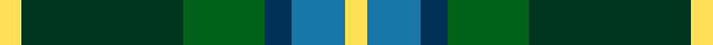
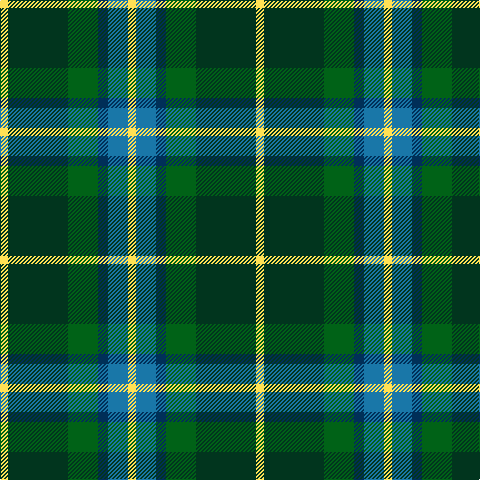

**Bands:** [YGGBBY](/stripes/yggbby/) · **Stripes:** [LY DG G DB T LY](/stripes/stripes6/) LY DG G DB T LY

This was sourced from register-of-tartans.  It is a [6 band tartan](/bands/bands6/).

Original link https://www.tartanregister.gov.uk/tartanDetails.aspx?ref=10711

## Also known as

This cloth is also recorded under:

- MPS Emerald Society NCLEES 2012 Commemorative

## Attestations

This cloth appears in 2 source records; the oldest owns this page.

- 01/10/2012 — MPS Emerald Society NCLEES 2012 (register-of-tartans, [record](https://www.tartanregister.gov.uk/tartanDetails.aspx?ref=10711))
- undated — MPS Emerald Society NCLEES 2012 Commemorative Tartan Tartan Number: 10711. Earliest known date: 5 October 2012 The Metropolitan Police Emerald Society was formed in 2005 and was the first law enforcement organisation from outside North America to be admitted to membership of NCLEES (National Conference of Law Enforcement Emerald Societies). During October 2012 in London, the MPS Emerald Society hosted the annual NCLEES Conference, the first time the conference has been held outside the USA. The Metropolitan Police Emerald Society tartan was designed to commemorate this historic occasion. Colours: two shades of green for the national colour of Ireland; two shades of blue - dark blue for the Thin Blue Line of Police Officers everywhere and light blue for the river Thames that flows through the City of London; yellow in recognition of the saffron kilts worn by MPS Emerald Society Pipe Band. See products available Copyright © Blair Urquhart, Comrie, 2015 (house-of-tartan, [record](http://www.house-of-tartan.scotland.net/house/TartanViewjs.asp?colr=Def&tnam=10711))

## Register references

External register numbers recorded for this tartan.

- Scottish Register of Tartans: [10711](https://www.tartanregister.gov.uk/tartanDetails.aspx?ref=10711)

## Thread count
LY/8 DG60 G30 DB10 B20 LY/8

## Palette
Each colour and its ΔE from the base-6 reference it is a variant of.

| Colour | Shade | Base | ΔE (OKLab) |
|---|---|---|---|
| B | <code style="background-color:#1977A8;">#1977A8</code> `#1977A8` | B <code style="background-color:#2A418A;">#2A418A</code> | 0.15 |
| DB | <code style="background-color:#002F58;">#002F58</code> `#002F58` | B <code style="background-color:#2A418A;">#2A418A</code> | 0.11 |
| DG | <code style="background-color:#01351E;">#01351E</code> `#01351E` | G <code style="background-color:#006100;">#006100</code> | 0.16 |
| G | <code style="background-color:#006217;">#006217</code> `#006217` | G <code style="background-color:#006100;">#006100</code> | 0.01 |
| LY | <code style="background-color:#FFE155;">#FFE155</code> `#FFE155` | Y <code style="background-color:#F2BF00;">#F2BF00</code> | 0.09 |

# Sample pattern

## Nearest tartans

The nearest existing variants by ΔTartan distance.

1. [MPS Emerald Society](/setts/s6/ly4dg30g15db5b10ly4~x2/) — ΔT 0.18
1. [Lanarkshire](/setts/s6/g31ly4g6k19db18t9~x2/) — ΔT 0.93
1. [Dick (Personal)](/setts/s7/k5g30ly3b15k15b7w3~x2/) — ΔT 0.95
1. [Disciples of Christ Motorcycle Ministry (Switzerland)](/setts/s7/k22g21k5g12t12o3w4~x2/) — ΔT 0.96
1. [New Mexico](/setts/s7/g10db42r5dg42g42ly5g10/) — ΔT 0.97
1. [Gorman, George (Personal)](/setts/s6/g9g1p2g1db4r1~x12/) — ΔT 1.10
1. [MacLeod of Assynt](/setts/s6/r3k2g20k10b20ly2~x2/) — ΔT 1.11
1. [Turnbull, hunting](/setts/s5/r7ly3g28db28w3~x2/) — ΔT 1.12
1. [Turnbull, hunting](/setts/s5/k7ly3g28db28w3~x2/) — ΔT 1.13
1. [Royal College of Physicians (Corp)](/setts/s6/db18r3k9r3g23ly3~x2/) — ΔT 1.14

## Neighbour map

Every grey dot is one of 14299 variants placed by the first two principal components of the ΔTartan feature space (44% of its variance). Red is this tartan; blue dots are its nearest — click one to open its page.

<svg viewBox="0 0 640 380" role="img" style="max-width:100%;height:auto;border:1px solid #e0e0e0;border-radius:4px;display:block" xmlns="http://www.w3.org/2000/svg"><image href="/nn/cloud.v1.png" width="640" height="380"/><a href="/setts/s6/ly4dg30g15db5b10ly4~x2/"><circle cx="178.5" cy="213.8" r="4" fill="#3465a4"><title>MPS Emerald Society</title></circle></a><a href="/setts/s6/g31ly4g6k19db18t9~x2/"><circle cx="165.2" cy="232.1" r="4" fill="#3465a4"><title>Lanarkshire</title></circle></a><a href="/setts/s7/k5g30ly3b15k15b7w3~x2/"><circle cx="160.2" cy="190.6" r="4" fill="#3465a4"><title>Dick (Personal)</title></circle></a><a href="/setts/s7/k22g21k5g12t12o3w4~x2/"><circle cx="156.2" cy="221.1" r="4" fill="#3465a4"><title>Disciples of Christ Motorcycle Ministry (Switzerland)</title></circle></a><a href="/setts/s7/g10db42r5dg42g42ly5g10/"><circle cx="187.9" cy="218.1" r="4" fill="#3465a4"><title>New Mexico</title></circle></a><a href="/setts/s6/g9g1p2g1db4r1~x12/"><circle cx="247.1" cy="202.7" r="4" fill="#3465a4"><title>Gorman, George (Personal)</title></circle></a><a href="/setts/s6/r3k2g20k10b20ly2~x2/"><circle cx="169.5" cy="202.8" r="4" fill="#3465a4"><title>MacLeod of Assynt</title></circle></a><a href="/setts/s5/r7ly3g28db28w3~x2/"><circle cx="207.2" cy="208.8" r="4" fill="#3465a4"><title>Turnbull, hunting</title></circle></a><a href="/setts/s5/k7ly3g28db28w3~x2/"><circle cx="185.7" cy="202.4" r="4" fill="#3465a4"><title>Turnbull, hunting</title></circle></a><a href="/setts/s6/db18r3k9r3g23ly3~x2/"><circle cx="168.7" cy="210.9" r="4" fill="#3465a4"><title>Royal College of Physicians (Corp)</title></circle></a><circle cx="174.7" cy="212.8" r="5" fill="#c00000"/></svg>

ID: /setts/s6/ly4dg30g15db5t10ly4~x2/
