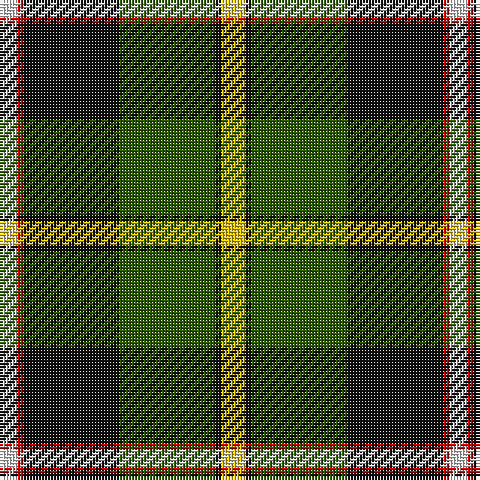

**Bands:** [WRKGKY](/stripes/wrkgky/) · **Stripes:** [W R K DG K LY](/stripes/stripes6/) W R K DG K LY

This was sourced from register-of-tartans.  It is a [6 band tartan](/bands/bands6/).

Original link https://www.tartanregister.gov.uk/tartanDetails.aspx?ref=2593

## Attestations

This cloth appears in 2 source records; the oldest owns this page.

- 01/01/1999 — MacLamroc (register-of-tartans, [record](https://www.tartanregister.gov.uk/tartanDetails.aspx?ref=2593))
- January 1999 — MacLamrock (Clan) (tartans-authority, [record](http://www.tartansauthority.com/tartan-ferret/display/2591/))

## Register references

External register numbers recorded for this tartan.

- Scottish Register of Tartans: [2593](https://www.tartanregister.gov.uk/tartanDetails.aspx?ref=2593)
- Scottish Tartans Authority (ITI): 2591
- Scottish Tartans World Register: 2591

## Thread count
LN/6 R2 K32 G32 K2 Y/8

## Palette
Each colour and its ΔE from the base-6 reference it is a variant of.

| Colour | Shade | Base | ΔE (OKLab) |
|---|---|---|---|
| G | <code style="background-color:#285800;">#285800</code> `#285800` | G <code style="background-color:#006100;">#006100</code> | 0.03 |
| K | <code style="background-color:#101010;">#101010</code> `#101010` | K <code style="background-color:#000000;">#000000</code> | 0.17 |
| LN | <code style="background-color:#E0E0E0;">#E0E0E0</code> `#E0E0E0` | W <code style="background-color:#F7F7F7;">#F7F7F7</code> | 0.07 |
| R | <code style="background-color:#C80000;">#C80000</code> `#C80000` | R <code style="background-color:#CC0000;">#CC0000</code> | 0.01 |
| Y | <code style="background-color:#E8C000;">#E8C000</code> `#E8C000` | Y <code style="background-color:#F2BF00;">#F2BF00</code> | 0.02 |

# Sample pattern

## Nearest tartans

The nearest existing variants by ΔTartan distance.

1. [Unidentified 20th Centuary](/setts/s7/lo2k1y15k7g15k1r2~x2/) — ΔT 1.02
1. [Afternoon Tea / Afternoon Tea](/setts/s6/ly15g98k72m25k8w15/) — ΔT 1.08
1. [Hackett (Personal)](/setts/s7/k20w4r4g20w5g2g2~x2/) — ΔT 1.09
1. [Chiti, Cristiano (Personal)](/setts/s6/dg20dg11lb6r2dp3lb1~x2/) — ΔT 1.09
1. [Dalveen (Fashion)](/setts/s8/k3g2k21w11g1y21g2y3~x2/) — ΔT 1.13
1. [Colquhoun](/setts/s7/db4k2db16w1k8g24r4~x2/) — ΔT 1.14
1. [MacNeil 3](/setts/s8/g45w2r3k15r3db15r3db15~x2/) — ΔT 1.14
1. [MacPhadran](/setts/s7/g3db12lr1k12g13r2g2~x2/) — ΔT 1.14
1. [Bryan Wedding (Personal)](/setts/s6/dy30ly5t10k10w2k2~x2/) — ΔT 1.21
1. [Garvock (2015)](/setts/s8/g28t3g3k10r2k10r20ly4~x2/) — ΔT 1.25

## Neighbour map

Every grey dot is one of 14313 variants placed by the first two principal components of the ΔTartan feature space (44% of its variance). Red is this tartan; blue dots are its nearest — click one to open its page.

<svg viewBox="0 0 640 380" role="img" style="max-width:100%;height:auto;border:1px solid #e0e0e0;border-radius:4px;display:block" xmlns="http://www.w3.org/2000/svg"><image href="/nn/cloud.v1.png" width="640" height="380"/><a href="/setts/s7/lo2k1y15k7g15k1r2~x2/"><circle cx="183.0" cy="163.0" r="4" fill="#3465a4"><title>Unidentified 20th Centuary</title></circle></a><a href="/setts/s6/ly15g98k72m25k8w15/"><circle cx="201.5" cy="180.7" r="4" fill="#3465a4"><title>Afternoon Tea / Afternoon Tea</title></circle></a><a href="/setts/s7/k20w4r4g20w5g2g2~x2/"><circle cx="153.4" cy="166.1" r="4" fill="#3465a4"><title>Hackett (Personal)</title></circle></a><a href="/setts/s6/dg20dg11lb6r2dp3lb1~x2/"><circle cx="245.1" cy="169.8" r="4" fill="#3465a4"><title>Chiti, Cristiano (Personal)</title></circle></a><a href="/setts/s8/k3g2k21w11g1y21g2y3~x2/"><circle cx="198.4" cy="130.8" r="4" fill="#3465a4"><title>Dalveen (Fashion)</title></circle></a><a href="/setts/s7/db4k2db16w1k8g24r4~x2/"><circle cx="212.9" cy="148.7" r="4" fill="#3465a4"><title>Colquhoun</title></circle></a><a href="/setts/s8/g45w2r3k15r3db15r3db15~x2/"><circle cx="230.5" cy="135.1" r="4" fill="#3465a4"><title>MacNeil 3</title></circle></a><a href="/setts/s7/g3db12lr1k12g13r2g2~x2/"><circle cx="168.7" cy="180.2" r="4" fill="#3465a4"><title>MacPhadran</title></circle></a><a href="/setts/s6/dy30ly5t10k10w2k2~x2/"><circle cx="252.8" cy="161.6" r="4" fill="#3465a4"><title>Bryan Wedding (Personal)</title></circle></a><a href="/setts/s8/g28t3g3k10r2k10r20ly4~x2/"><circle cx="164.2" cy="148.9" r="4" fill="#3465a4"><title>Garvock (2015)</title></circle></a><circle cx="212.8" cy="162.8" r="5" fill="#c00000"/></svg>

ID: /setts/s6/ly4k1dg16k16r1w3~x2/
