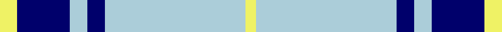

This page is one **sett** — a single exact thread-count. It belongs to the [tartan](/tartans/ly5db15lb5db5lb40ly3/)
(the same proportion at any scale), whose colour order is pattern [YBWBWY](/stripes/ybwbwy/).

Sourced from register-of-tartans.  It is a [6 stripe tartan](/stripes/stripes6/).

Original link https://www.tartanregister.gov.uk/tartanDetails.aspx?ref=10041

2 attestations — the source records this cloth was collapsed from (oldest owns this page)

<ul>
<li>27/05/2009 — Legary (register-of-tartans, <a href="https://www.tartanregister.gov.uk/tartanDetails.aspx?ref=10041">record</a>)</li>
<li>27th May 2009 — Legary (Name) (tartans-authority, <a href="http://www.tartansauthority.com/tartan-ferret/display/10041/">record</a>)</li>
</ul>

## Register references

External register numbers recorded for this tartan.

- Scottish Register of Tartans: [10041](https://www.tartanregister.gov.uk/tartanDetails.aspx?ref=10041)

## Thread count
LY/10 DB30 LB10 DB10 LB80 LY/6

## Palette
Each colour and the base-6 reference it is a variant of.

| Colour | Shade | Base |
|---|---|---|
| DB | <code style="background-color:#00006B;">#00006B</code> `oklch(23.9% 0.165 264.1)` <small>#00006B</small> | B <code style="background-color:#2A418A;">#2A418A</code> |
| LB | <code style="background-color:#ABCDD9;">#ABCDD9</code> `oklch(82.7% 0.040 221.2)` <small>#ABCDD9</small> | W <code style="background-color:#F7F7F7;">#F7F7F7</code> |
| LY | <code style="background-color:#EFF265;">#EFF265</code> `oklch(93.3% 0.162 110.3)` <small>#EFF265</small> | Y <code style="background-color:#F2BF00;">#F2BF00</code> |

# Sample pattern

## Nearest tartans

The nearest existing variants by ΔTartan distance, with this tartan at the top so the swatches line up against it.

ΔTartan

Tartan

Sett

—

<a href="/ttd/edit/#slug=ly5db15lb5db5lb40ly3~x2">Legary</a> <a class="nn-out" href="/setts/s6/ly5db15lb5db5lb40ly3~x2/" title="open its dictionary page">↗</a>

1.12

<a href="/ttd/edit/#slug=lb1lg11k6lg3lb1lg1lb1~x4">Angle, Blue (Fashion)</a> <a class="nn-out" href="/setts/s7/lb1lg11k6lg3lb1lg1lb1~x4/" title="open its dictionary page">↗</a>

1.22

<a href="/ttd/edit/#slug=db9lb27db2k4db2lb10db2w3~x2">Alaska Highlanders Pipes &amp; Drums Corporate Tartan Tartan Number: 8433. Earliest known date: pre 2001 Found on http://www.alaskahighlanders.com/alaska-flag-tartan: Captain Cook's own Alaska Highlanders was reformed in 1987 by the late great Pipe Major Iain MacPherson. We are a dedicated pipe band that is open to new discovery and experiences. We have played all over Alaska, Scotland twice and London in 2005. Our band has been represented at the Pipefest in 1995, 2000 and 2005. On August 23, 2005 (when his family and fellow Scots were finally allowed to hold a public funeral and memorial service 700 years to the day after his execution, we had the honor of escorting the spirit of the braveheart Sir William Wallace on his first mile home to Scotland. At the invitation of Clan Wallace Society convienor David Ross provided an Honour Guard with swords and led the funeral procession from the site of his execution thru the streets of London to the London Welsh Center where a Wake was held. The Highlanders wear the Alaska Flag Tartan and our uniforms reflect those worn by those pipers and drummers who sailed with Captain James Cook in 1778, when he discovered Alaska. (State of Alaska) See products available Copyright © Blair Urquhart, Comrie, 2015</a> <a class="nn-out" href="/setts/s8/db9lb27db2k4db2lb10db2w3~x2/" title="open its dictionary page">↗</a>

1.29

<a href="/ttd/edit/#slug=db9lb27db2ly4db2lb10db2w3~x2">Alaska Highlanders P &amp; D (Corporate)</a> <a class="nn-out" href="/setts/s8/db9lb27db2ly4db2lb10db2w3~x2/" title="open its dictionary page">↗</a>

1.40

<a href="/ttd/edit/#slug=t37w9t3db9w3~x2">Loch Lomond</a> <a class="nn-out" href="/setts/s5/t37w9t3db9w3~x2/" title="open its dictionary page">↗</a>

1.41

<a href="/ttd/edit/#slug=db23w8lb2k5w44db4~x2">WaterAid</a> <a class="nn-out" href="/setts/s6/db23w8lb2k5w44db4~x2/" title="open its dictionary page">↗</a>

1.49

<a href="/ttd/edit/#slug=w5db16w5db16w33r3~x2">Buchanan Dress Blue (Dance)</a> <a class="nn-out" href="/setts/s6/w5db16w5db16w33r3~x2/" title="open its dictionary page">↗</a>

1.51

<a href="/ttd/edit/#slug=w6b3w20k2w3k25w3~x2">Forbes Dress (Clans Originaux)</a> <a class="nn-out" href="/setts/s7/w6b3w20k2w3k25w3~x2/" title="open its dictionary page">↗</a>

1.52

<a href="/ttd/edit/#slug=b12ly1w16b1w1b14w3b14r2~x4">Orlando Dress, City of (District)</a> <a class="nn-out" href="/setts/s9/b12ly1w16b1w1b14w3b14r2~x4/" title="open its dictionary page">↗</a>

1.56

<a href="/ttd/edit/#slug=dt3n2w2n30w30r2w3~x2">Torridon, Royal Blue (Dance)</a> <a class="nn-out" href="/setts/s7/dt3n2w2n30w30r2w3~x2/" title="open its dictionary page">↗</a>

1.59

<a href="/ttd/edit/#slug=w7db16w20db3w3ly3~x2">Unidentified (Shirt)</a> <a class="nn-out" href="/setts/s6/w7db16w20db3w3ly3~x2/" title="open its dictionary page">↗</a>

## Neighbour map

Every grey dot is one of 14299 variants placed by the first two principal components of the ΔTartan feature space (44% of its variance). Red is this tartan; blue dots are its nearest — click one to open its page.

<svg viewBox="0 0 640 380" role="img" style="max-width:100%;height:auto;border:1px solid #e0e0e0;border-radius:4px;display:block" xmlns="http://www.w3.org/2000/svg"><image href="/nn/cloud.v1.png" width="640" height="380"/><a href="/setts/s7/lb1lg11k6lg3lb1lg1lb1~x4/"><circle cx="338.8" cy="191.8" r="4" fill="#3465a4"><title>Angle, Blue (Fashion)</title></circle></a><a href="/setts/s8/db9lb27db2k4db2lb10db2w3~x2/"><circle cx="320.1" cy="150.0" r="4" fill="#3465a4"><title>Alaska Highlanders Pipes &amp; Drums Corporate Tartan Tartan Number: 8433. Earliest known date: pre 2001 Found on http://www.alaskahighlanders.com/alaska-flag-tartan: Captain Cook's own Alaska Highlanders was reformed in 1987 by the late great Pipe Major Iain MacPherson. We are a dedicated pipe band that is open to new discovery and experiences. We have played all over Alaska, Scotland twice and London in 2005. Our band has been represented at the Pipefest in 1995, 2000 and 2005. On August 23, 2005 (when his family and fellow Scots were finally allowed to hold a public funeral and memorial service 700 years to the day after his execution, we had the honor of escorting the spirit of the braveheart Sir William Wallace on his first mile home to Scotland. At the invitation of Clan Wallace Society convienor David Ross provided an Honour Guard with swords and led the funeral procession from the site of his execution thru the streets of London to the London Welsh Center where a Wake was held. The Highlanders wear the Alaska Flag Tartan and our uniforms reflect those worn by those pipers and drummers who sailed with Captain James Cook in 1778, when he discovered Alaska. (State of Alaska) See products available Copyright © Blair Urquhart, Comrie, 2015</title></circle></a><a href="/setts/s8/db9lb27db2ly4db2lb10db2w3~x2/"><circle cx="333.6" cy="153.4" r="4" fill="#3465a4"><title>Alaska Highlanders P &amp; D (Corporate)</title></circle></a><a href="/setts/s5/t37w9t3db9w3~x2/"><circle cx="382.6" cy="206.0" r="4" fill="#3465a4"><title>Loch Lomond</title></circle></a><a href="/setts/s6/db23w8lb2k5w44db4~x2/"><circle cx="319.9" cy="134.8" r="4" fill="#3465a4"><title>WaterAid</title></circle></a><a href="/setts/s6/w5db16w5db16w33r3~x2/"><circle cx="283.7" cy="194.6" r="4" fill="#3465a4"><title>Buchanan Dress Blue (Dance)</title></circle></a><a href="/setts/s7/w6b3w20k2w3k25w3~x2/"><circle cx="282.1" cy="169.7" r="4" fill="#3465a4"><title>Forbes Dress (Clans Originaux)</title></circle></a><a href="/setts/s9/b12ly1w16b1w1b14w3b14r2~x4/"><circle cx="340.6" cy="160.1" r="4" fill="#3465a4"><title>Orlando Dress, City of (District)</title></circle></a><a href="/setts/s7/dt3n2w2n30w30r2w3~x2/"><circle cx="285.2" cy="141.8" r="4" fill="#3465a4"><title>Torridon, Royal Blue (Dance)</title></circle></a><a href="/setts/s6/w7db16w20db3w3ly3~x2/"><circle cx="286.1" cy="218.6" r="4" fill="#3465a4"><title>Unidentified (Shirt)</title></circle></a><circle cx="334.0" cy="175.5" r="5" fill="#c00000"/></svg>

ID: /setts/s6/ly5db15lb5db5lb40ly3~x2/
