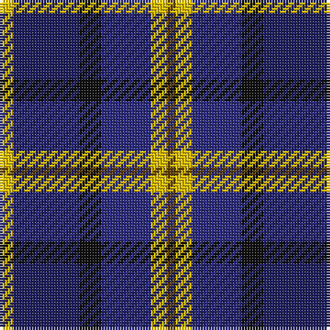

In pattern [GYBKBY](/stripes/gybkby/).

This was sourced from register-of-tartans.  It is a [6 stripe tartan](/stripes/stripes6/).

Original link https://www.tartanregister.gov.uk/tartanDetails.aspx?ref=466

## Attestations

This cloth appears in 2 source records; the oldest owns this page.

- 01/02/1999 — Cala Homes (Corporate) (register-of-tartans, [record](https://www.tartanregister.gov.uk/tartanDetails.aspx?ref=466))
- Feb. 1999 — Cala Homes (Corporate) (tartans-authority, [record](http://www.tartansauthority.com/tartan-ferret/display/2527/))

## Register references

External register numbers recorded for this tartan.

- Scottish Register of Tartans: [466](https://www.tartanregister.gov.uk/tartanDetails.aspx?ref=466)
- Scottish Tartans Authority (ITI): 2527
- Scottish Tartans World Register: 2527

## Thread count
Y/5 DBa24 K8 DB18 Y6 T/3

## Palette
Each colour and its ΔE from the base-6 reference it is a variant of.

| Colour | Shade | Base | ΔE (OKLab) |
|---|---|---|---|
| DB | <code style="background-color:#2C2C80;">#2C2C80</code> `#2C2C80` | B <code style="background-color:#2A418A;">#2A418A</code> | 0.06 |
| DBa | <code style="background-color:#202060;">#202060</code> `#202060` | B <code style="background-color:#2A418A;">#2A418A</code> | 0.11 |
| K | <code style="background-color:#101010;">#101010</code> `#101010` | K <code style="background-color:#000000;">#000000</code> | 0.17 |
| T | <code style="background-color:#604000;">#604000</code> `#604000` | G <code style="background-color:#006100;">#006100</code> | 0.14 |
| Y | <code style="background-color:#E8C000;">#E8C000</code> `#E8C000` | Y <code style="background-color:#F2BF00;">#F2BF00</code> | 0.02 |

# Sample pattern

## Nearest tartans

The nearest existing variants by ΔTartan distance.

1. [Lopez-Gasparotto](/setts/s7/r1o5k5db1k1db6ly1~x8/) — ΔT 0.75
1. [Wellington No 229](/setts/s5/k4t3dp11dg14w2~x2/) — ΔT 0.85
1. [American Express](/setts/s6/db2b9m1db9dg9w2~x4/) — ΔT 0.86
1. [Gold Brothers](/setts/s6/db6g27db3k19dp27w3~x2/) — ΔT 0.86
1. [MacPhail Hunting #2](/setts/s6/r4db24k12g14k4lb3~x2/) — ΔT 0.87
1. [CALA Homes](/setts/s6/ly5db24k8db18ly6o3/) — ΔT 0.87
1. [Stovell (2015)](/setts/s6/db15r6dg8k2w2k2~x6/) — ΔT 0.95
1. [The Open Championship](/setts/s6/w2db15y2db20r9w2~x2/) — ΔT 0.96
1. [Swankie (Personal)](/setts/s7/k4b21dy10y4k20r6b3~x2/) — ΔT 0.96
1. [Thom(p)son's, Fancy](/setts/s6/r2o8db2t4k4t1~x6/) — ΔT 0.99

## Neighbour map

Every grey dot is one of 14299 variants placed by the first two principal components of the ΔTartan feature space (44% of its variance). Red is this tartan; blue dots are its nearest — click one to open its page.

<svg viewBox="0 0 640 380" role="img" style="max-width:100%;height:auto;border:1px solid #e0e0e0;border-radius:4px;display:block" xmlns="http://www.w3.org/2000/svg"><image href="/nn/cloud.v1.png" width="640" height="380"/><a href="/setts/s7/r1o5k5db1k1db6ly1~x8/"><circle cx="132.1" cy="209.5" r="4" fill="#3465a4"><title>Lopez-Gasparotto</title></circle></a><a href="/setts/s5/k4t3dp11dg14w2~x2/"><circle cx="173.1" cy="231.0" r="4" fill="#3465a4"><title>Wellington No 229</title></circle></a><a href="/setts/s6/db2b9m1db9dg9w2~x4/"><circle cx="126.8" cy="207.5" r="4" fill="#3465a4"><title>American Express</title></circle></a><a href="/setts/s6/db6g27db3k19dp27w3~x2/"><circle cx="141.0" cy="206.8" r="4" fill="#3465a4"><title>Gold Brothers</title></circle></a><a href="/setts/s6/r4db24k12g14k4lb3~x2/"><circle cx="172.5" cy="220.7" r="4" fill="#3465a4"><title>MacPhail Hunting #2</title></circle></a><a href="/setts/s6/ly5db24k8db18ly6o3/"><circle cx="123.1" cy="204.6" r="4" fill="#3465a4"><title>CALA Homes</title></circle></a><a href="/setts/s6/db15r6dg8k2w2k2~x6/"><circle cx="182.2" cy="210.6" r="4" fill="#3465a4"><title>Stovell (2015)</title></circle></a><a href="/setts/s6/w2db15y2db20r9w2~x2/"><circle cx="177.1" cy="188.2" r="4" fill="#3465a4"><title>The Open Championship</title></circle></a><a href="/setts/s7/k4b21dy10y4k20r6b3~x2/"><circle cx="147.4" cy="213.4" r="4" fill="#3465a4"><title>Swankie (Personal)</title></circle></a><a href="/setts/s6/r2o8db2t4k4t1~x6/"><circle cx="135.4" cy="210.8" r="4" fill="#3465a4"><title>Thom(p)son's, Fancy</title></circle></a><circle cx="142.8" cy="211.7" r="5" fill="#c00000"/></svg>

ID: /setts/s6/ly5db24k8db18ly6dy3/
