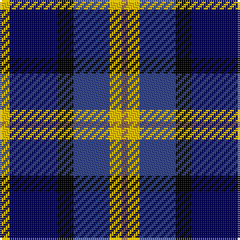

This page is one **sett** — a single exact thread-count. It belongs to the [tartan](/tartans/ly5dbi24k8db18ly6o3/)
(the same proportion at any scale), whose colour order is pattern [RYBKBY](/stripes/rybkby/).

Sourced from weddslist.  It is a [6 stripe tartan](/stripes/stripes6/).

Original link http://www.weddslist.com/cgi-bin/tartans/pg.pl?source=sts

## Thread count
Y/5 DB24 K8 B18 Y6 LT/3

## Palette

Palette: <strong>Ingles Buchan</strong> <small style="color:#888">(1 of 5 colours)</small>
<table><thead><tr><th>Colour</th><th>Threads</th><th>Shade</th><th>Base</th><th>OKLCh</th></tr></thead><tbody><tr><td>Y/</td><td style="text-align:right;font-variant-numeric:tabular-nums">5</td><td><code style="background-color:#F0C000;">#F0C000</code> <small style="color:#888">#F0C000</small></td><td>Y <code style="background-color:#F2BF00;">#F2BF00</code></td><td><small style="color:#888">oklch(82.7% 0.169 90.5)</small></td></tr><tr><td>DB</td><td style="text-align:right;font-variant-numeric:tabular-nums">24</td><td><code style="background-color:#000050;">#000050</code> <small style="color:#888">#000050</small></td><td>B <code style="background-color:#2A418A;">#2A418A</code></td><td><small style="color:#888">oklch(19.5% 0.135 264.1)</small></td></tr><tr><td>K</td><td style="text-align:right;font-variant-numeric:tabular-nums">8</td><td><code style="background-color:#000000;">#000000</code> <small style="color:#888">#000000</small></td><td>K <code style="background-color:#000000;">#000000</code></td><td><small style="color:#888">oklch(0.0% 0.000 0.0)</small></td></tr><tr><td>B</td><td style="text-align:right;font-variant-numeric:tabular-nums">18</td><td><code style="background-color:#304080;">#304080</code> <small style="color:#888">#304080</small></td><td>B <code style="background-color:#2A418A;">#2A418A</code></td><td><small style="color:#888">oklch(39.4% 0.109 270.2)</small></td></tr><tr><td>Y</td><td style="text-align:right;font-variant-numeric:tabular-nums">6</td><td><code style="background-color:#F0C000;">#F0C000</code> <small style="color:#888">#F0C000</small></td><td>Y <code style="background-color:#F2BF00;">#F2BF00</code></td><td><small style="color:#888">oklch(82.7% 0.169 90.5)</small></td></tr><tr><td>LT/</td><td style="text-align:right;font-variant-numeric:tabular-nums">3</td><td><code style="background-color:#806050;">#806050</code> <small style="color:#888">#806050</small></td><td>R <code style="background-color:#CC0000;">#CC0000</code></td><td><small style="color:#888">oklch(51.7% 0.049 47.8)</small></td></tr></tbody></table>

# Sample pattern

## Nearest tartans

The nearest existing variants by ΔTartan distance, with this tartan at the top so the swatches line up against it.

ΔTartan

Tartan

Sett

—

<a href="/ttd/edit/#slug=ly5dbi24k8db18ly6o3">CALA Homes</a> <a class="nn-out" href="/setts/s6/ly5dbi24k8db18ly6o3/" title="open its dictionary page">↗</a>

0.68

<a href="/ttd/edit/#slug=db2b9m1db9dg9w2~x4">American Express</a> <a class="nn-out" href="/setts/s6/db2b9m1db9dg9w2~x4/" title="open its dictionary page">↗</a>

0.87

<a href="/ttd/edit/#slug=ly5db24k8dbi18ly6dy3">Cala Homes (Corporate)</a> <a class="nn-out" href="/setts/s6/ly5db24k8dbi18ly6dy3/" title="open its dictionary page">↗</a>

1.10

<a href="/ttd/edit/#slug=db31b4db5k19g20ly4~x2">Midlothian</a> <a class="nn-out" href="/setts/s6/db31b4db5k19g20ly4~x2/" title="open its dictionary page">↗</a>

1.10

<a href="/ttd/edit/#slug=r7k4db28k24t24k4db4~x2">MacCorquodale</a> <a class="nn-out" href="/setts/s7/r7k4db28k24t24k4db4~x2/" title="open its dictionary page">↗</a>

1.14

<a href="/ttd/edit/#slug=b5k15lr5n9lr2db2lr2db2n9k3~x2">Ryukoku University Heian Senior High School</a> <a class="nn-out" href="/setts/s10/b5k15lr5n9lr2db2lr2db2n9k3~x2/" title="open its dictionary page">↗</a>

1.14

<a href="/ttd/edit/#slug=r1o5k5db1k1db6ly1~x8">Lopez-Gasparotto</a> <a class="nn-out" href="/setts/s7/r1o5k5db1k1db6ly1~x8/" title="open its dictionary page">↗</a>

1.16

<a href="/ttd/edit/#slug=m3db17dt13m2k20w2~x2">Commonwealth Games</a> <a class="nn-out" href="/setts/s6/m3db17dt13m2k20w2~x2/" title="open its dictionary page">↗</a>

1.17

<a href="/ttd/edit/#slug=w2db15y2dbi20r9w2~x2">The Open Championship</a> <a class="nn-out" href="/setts/s6/w2db15y2dbi20r9w2~x2/" title="open its dictionary page">↗</a>

1.21

<a href="/ttd/edit/#slug=r1k1g6k6db6lb1~x4">Gaines Center for the Humanities</a> <a class="nn-out" href="/setts/s6/r1k1g6k6db6lb1~x4/" title="open its dictionary page">↗</a>

1.21

<a href="/ttd/edit/#slug=k3lo1lb9lo1db9k3t1~x4">St. Francis Xavier University</a> <a class="nn-out" href="/setts/s7/k3lo1lb9lo1db9k3t1~x4/" title="open its dictionary page">↗</a>

## Neighbour map

Every grey dot is one of 14359 variants placed by the first two principal components of the ΔTartan feature space (44% of its variance). Red is this tartan; blue dots are its nearest — click one to open its page.

<svg viewBox="0 0 640 380" role="img" style="max-width:100%;height:auto;border:1px solid #e0e0e0;border-radius:4px;display:block" xmlns="http://www.w3.org/2000/svg"><image href="/nn/cloud.v1.png" width="640" height="380"/><a href="/setts/s6/db2b9m1db9dg9w2~x4/"><circle cx="126.7" cy="208.9" r="4" fill="#3465a4"><title>American Express</title></circle></a><a href="/setts/s6/ly5db24k8dbi18ly6dy3/"><circle cx="142.7" cy="213.0" r="4" fill="#3465a4"><title>Cala Homes (Corporate)</title></circle></a><a href="/setts/s6/db31b4db5k19g20ly4~x2/"><circle cx="158.8" cy="210.1" r="4" fill="#3465a4"><title>Midlothian</title></circle></a><a href="/setts/s7/r7k4db28k24t24k4db4~x2/"><circle cx="144.1" cy="220.6" r="4" fill="#3465a4"><title>MacCorquodale</title></circle></a><a href="/setts/s10/b5k15lr5n9lr2db2lr2db2n9k3~x2/"><circle cx="95.2" cy="178.2" r="4" fill="#3465a4"><title>Ryukoku University Heian Senior High School</title></circle></a><a href="/setts/s7/r1o5k5db1k1db6ly1~x8/"><circle cx="131.9" cy="210.9" r="4" fill="#3465a4"><title>Lopez-Gasparotto</title></circle></a><a href="/setts/s6/m3db17dt13m2k20w2~x2/"><circle cx="143.2" cy="201.7" r="4" fill="#3465a4"><title>Commonwealth Games</title></circle></a><a href="/setts/s6/w2db15y2dbi20r9w2~x2/"><circle cx="176.8" cy="189.4" r="4" fill="#3465a4"><title>The Open Championship</title></circle></a><a href="/setts/s6/r1k1g6k6db6lb1~x4/"><circle cx="103.1" cy="224.2" r="4" fill="#3465a4"><title>Gaines Center for the Humanities</title></circle></a><a href="/setts/s7/k3lo1lb9lo1db9k3t1~x4/"><circle cx="110.6" cy="169.8" r="4" fill="#3465a4"><title>St. Francis Xavier University</title></circle></a><circle cx="123.0" cy="206.0" r="5" fill="#c00000"/></svg>

ID: /setts/s6/ly5dbi24k8db18ly6o3/
