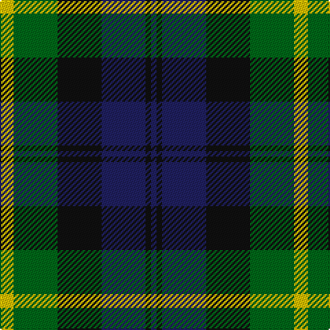

**Bands:** [YGKBKB](/stripes/ygkbkb/) · **Stripes:** [LY G K DB K DB](/stripes/stripes6/) LY G K DB K DB

This was sourced from tartans-authority.  It is a [6 band tartan](/bands/bands6/).

Original link http://www.tartansauthority.com/tartan-ferret/display/8389/

## Thread count
Y/10 G32 K32 DB32 K4 DB/4

## Palette
Each colour and its ΔE from the base-6 reference it is a variant of.

| Colour | Shade | Base | ΔE (OKLab) |
|---|---|---|---|
| DB | <code style="background-color:#202060;">#202060</code> `#202060` | B <code style="background-color:#2A418A;">#2A418A</code> | 0.11 |
| G | <code style="background-color:#006818;">#006818</code> `#006818` | G <code style="background-color:#006100;">#006100</code> | 0.02 |
| K | <code style="background-color:#101010;">#101010</code> `#101010` | K <code style="background-color:#000000;">#000000</code> | 0.17 |
| Y | <code style="background-color:#E8C000;">#E8C000</code> `#E8C000` | Y <code style="background-color:#F2BF00;">#F2BF00</code> | 0.02 |

# Sample pattern

## Nearest tartans

The nearest existing variants by ΔTartan distance.

1. [Unidentified No 26](/setts/s6/w4db4dg22k20db20w3/) — ΔT 0.62
1. [Morrison Society](/setts/s6/k3g14k14g2b14r3~x2/) — ΔT 0.62
1. [Campbell of Argyll (Smiths)](/setts/s6/db2k2db12k11g16w2~x2/) — ΔT 0.66
1. [Gunn - 1810 (Clan)](/setts/s6/r4g12k12g2db12g3~x2/) — ΔT 0.89
1. [Gordon of Esslemont](/setts/s7/ly6dg3ly3dg22k23dp23k4~x2/) — ΔT 0.92
1. [Blair](/setts/s7/db3r1db10k8g10r1g3~x4/) — ΔT 0.93
1. [Fletcher of Dunans](/setts/s7/b10k3b10k14r2g14r5~x2/) — ΔT 0.95
1. [Oceanic (Corporate?)](/setts/s7/ly8k4o39k37dt36k6dt7/) — ΔT 0.95
1. [Morrison](/setts/s6/k3g14k14g2db14r3~x2/) — ΔT 0.95
1. [Murray](/setts/s6/db2k2db12k8g11r2~x2/) — ΔT 0.97

## Neighbour map

Every grey dot is one of 14299 variants placed by the first two principal components of the ΔTartan feature space (44% of its variance). Red is this tartan; blue dots are its nearest — click one to open its page.

<svg viewBox="0 0 640 380" role="img" style="max-width:100%;height:auto;border:1px solid #e0e0e0;border-radius:4px;display:block" xmlns="http://www.w3.org/2000/svg"><image href="/nn/cloud.v1.png" width="640" height="380"/><a href="/setts/s6/w4db4dg22k20db20w3/"><circle cx="150.1" cy="239.6" r="4" fill="#3465a4"><title>Unidentified No 26</title></circle></a><a href="/setts/s6/k3g14k14g2b14r3~x2/"><circle cx="163.1" cy="247.3" r="4" fill="#3465a4"><title>Morrison Society</title></circle></a><a href="/setts/s6/db2k2db12k11g16w2~x2/"><circle cx="184.6" cy="237.1" r="4" fill="#3465a4"><title>Campbell of Argyll (Smiths)</title></circle></a><a href="/setts/s6/r4g12k12g2db12g3~x2/"><circle cx="167.6" cy="263.6" r="4" fill="#3465a4"><title>Gunn - 1810 (Clan)</title></circle></a><a href="/setts/s7/ly6dg3ly3dg22k23dp23k4~x2/"><circle cx="148.7" cy="217.0" r="4" fill="#3465a4"><title>Gordon of Esslemont</title></circle></a><a href="/setts/s7/db3r1db10k8g10r1g3~x4/"><circle cx="167.4" cy="213.5" r="4" fill="#3465a4"><title>Blair</title></circle></a><a href="/setts/s7/b10k3b10k14r2g14r5~x2/"><circle cx="141.8" cy="250.5" r="4" fill="#3465a4"><title>Fletcher of Dunans</title></circle></a><a href="/setts/s7/ly8k4o39k37dt36k6dt7/"><circle cx="173.1" cy="209.2" r="4" fill="#3465a4"><title>Oceanic (Corporate?)</title></circle></a><a href="/setts/s6/k3g14k14g2db14r3~x2/"><circle cx="137.1" cy="235.4" r="4" fill="#3465a4"><title>Morrison</title></circle></a><a href="/setts/s6/db2k2db12k8g11r2~x2/"><circle cx="152.4" cy="240.0" r="4" fill="#3465a4"><title>Murray</title></circle></a><circle cx="151.5" cy="238.7" r="5" fill="#c00000"/></svg>

ID: /setts/s6/ly5g16k16db16k2db2~x2/
