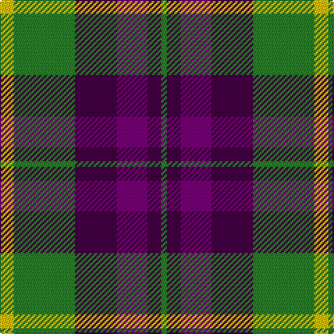

**Bands:** [YGBBBG](/stripes/ygbbbg/) · **Stripes:** [LY G DP DP DP G](/stripes/stripes6/) LY G DP DP DP G

This was sourced from tartans-authority.  It is a [6 band tartan](/bands/bands6/).

Original link http://www.tartansauthority.com/tartan-ferret/display/10896/

## Thread count
Y/10 G44 DP30 P22 DP10 G/4

## Palette
Each colour and its ΔE from the base-6 reference it is a variant of.

| Colour | Shade | Base | ΔE (OKLab) |
|---|---|---|---|
| DP | <code style="background-color:#440044;">#440044</code> `#440044` | B <code style="background-color:#2A418A;">#2A418A</code> | 0.18 |
| G | <code style="background-color:#288028;">#288028</code> `#288028` | G <code style="background-color:#006100;">#006100</code> | 0.10 |
| P | <code style="background-color:#780078;">#780078</code> `#780078` | B <code style="background-color:#2A418A;">#2A418A</code> | 0.17 |
| Y | <code style="background-color:#E8C000;">#E8C000</code> `#E8C000` | Y <code style="background-color:#F2BF00;">#F2BF00</code> | 0.02 |

# Sample pattern

## Nearest tartans

The nearest existing variants by ΔTartan distance.

1. [Thompson/Thomson/MacTavish special grey](/setts/s6/r3y27k6lo13k14r3~x2/) — ΔT 0.70
1. [MacTavish / Thom(p)son, hunting](/setts/s6/t4o28g6t12k12t3~x2/) — ΔT 0.74
1. [MacTavish / Thom(p)son, hunting](/setts/s6/t3o26g4t13k13t2~x2/) — ΔT 0.83
1. [Kilgour](/setts/s6/db14g21db4r21db14ly2~x2/) — ΔT 0.85
1. [Kilgour](/setts/s6/db14dg21db4r21db14ly2~x2/) — ΔT 0.92
1. [Eyre (Personal)](/setts/s6/r3db12r4g18r6k2~x2/) — ΔT 0.93
1. [United Distillers](/setts/s6/o2dr14o1k14o14ly2~x2/) — ΔT 0.95
1. [Utah (US State)](/setts/s8/w2r3dg9r3db2r3db3w1~x6/) — ΔT 0.97
1. [British Hills](/setts/s5/r2dg17r8db8ly2~x4/) — ΔT 1.00
1. [Thompson Black (Fashion)](/setts/s6/g3k15r8g2o8k2~x4/) — ΔT 1.03

## Neighbour map

Every grey dot is one of 14299 variants placed by the first two principal components of the ΔTartan feature space (44% of its variance). Red is this tartan; blue dots are its nearest — click one to open its page.

<svg viewBox="0 0 640 380" role="img" style="max-width:100%;height:auto;border:1px solid #e0e0e0;border-radius:4px;display:block" xmlns="http://www.w3.org/2000/svg"><image href="/nn/cloud.v1.png" width="640" height="380"/><a href="/setts/s6/r3y27k6lo13k14r3~x2/"><circle cx="192.4" cy="206.6" r="4" fill="#3465a4"><title>Thompson/Thomson/MacTavish special grey</title></circle></a><a href="/setts/s6/t4o28g6t12k12t3~x2/"><circle cx="202.5" cy="212.7" r="4" fill="#3465a4"><title>MacTavish / Thom(p)son, hunting</title></circle></a><a href="/setts/s6/t3o26g4t13k13t2~x2/"><circle cx="215.2" cy="195.4" r="4" fill="#3465a4"><title>MacTavish / Thom(p)son, hunting</title></circle></a><a href="/setts/s6/db14g21db4r21db14ly2~x2/"><circle cx="185.6" cy="224.4" r="4" fill="#3465a4"><title>Kilgour</title></circle></a><a href="/setts/s6/db14dg21db4r21db14ly2~x2/"><circle cx="197.8" cy="227.0" r="4" fill="#3465a4"><title>Kilgour</title></circle></a><a href="/setts/s6/r3db12r4g18r6k2~x2/"><circle cx="215.7" cy="223.8" r="4" fill="#3465a4"><title>Eyre (Personal)</title></circle></a><a href="/setts/s6/o2dr14o1k14o14ly2~x2/"><circle cx="204.5" cy="193.2" r="4" fill="#3465a4"><title>United Distillers</title></circle></a><a href="/setts/s8/w2r3dg9r3db2r3db3w1~x6/"><circle cx="158.7" cy="206.3" r="4" fill="#3465a4"><title>Utah (US State)</title></circle></a><a href="/setts/s5/r2dg17r8db8ly2~x4/"><circle cx="220.6" cy="221.1" r="4" fill="#3465a4"><title>British Hills</title></circle></a><a href="/setts/s6/g3k15r8g2o8k2~x4/"><circle cx="201.2" cy="223.0" r="4" fill="#3465a4"><title>Thompson Black (Fashion)</title></circle></a><circle cx="194.9" cy="212.8" r="5" fill="#c00000"/></svg>

ID: /setts/s6/ly5g22dp15dp11dp5g2~x2/
