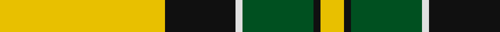
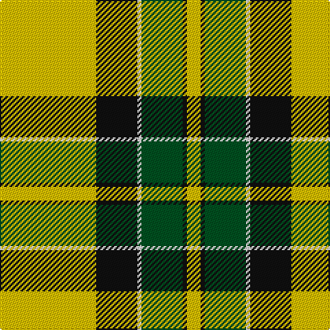

In pattern [YKGWKY](/stripes/ykgwky/).

This was sourced from register-of-tartans.  It is a [6 stripe tartan](/stripes/stripes6/).

Original link https://www.tartanregister.gov.uk/tartanDetails.aspx?ref=1874

## Also known as

This cloth is also recorded under:

- Jacobite #2

## Register references

External register numbers recorded for this tartan.

- Scottish Register of Tartans: [1874](https://www.tartanregister.gov.uk/tartanDetails.aspx?ref=1874)
- Scottish Tartans World Register: 1885

## Thread count
Y/70 K30 LN3 G30 K3 Y/10

## Palette
Each colour and its ΔE from the base-6 reference it is a variant of.

| Colour | Shade | Base | ΔE (OKLab) |
|---|---|---|---|
| G | <code style="background-color:#005020;">#005020</code> `#005020` | G <code style="background-color:#006100;">#006100</code> | 0.07 |
| K | <code style="background-color:#101010;">#101010</code> `#101010` | K <code style="background-color:#000000;">#000000</code> | 0.17 |
| LN | <code style="background-color:#E0E0E0;">#E0E0E0</code> `#E0E0E0` | W <code style="background-color:#F7F7F7;">#F7F7F7</code> | 0.07 |
| Y | <code style="background-color:#E8C000;">#E8C000</code> `#E8C000` | Y <code style="background-color:#F2BF00;">#F2BF00</code> | 0.02 |

# Sample pattern

## Nearest tartans

The nearest existing variants by ΔTartan distance.

1. [Jacobite](/setts/s6/ly70k30w3g30k3ly10/) — ΔT 0.40
1. [Pollock](/setts/s7/g3r16w4k6g28r1g3~x2/) — ΔT 1.11
1. [Brandon Manitoba Trade Tartan Tartan Number: 1884. Earliest known date: pre 1997 From Dalgleish as Hamilton of Brandon. There is a similarity to Cape Breton. And to Paton's Jacobite. See products available Copyright © Blair Urquhart, Comrie, 2015](/setts/s6/ly83k35w3g35k3ly10/) — ΔT 1.15
1. [Billy Apple® Yellow](/setts/s4/r1ly13k8g1~x6/) — ΔT 1.43
1. [MacDuck (Corporate)](/setts/s6/k4r5k2ly21g8k2~x2/) — ΔT 1.45
1. [Brandon, Manitoba](/setts/s6/y83k35w3g35k3ly10/) — ΔT 1.58
1. [Fraser Yellow](/setts/s7/r2w2ly27dg14ly2db14ly2~x2/) — ΔT 1.61
1. [Livingston (Personal)](/setts/s11/g26r5k1r2k1r5g16r5w16g2w8~x2/) — ΔT 1.63
1. [Fraser, Yellow](/setts/s7/r2w2ly27g14ly2db14ly2~x2/) — ΔT 1.68
1. [Dogwood](/setts/s8/dg4do10dg10o6do1w26dg2do1~x4/) — ΔT 1.69

## Neighbour map

Every grey dot is one of 14299 variants placed by the first two principal components of the ΔTartan feature space (44% of its variance). Red is this tartan; blue dots are its nearest — click one to open its page.

<svg viewBox="0 0 640 380" role="img" style="max-width:100%;height:auto;border:1px solid #e0e0e0;border-radius:4px;display:block" xmlns="http://www.w3.org/2000/svg"><image href="/nn/cloud.v1.png" width="640" height="380"/><a href="/setts/s6/ly70k30w3g30k3ly10/"><circle cx="279.9" cy="142.3" r="4" fill="#3465a4"><title>Jacobite</title></circle></a><a href="/setts/s7/g3r16w4k6g28r1g3~x2/"><circle cx="322.3" cy="141.5" r="4" fill="#3465a4"><title>Pollock</title></circle></a><a href="/setts/s6/ly83k35w3g35k3ly10/"><circle cx="242.6" cy="121.1" r="4" fill="#3465a4"><title>Brandon Manitoba Trade Tartan Tartan Number: 1884. Earliest known date: pre 1997 From Dalgleish as Hamilton of Brandon. There is a similarity to Cape Breton. And to Paton's Jacobite. See products available Copyright © Blair Urquhart, Comrie, 2015</title></circle></a><a href="/setts/s4/r1ly13k8g1~x6/"><circle cx="283.4" cy="182.3" r="4" fill="#3465a4"><title>Billy Apple® Yellow</title></circle></a><a href="/setts/s6/k4r5k2ly21g8k2~x2/"><circle cx="227.9" cy="171.9" r="4" fill="#3465a4"><title>MacDuck (Corporate)</title></circle></a><a href="/setts/s6/y83k35w3g35k3ly10/"><circle cx="249.9" cy="133.5" r="4" fill="#3465a4"><title>Brandon, Manitoba</title></circle></a><a href="/setts/s7/r2w2ly27dg14ly2db14ly2~x2/"><circle cx="224.1" cy="142.1" r="4" fill="#3465a4"><title>Fraser Yellow</title></circle></a><a href="/setts/s11/g26r5k1r2k1r5g16r5w16g2w8~x2/"><circle cx="272.4" cy="123.2" r="4" fill="#3465a4"><title>Livingston (Personal)</title></circle></a><a href="/setts/s7/r2w2ly27g14ly2db14ly2~x2/"><circle cx="228.8" cy="143.4" r="4" fill="#3465a4"><title>Fraser, Yellow</title></circle></a><a href="/setts/s8/dg4do10dg10o6do1w26dg2do1~x4/"><circle cx="217.7" cy="118.1" r="4" fill="#3465a4"><title>Dogwood</title></circle></a><circle cx="288.1" cy="145.6" r="5" fill="#c00000"/></svg>

ID: /setts/s6/ly70k30w3dg30k3ly10/
