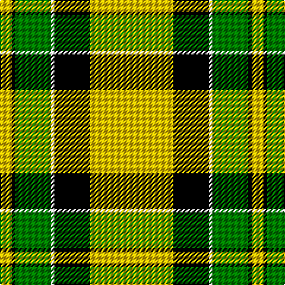

In pattern [YKGWKY](/stripes/ykgwky/).

This was sourced from weddslist.  It is a [6 stripe tartan](/stripes/stripes6/).

Original link http://www.weddslist.com/cgi-bin/tartans/pg.pl?source=sts

## Also known as

This cloth is also recorded under:

- Jacobite #2

## Thread count
Y/70 K30 LN3 G30 K3 Y/10

## Palette
Each colour and the base-6 reference it is a variant of.

| Colour | Shade | Base |
|---|---|---|
| G | <code style="background-color:#008000;">#008000</code> `oklch(52.0% 0.177 142.5)` <small>#008000</small> | G <code style="background-color:#006100;">#006100</code> |
| K | <code style="background-color:#000000;">#000000</code> `oklch(0.0% 0.000 0.0)` <small>#000000</small> | K <code style="background-color:#000000;">#000000</code> |
| LN | <code style="background-color:#E0E0E0;">#E0E0E0</code> `oklch(90.7% 0.000 89.9)` <small>#E0E0E0</small> | W <code style="background-color:#F7F7F7;">#F7F7F7</code> |
| Y | <code style="background-color:#F0C000;">#F0C000</code> `oklch(82.7% 0.169 90.5)` <small>#F0C000</small> | Y <code style="background-color:#F2BF00;">#F2BF00</code> |

# Sample pattern

## Nearest tartans

The nearest existing variants by ΔTartan distance.

1. [Jacobite #2](/setts/s6/ly70k30w3dg30k3ly10/) — ΔT 0.40
1. [Brandon Manitoba Trade Tartan Tartan Number: 1884. Earliest known date: pre 1997 From Dalgleish as Hamilton of Brandon. There is a similarity to Cape Breton. And to Paton's Jacobite. See products available Copyright © Blair Urquhart, Comrie, 2015](/setts/s6/ly83k35w3g35k3ly10/) — ΔT 1.20
1. [Pollock](/setts/s7/g3r16w4k6g28r1g3~x2/) — ΔT 1.32
1. [Billy Apple® Yellow](/setts/s4/r1ly13k8g1~x6/) — ΔT 1.40
1. [MacDuck (Corporate)](/setts/s6/k4r5k2ly21g8k2~x2/) — ΔT 1.54
1. [Brandon, Manitoba](/setts/s6/y83k35w3g35k3ly10/) — ΔT 1.64
1. [Fraser Yellow](/setts/s7/r2w2ly27dg14ly2db14ly2~x2/) — ΔT 1.83
1. [Dogwood](/setts/s8/dg4do10dg10o6do1w26dg2do1~x4/) — ΔT 1.87
1. [Longniddry Green (Dance)](/setts/s8/g42g2w2g2g5dt12w32g4~x2/) — ΔT 1.88
1. [Fraser, Yellow](/setts/s7/r2w2ly27g14ly2db14ly2~x2/) — ΔT 1.88

## Neighbour map

Every grey dot is one of 14299 variants placed by the first two principal components of the ΔTartan feature space (44% of its variance). Red is this tartan; blue dots are its nearest — click one to open its page.

<svg viewBox="0 0 640 380" role="img" style="max-width:100%;height:auto;border:1px solid #e0e0e0;border-radius:4px;display:block" xmlns="http://www.w3.org/2000/svg"><image href="/nn/cloud.v1.png" width="640" height="380"/><a href="/setts/s6/ly70k30w3dg30k3ly10/"><circle cx="288.1" cy="145.6" r="4" fill="#3465a4"><title>Jacobite #2</title></circle></a><a href="/setts/s6/ly83k35w3g35k3ly10/"><circle cx="242.6" cy="121.1" r="4" fill="#3465a4"><title>Brandon Manitoba Trade Tartan Tartan Number: 1884. Earliest known date: pre 1997 From Dalgleish as Hamilton of Brandon. There is a similarity to Cape Breton. And to Paton's Jacobite. See products available Copyright © Blair Urquhart, Comrie, 2015</title></circle></a><a href="/setts/s7/g3r16w4k6g28r1g3~x2/"><circle cx="322.3" cy="141.5" r="4" fill="#3465a4"><title>Pollock</title></circle></a><a href="/setts/s4/r1ly13k8g1~x6/"><circle cx="283.4" cy="182.3" r="4" fill="#3465a4"><title>Billy Apple® Yellow</title></circle></a><a href="/setts/s6/k4r5k2ly21g8k2~x2/"><circle cx="227.9" cy="171.9" r="4" fill="#3465a4"><title>MacDuck (Corporate)</title></circle></a><a href="/setts/s6/y83k35w3g35k3ly10/"><circle cx="249.9" cy="133.5" r="4" fill="#3465a4"><title>Brandon, Manitoba</title></circle></a><a href="/setts/s7/r2w2ly27dg14ly2db14ly2~x2/"><circle cx="224.1" cy="142.1" r="4" fill="#3465a4"><title>Fraser Yellow</title></circle></a><a href="/setts/s8/dg4do10dg10o6do1w26dg2do1~x4/"><circle cx="217.7" cy="118.1" r="4" fill="#3465a4"><title>Dogwood</title></circle></a><a href="/setts/s8/g42g2w2g2g5dt12w32g4~x2/"><circle cx="266.5" cy="129.2" r="4" fill="#3465a4"><title>Longniddry Green (Dance)</title></circle></a><a href="/setts/s7/r2w2ly27g14ly2db14ly2~x2/"><circle cx="228.8" cy="143.4" r="4" fill="#3465a4"><title>Fraser, Yellow</title></circle></a><circle cx="279.9" cy="142.3" r="5" fill="#c00000"/></svg>

ID: /setts/s6/ly70k30w3g30k3ly10/
