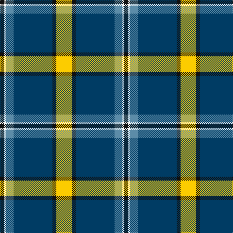

In pattern [KWBBKY](/stripes/kwbbky/).

This was sourced from tartans-authority.  It is a [6 stripe tartan](/stripes/stripes6/).

Original link http://www.tartansauthority.com/tartan-ferret/display/11124/

## Thread count
Y/32 K8 DB80 B16 W4 K/8

## Palette
Each colour and the base-6 reference it is a variant of.

| Colour | Shade | Base |
|---|---|---|
| B | <code style="background-color:#5C8CA8;">#5C8CA8</code> `oklch(61.7% 0.067 235.0)` <small>#5C8CA8</small> | B <code style="background-color:#2A418A;">#2A418A</code> |
| DB | <code style="background-color:#003C64;">#003C64</code> `oklch(34.5% 0.089 246.0)` <small>#003C64</small> | B <code style="background-color:#2A418A;">#2A418A</code> |
| K | <code style="background-color:#101010;">#101010</code> `oklch(17.3% 0.000 89.9)` <small>#101010</small> | K <code style="background-color:#000000;">#000000</code> |
| W | <code style="background-color:#FCFCFC;">#FCFCFC</code> `oklch(99.1% 0.000 89.9)` <small>#FCFCFC</small> | W <code style="background-color:#F7F7F7;">#F7F7F7</code> |
| Y | <code style="background-color:#FCCC00;">#FCCC00</code> `oklch(86.2% 0.176 91.5)` <small>#FCCC00</small> | Y <code style="background-color:#F2BF00;">#F2BF00</code> |

# Sample pattern

## Nearest tartans

The nearest existing variants by ΔTartan distance, with this tartan at the top so the swatches line up against it.

ΔTartan

Tartan

Sett

—

<a href="/ttd/edit/#slug=ly8k2dt20t4w1k2~x4">Solberg-Bell</a> <a class="nn-out" href="/setts/s6/ly8k2dt20t4w1k2~x4/" title="open its dictionary page">↗</a>

0.51

<a href="/ttd/edit/#slug=lo8k2dt20t4w1k2~x4">Solberg-Bell (Personal)</a> <a class="nn-out" href="/setts/s6/lo8k2dt20t4w1k2~x4/" title="open its dictionary page">↗</a>

0.81

<a href="/ttd/edit/#slug=ly21g26db62w2dg2w2">Nynashamn Whisky Society (Corporate)</a> <a class="nn-out" href="/setts/s6/ly21g26db62w2dg2w2/" title="open its dictionary page">↗</a>

1.07

<a href="/ttd/edit/#slug=r2w7db30g36ly2~x2">Centennial-King George Lodge No.171</a> <a class="nn-out" href="/setts/s5/r2w7db30g36ly2~x2/" title="open its dictionary page">↗</a>

1.10

<a href="/ttd/edit/#slug=dt42t2w2t2dt5k12w32db4~x2">Comrie, Navy Blue (Dance)</a> <a class="nn-out" href="/setts/s8/dt42t2w2t2dt5k12w32db4~x2/" title="open its dictionary page">↗</a>

1.11

<a href="/ttd/edit/#slug=db2r1db16k5g2w11g1~x4">Sinclair dress</a> <a class="nn-out" href="/setts/s7/db2r1db16k5g2w11g1~x4/" title="open its dictionary page">↗</a>

1.13

<a href="/ttd/edit/#slug=r2w7b30dg36ly2~x2">Centennial-King George Lodge No.171</a> <a class="nn-out" href="/setts/s5/r2w7b30dg36ly2~x2/" title="open its dictionary page">↗</a>

1.18

<a href="/ttd/edit/#slug=lr2dg17w6b5r1~x4">Scotstown</a> <a class="nn-out" href="/setts/s5/lr2dg17w6b5r1~x4/" title="open its dictionary page">↗</a>

1.22

<a href="/ttd/edit/#slug=r3dt4w10dg2w2dg5dt34ly3~x2">Royal Troon Golf Club, The</a> <a class="nn-out" href="/setts/s8/r3dt4w10dg2w2dg5dt34ly3~x2/" title="open its dictionary page">↗</a>

1.24

<a href="/ttd/edit/#slug=db4r2db39k11g2w16r2~x2">Sinclair, The Jack</a> <a class="nn-out" href="/setts/s7/db4r2db39k11g2w16r2~x2/" title="open its dictionary page">↗</a>

1.24

<a href="/ttd/edit/#slug=dt42lb2lb2lb2dt5dt12lb32dt4~x2">Longniddry Blue (Dance)</a> <a class="nn-out" href="/setts/s8/dt42lb2lb2lb2dt5dt12lb32dt4~x2/" title="open its dictionary page">↗</a>

## Neighbour map

Every grey dot is one of 14299 variants placed by the first two principal components of the ΔTartan feature space (44% of its variance). Red is this tartan; blue dots are its nearest — click one to open its page.

<svg viewBox="0 0 640 380" role="img" style="max-width:100%;height:auto;border:1px solid #e0e0e0;border-radius:4px;display:block" xmlns="http://www.w3.org/2000/svg"><image href="/nn/cloud.v1.png" width="640" height="380"/><a href="/setts/s6/lo8k2dt20t4w1k2~x4/"><circle cx="281.0" cy="148.0" r="4" fill="#3465a4"><title>Solberg-Bell (Personal)</title></circle></a><a href="/setts/s6/ly21g26db62w2dg2w2/"><circle cx="301.2" cy="128.1" r="4" fill="#3465a4"><title>Nynashamn Whisky Society (Corporate)</title></circle></a><a href="/setts/s5/r2w7db30g36ly2~x2/"><circle cx="252.6" cy="171.4" r="4" fill="#3465a4"><title>Centennial-King George Lodge No.171</title></circle></a><a href="/setts/s8/dt42t2w2t2dt5k12w32db4~x2/"><circle cx="230.7" cy="115.3" r="4" fill="#3465a4"><title>Comrie, Navy Blue (Dance)</title></circle></a><a href="/setts/s7/db2r1db16k5g2w11g1~x4/"><circle cx="210.0" cy="139.2" r="4" fill="#3465a4"><title>Sinclair dress</title></circle></a><a href="/setts/s5/r2w7b30dg36ly2~x2/"><circle cx="255.8" cy="173.5" r="4" fill="#3465a4"><title>Centennial-King George Lodge No.171</title></circle></a><a href="/setts/s5/lr2dg17w6b5r1~x4/"><circle cx="256.8" cy="164.8" r="4" fill="#3465a4"><title>Scotstown</title></circle></a><a href="/setts/s8/r3dt4w10dg2w2dg5dt34ly3~x2/"><circle cx="302.9" cy="118.8" r="4" fill="#3465a4"><title>Royal Troon Golf Club, The</title></circle></a><a href="/setts/s7/db4r2db39k11g2w16r2~x2/"><circle cx="284.9" cy="128.0" r="4" fill="#3465a4"><title>Sinclair, The Jack</title></circle></a><a href="/setts/s8/dt42lb2lb2lb2dt5dt12lb32dt4~x2/"><circle cx="287.3" cy="139.3" r="4" fill="#3465a4"><title>Longniddry Blue (Dance)</title></circle></a><circle cx="267.0" cy="141.0" r="5" fill="#c00000"/></svg>

ID: /setts/s6/ly8k2dt20t4w1k2~x4/
