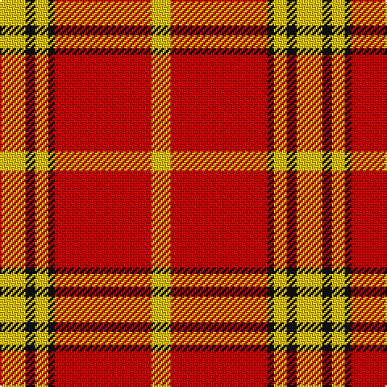

This page is one **sett** — a single exact thread-count. It belongs to the [tartan](/tartans/y8k3y4k2r30y6/)
(the same proportion at any scale), whose colour order is pattern [YKYKRY](/stripes/ykykry/).

Sourced from tartans-authority.  It is a [6 stripe tartan](/stripes/stripes6/).

Original link http://www.tartansauthority.com/tartan-ferret/display/7276/

## Thread count
Y/16 K6 Y8 K4 R60 Y/12

## Palette
Each colour and the base-6 reference it is a variant of.

| Colour | Shade | Base |
|---|---|---|
| K | <code style="background-color:#101010;">#101010</code> `oklch(17.3% 0.000 89.9)` <small>#101010</small> | K <code style="background-color:#000000;">#000000</code> |
| R | <code style="background-color:#C80000;">#C80000</code> `oklch(52.3% 0.215 29.2)` <small>#C80000</small> | R <code style="background-color:#CC0000;">#CC0000</code> |
| Y | <code style="background-color:#E8C000;">#E8C000</code> `oklch(81.9% 0.168 93.7)` <small>#E8C000</small> | Y <code style="background-color:#F2BF00;">#F2BF00</code> |

# Sample pattern

## Nearest tartans

The nearest existing variants by ΔTartan distance, with this tartan at the top so the swatches line up against it.

ΔTartan

Tartan

Sett

—

<a href="/ttd/edit/#slug=ly8k3ly4k2r30ly6~x2">Masai Shuka 16 (Artefact)</a> <a class="nn-out" href="/setts/s6/ly8k3ly4k2r30ly6~x2/" title="open its dictionary page">↗</a>

1.24

<a href="/ttd/edit/#slug=g1ly1g1w1g10r20ly1~x4">Maver (Buckie)</a> <a class="nn-out" href="/setts/s7/g1ly1g1w1g10r20ly1~x4/" title="open its dictionary page">↗</a>

1.36

<a href="/ttd/edit/#slug=db4ly1r12ly2r2ly12r1ly4~x4">Glassary #3</a> <a class="nn-out" href="/setts/s8/db4ly1r12ly2r2ly12r1ly4~x4/" title="open its dictionary page">↗</a>

1.37

<a href="/ttd/edit/#slug=r29g2r2g2r6ly21~x4">Maguire, Black</a> <a class="nn-out" href="/setts/s6/r29g2r2g2r6ly21~x4/" title="open its dictionary page">↗</a>

1.45

<a href="/ttd/edit/#slug=r38w9r3do9w3~x2">Loch Morar Trade Tartan Tartan Number: 1701. Earliest known date: pre 2003 Nothing See products available Copyright © Blair Urquhart, Comrie, 2015</a> <a class="nn-out" href="/setts/s5/r38w9r3do9w3~x2/" title="open its dictionary page">↗</a>

1.48

<a href="/ttd/edit/#slug=r38w9r3dr9w3~x2">Loch Morar</a> <a class="nn-out" href="/setts/s5/r38w9r3dr9w3~x2/" title="open its dictionary page">↗</a>

1.50

<a href="/ttd/edit/#slug=r35dg16r5dg5w2k3~x2">MacGregor</a> <a class="nn-out" href="/setts/s6/r35dg16r5dg5w2k3~x2/" title="open its dictionary page">↗</a>

1.53

<a href="/ttd/edit/#slug=ly3k2r10k1~x4">Masai Shuka 26 (Artefact)</a> <a class="nn-out" href="/setts/s4/ly3k2r10k1~x4/" title="open its dictionary page">↗</a>

1.57

<a href="/ttd/edit/#slug=r35g16r5g5w2k3~x2">MacGregor</a> <a class="nn-out" href="/setts/s6/r35g16r5g5w2k3~x2/" title="open its dictionary page">↗</a>

1.60

<a href="/ttd/edit/#slug=r4w8r3w2r3w2r21g2r2g4~x2">Queen Alexandra</a> <a class="nn-out" href="/setts/s10/r4w8r3w2r3w2r21g2r2g4~x2/" title="open its dictionary page">↗</a>

1.61

<a href="/ttd/edit/#slug=r46k3ly6db8r6k3ly46">Scrymgeour</a> <a class="nn-out" href="/setts/s7/r46k3ly6db8r6k3ly46/" title="open its dictionary page">↗</a>

## Neighbour map

Every grey dot is one of 14299 variants placed by the first two principal components of the ΔTartan feature space (44% of its variance). Red is this tartan; blue dots are its nearest — click one to open its page.

<svg viewBox="0 0 640 380" role="img" style="max-width:100%;height:auto;border:1px solid #e0e0e0;border-radius:4px;display:block" xmlns="http://www.w3.org/2000/svg"><image href="/nn/cloud.v1.png" width="640" height="380"/><a href="/setts/s7/g1ly1g1w1g10r20ly1~x4/"><circle cx="369.6" cy="117.8" r="4" fill="#3465a4"><title>Maver (Buckie)</title></circle></a><a href="/setts/s8/db4ly1r12ly2r2ly12r1ly4~x4/"><circle cx="298.1" cy="171.5" r="4" fill="#3465a4"><title>Glassary #3</title></circle></a><a href="/setts/s6/r29g2r2g2r6ly21~x4/"><circle cx="382.8" cy="161.8" r="4" fill="#3465a4"><title>Maguire, Black</title></circle></a><a href="/setts/s5/r38w9r3do9w3~x2/"><circle cx="414.5" cy="182.1" r="4" fill="#3465a4"><title>Loch Morar Trade Tartan Tartan Number: 1701. Earliest known date: pre 2003 Nothing See products available Copyright © Blair Urquhart, Comrie, 2015</title></circle></a><a href="/setts/s5/r38w9r3dr9w3~x2/"><circle cx="412.6" cy="182.4" r="4" fill="#3465a4"><title>Loch Morar</title></circle></a><a href="/setts/s6/r35dg16r5dg5w2k3~x2/"><circle cx="387.6" cy="160.5" r="4" fill="#3465a4"><title>MacGregor</title></circle></a><a href="/setts/s4/ly3k2r10k1~x4/"><circle cx="367.3" cy="212.0" r="4" fill="#3465a4"><title>Masai Shuka 26 (Artefact)</title></circle></a><a href="/setts/s6/r35g16r5g5w2k3~x2/"><circle cx="380.5" cy="161.6" r="4" fill="#3465a4"><title>MacGregor</title></circle></a><a href="/setts/s10/r4w8r3w2r3w2r21g2r2g4~x2/"><circle cx="382.6" cy="157.9" r="4" fill="#3465a4"><title>Queen Alexandra</title></circle></a><a href="/setts/s7/r46k3ly6db8r6k3ly46/"><circle cx="262.9" cy="130.3" r="4" fill="#3465a4"><title>Scrymgeour</title></circle></a><circle cx="361.9" cy="162.7" r="5" fill="#c00000"/></svg>

ID: /setts/s6/ly8k3ly4k2r30ly6~x2/
