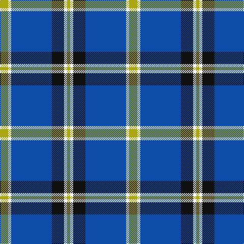

**Bands:** [YWKBWY](/stripes/ywkbwy/) · **Stripes:** [LY W K B W LY](/stripes/stripes6/) LY W K B W LY

This was sourced from register-of-tartans.  It is a [6 band tartan](/bands/bands6/).

Original link https://www.tartanregister.gov.uk/tartanDetails.aspx?ref=10748

## Register references

External register numbers recorded for this tartan.

- Scottish Register of Tartans: [10748](https://www.tartanregister.gov.uk/tartanDetails.aspx?ref=10748)

## Thread count
LG/16 W6 B80 K24 W6 LG/6

## Palette
Each colour and its ΔE from the base-6 reference it is a variant of.

| Colour | Shade | Base | ΔE (OKLab) |
|---|---|---|---|
| B | <code style="background-color:#0C4BA8;">#0C4BA8</code> `#0C4BA8` | B <code style="background-color:#2A418A;">#2A418A</code> | 0.06 |
| K | <code style="background-color:#101010;">#101010</code> `#101010` | K <code style="background-color:#000000;">#000000</code> | 0.17 |
| LG | <code style="background-color:#ABA712;">#ABA712</code> `#ABA712` | Y <code style="background-color:#F2BF00;">#F2BF00</code> | 0.13 |
| W | <code style="background-color:#FFFFFF;">#FFFFFF</code> `#FFFFFF` | W <code style="background-color:#F7F7F7;">#F7F7F7</code> | 0.02 |

# Sample pattern

## Nearest tartans

The nearest existing variants by ΔTartan distance.

1. [Wolverine Corporate Tartan Tartan Number: 10748. Earliest known date: 03/12/2012 Created by the designer to celebrate an exclusive group of work colleagues known affectionately as the 'Wolverines'. Many within this close group share a proud Scottish heritage and wished to acknowledge this strong affiliation by commissioning a tartan. Yes. The Wolverine tartan has been created for the exclusive use of the 'Wolverines'. No commercial use of this tartan is permitted without expressed permission from the designer, and any party wishing to use or reproduce this tartan should first seek permission by email from the designer. See products available Copyright © Blair Urquhart, Comrie, 2015](/setts/s6/ly8k3b40k12k3ly3~x2/) — ΔT 0.79
1. [Detroit Lions](/setts/s8/db30lb2k9w3db6w4k3lb6~x2/) — ΔT 0.82
1. [Wolverines (Corporate)](/setts/s6/lo8w3db40k12w3lo3~x2/) — ΔT 0.98
1. [Oklahoma](/setts/s5/k8ly2b21w3r2~x4/) — ΔT 1.14
1. [Micron](/setts/s6/k30b40ly3b5w2b6~x2/) — ΔT 1.14
1. [Int. Police Association (Official)](/setts/s7/db7r3db26t2db2t26ly4~x2/) — ΔT 1.16
1. [MacLintock #2](/setts/s7/n3b2w10b2n6b26k2~x2/) — ΔT 1.22
1. [Longniddry Eildon Blue Dress Fancy Tartan Tartan Number: 5486. Earliest known date: pre 1992 Dancers tartan See products available Copyright © Blair Urquhart, Comrie, 2015](/setts/s8/db42lb2lb2lb2db5dt12lb32db4~x2/) — ΔT 1.24
1. [Hydro-Electric](/setts/s6/k3db30k8w8k2r3~x2/) — ΔT 1.27
1. [Highlands School (N. Carolina) Corporate Tartan Tartan Number: 2109. Earliest known date: 1990 Highlands in North Carolina is the home of the Scottish Tartans Society's Museum Extension. The school tartan was designed by Bob Martin who is a 'Fellow of the Society'. Blue and Gold are the school colours. See products available Copyright © Blair Urquhart, Comrie, 2015](/setts/s8/ly12db2ly2db30db3db2db13w4~x2/) — ΔT 1.27

## Neighbour map

Every grey dot is one of 14299 variants placed by the first two principal components of the ΔTartan feature space (44% of its variance). Red is this tartan; blue dots are its nearest — click one to open its page.

<svg viewBox="0 0 640 380" role="img" style="max-width:100%;height:auto;border:1px solid #e0e0e0;border-radius:4px;display:block" xmlns="http://www.w3.org/2000/svg"><image href="/nn/cloud.v1.png" width="640" height="380"/><a href="/setts/s6/ly8k3b40k12k3ly3~x2/"><circle cx="314.5" cy="180.5" r="4" fill="#3465a4"><title>Wolverine Corporate Tartan Tartan Number: 10748. Earliest known date: 03/12/2012 Created by the designer to celebrate an exclusive group of work colleagues known affectionately as the 'Wolverines'. Many within this close group share a proud Scottish heritage and wished to acknowledge this strong affiliation by commissioning a tartan. Yes. The Wolverine tartan has been created for the exclusive use of the 'Wolverines'. No commercial use of this tartan is permitted without expressed permission from the designer, and any party wishing to use or reproduce this tartan should first seek permission by email from the designer. See products available Copyright © Blair Urquhart, Comrie, 2015</title></circle></a><a href="/setts/s8/db30lb2k9w3db6w4k3lb6~x2/"><circle cx="291.5" cy="153.4" r="4" fill="#3465a4"><title>Detroit Lions</title></circle></a><a href="/setts/s6/lo8w3db40k12w3lo3~x2/"><circle cx="306.9" cy="166.6" r="4" fill="#3465a4"><title>Wolverines (Corporate)</title></circle></a><a href="/setts/s5/k8ly2b21w3r2~x4/"><circle cx="279.7" cy="181.2" r="4" fill="#3465a4"><title>Oklahoma</title></circle></a><a href="/setts/s6/k30b40ly3b5w2b6~x2/"><circle cx="355.6" cy="175.0" r="4" fill="#3465a4"><title>Micron</title></circle></a><a href="/setts/s7/db7r3db26t2db2t26ly4~x2/"><circle cx="288.6" cy="179.7" r="4" fill="#3465a4"><title>Int. Police Association (Official)</title></circle></a><a href="/setts/s7/n3b2w10b2n6b26k2~x2/"><circle cx="315.8" cy="169.4" r="4" fill="#3465a4"><title>MacLintock #2</title></circle></a><a href="/setts/s8/db42lb2lb2lb2db5dt12lb32db4~x2/"><circle cx="289.4" cy="138.9" r="4" fill="#3465a4"><title>Longniddry Eildon Blue Dress Fancy Tartan Tartan Number: 5486. Earliest known date: pre 1992 Dancers tartan See products available Copyright © Blair Urquhart, Comrie, 2015</title></circle></a><a href="/setts/s6/k3db30k8w8k2r3~x2/"><circle cx="291.8" cy="167.8" r="4" fill="#3465a4"><title>Hydro-Electric</title></circle></a><a href="/setts/s8/ly12db2ly2db30db3db2db13w4~x2/"><circle cx="260.4" cy="155.7" r="4" fill="#3465a4"><title>Highlands School (N. Carolina) Corporate Tartan Tartan Number: 2109. Earliest known date: 1990 Highlands in North Carolina is the home of the Scottish Tartans Society's Museum Extension. The school tartan was designed by Bob Martin who is a 'Fellow of the Society'. Blue and Gold are the school colours. See products available Copyright © Blair Urquhart, Comrie, 2015</title></circle></a><circle cx="302.7" cy="170.9" r="5" fill="#c00000"/></svg>

ID: /setts/s6/ly8w3b40k12w3ly3~x2/
