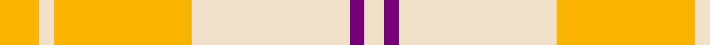

In pattern [WBWYWY](/stripes/wbwywy/).

This was sourced from tartans-authority.  It is a [6 stripe tartan](/stripes/stripes6/).

Original link http://www.tartansauthority.com/tartan-ferret/display/7605/

## Also known as

This cloth is also recorded under:

- Ailsa Yellow
- Ailsa, Gold

## Attestations

This cloth appears in 4 source records; the oldest owns this page.

- March 2008 — Ailsa, Gold (Dance) (tartans-authority, [record](http://www.tartansauthority.com/tartan-ferret/display/7605/))
- undated — Ailsa Gold (register-of-tartans, [record](https://www.tartanregister.gov.uk/tartanDetails.aspx?ref=5629))
- undated — Ailsa Yellow Fashion Tartan Tartan Number: 7604. Earliest known date: March 2008 One of a series of dancer's tartans for the House of Edgar's in-house collection designed by Kirsty Anderson. See products available Copyright © Blair Urquhart, Comrie, 2015 (house-of-tartan, [record](http://www.house-of-tartan.scotland.net/house/TartanViewjs.asp?colr=Def&tnam=7604))
- undated — Ailsa Gold Fashion Tartan Tartan Number: 7605. Earliest known date: March 2008 One of a series of dancer's tartans for the House of Edgar's in-house collection designed by Kirsty Anderson. See products available Copyright © Blair Urquhart, Comrie, 2015 (house-of-tartan, [record](http://www.house-of-tartan.scotland.net/house/TartanViewjs.asp?colr=Def&tnam=7605))

## Register references

External register numbers recorded for this tartan.

- Scottish Register of Tartans: [5629](https://www.tartanregister.gov.uk/tartanDetails.aspx?ref=5629)
- Scottish Tartans Authority (ITI): 7605

## Thread count
Y/16 W6 Y56 W64 P6 W/8

## Palette
Each colour and the base-6 reference it is a variant of.

| Colour | Shade | Base |
|---|---|---|
| P | <code style="background-color:#780078;">#780078</code> `oklch(40.2% 0.185 328.4)` <small>#780078</small> | B <code style="background-color:#2A418A;">#2A418A</code> |
| W | <code style="background-color:#F0E0C8;">#F0E0C8</code> `oklch(91.3% 0.036 78.1)` <small>#F0E0C8</small> | W <code style="background-color:#F7F7F7;">#F7F7F7</code> |
| Y | <code style="background-color:#F8B400;">#F8B400</code> `oklch(81.2% 0.168 81.1)` <small>#F8B400</small> | Y <code style="background-color:#F2BF00;">#F2BF00</code> |

# Sample pattern

## Nearest tartans

The nearest existing variants by ΔTartan distance, with this tartan at the top so the swatches line up against it.

ΔTartan

Tartan

Sett

—

<a href="/ttd/edit/#slug=ly8w3ly28w32dp3w4~x2">Ailsa, Gold (Dance)</a> <a class="nn-out" href="/setts/s6/ly8w3ly28w32dp3w4~x2/" title="open its dictionary page">↗</a>

2.10

<a href="/ttd/edit/#slug=ly8r2ly8g1r6ly3g4ly2~x4">Glufree</a> <a class="nn-out" href="/setts/s8/ly8r2ly8g1r6ly3g4ly2~x4/" title="open its dictionary page">↗</a>

2.34

<a href="/ttd/edit/#slug=n2w2ly7lb14n2w2~x2">Cairngorm</a> <a class="nn-out" href="/setts/s6/n2w2ly7lb14n2w2~x2/" title="open its dictionary page">↗</a>

2.42

<a href="/ttd/edit/#slug=r8w3r28w32k3w4~x2">Ailsa, Pink (Dance)</a> <a class="nn-out" href="/setts/s6/r8w3r28w32k3w4~x2/" title="open its dictionary page">↗</a>

2.50

<a href="/setts/s10/o29g2o2g2o6ly21~x4/">Maguire Clan Family Tartan Tartan Number: 6812. Earliest known date: 2005 The first Scottish Maguire as recorded with Lord Lyon. The design is based on MacQuarrie and was created by FE Maguire at the House of Tartan in Comrie, Perthshire. The tartan is intended for the use of all Scottish Maguires. See products available Copyright © Blair Urquhart, Comrie, 2015</a>

2.55

<a href="/ttd/edit/#slug=t6lo28o20t3~x2">Prince of Orange</a> <a class="nn-out" href="/setts/s4/t6lo28o20t3~x2/" title="open its dictionary page">↗</a>

2.57

<a href="/ttd/edit/#slug=y2w19lr2w2y3w3y3lr6ly25w2~x2">Llama (Fashion)</a> <a class="nn-out" href="/setts/s10/y2w19lr2w2y3w3y3lr6ly25w2~x2/" title="open its dictionary page">↗</a>

2.58

<a href="/ttd/edit/#slug=o2w1lo17o14w15o2w2~x2">North American Sheep Breeders Association</a> <a class="nn-out" href="/setts/s7/o2w1lo17o14w15o2w2~x2/" title="open its dictionary page">↗</a>

2.60

<a href="/ttd/edit/#slug=w1dp1lb7o4lb1w1~x4">Lochnagar Trade Tartan Tartan Number: 1771. Earliest known date: pre 2003 Colours represents the Scottish hills, the water, and the heather. See products available Copyright © Blair Urquhart, Comrie, 2015</a> <a class="nn-out" href="/setts/s6/w1dp1lb7o4lb1w1~x4/" title="open its dictionary page">↗</a>

2.64

<a href="/ttd/edit/#slug=o10y1k1y1k1y11o18y1k1y10~x4">Donachie of Brockloch Ancient Hunting</a> <a class="nn-out" href="/setts/s10/o10y1k1y1k1y11o18y1k1y10~x4/" title="open its dictionary page">↗</a>

2.64

<a href="/ttd/edit/#slug=lb40dp5lb6ly26o13lb9dy3~x2">de Meuron Dress (Family)</a> <a class="nn-out" href="/setts/s7/lb40dp5lb6ly26o13lb9dy3~x2/" title="open its dictionary page">↗</a>

## Neighbour map

Every grey dot is one of 14299 variants placed by the first two principal components of the ΔTartan feature space (44% of its variance). Red is this tartan; blue dots are its nearest — click one to open its page.

<svg viewBox="0 0 640 380" role="img" style="max-width:100%;height:auto;border:1px solid #e0e0e0;border-radius:4px;display:block" xmlns="http://www.w3.org/2000/svg"><image href="/nn/cloud.v1.png" width="640" height="380"/><a href="/setts/s8/ly8r2ly8g1r6ly3g4ly2~x4/"><circle cx="347.9" cy="239.8" r="4" fill="#3465a4"><title>Glufree</title></circle></a><a href="/setts/s6/n2w2ly7lb14n2w2~x2/"><circle cx="262.9" cy="213.8" r="4" fill="#3465a4"><title>Cairngorm</title></circle></a><a href="/setts/s6/r8w3r28w32k3w4~x2/"><circle cx="340.8" cy="197.6" r="4" fill="#3465a4"><title>Ailsa, Pink (Dance)</title></circle></a><a href="/setts/s10/o29g2o2g2o6ly21~x4/"><circle cx="444.6" cy="171.7" r="4" fill="#3465a4"><title>Maguire Clan Family Tartan Tartan Number: 6812. Earliest known date: 2005 The first Scottish Maguire as recorded with Lord Lyon. The design is based on MacQuarrie and was created by FE Maguire at the House of Tartan in Comrie, Perthshire. The tartan is intended for the use of all Scottish Maguires. See products available Copyright © Blair Urquhart, Comrie, 2015</title></circle></a><a href="/setts/s4/t6lo28o20t3~x2/"><circle cx="329.8" cy="259.4" r="4" fill="#3465a4"><title>Prince of Orange</title></circle></a><a href="/setts/s10/y2w19lr2w2y3w3y3lr6ly25w2~x2/"><circle cx="265.8" cy="155.7" r="4" fill="#3465a4"><title>Llama (Fashion)</title></circle></a><a href="/setts/s7/o2w1lo17o14w15o2w2~x2/"><circle cx="274.9" cy="201.5" r="4" fill="#3465a4"><title>North American Sheep Breeders Association</title></circle></a><a href="/setts/s6/w1dp1lb7o4lb1w1~x4/"><circle cx="318.5" cy="229.7" r="4" fill="#3465a4"><title>Lochnagar Trade Tartan Tartan Number: 1771. Earliest known date: pre 2003 Colours represents the Scottish hills, the water, and the heather. See products available Copyright © Blair Urquhart, Comrie, 2015</title></circle></a><a href="/setts/s10/o10y1k1y1k1y11o18y1k1y10~x4/"><circle cx="420.7" cy="197.4" r="4" fill="#3465a4"><title>Donachie of Brockloch Ancient Hunting</title></circle></a><a href="/setts/s7/lb40dp5lb6ly26o13lb9dy3~x2/"><circle cx="286.5" cy="166.4" r="4" fill="#3465a4"><title>de Meuron Dress (Family)</title></circle></a><circle cx="384.8" cy="225.5" r="5" fill="#c00000"/></svg>

ID: /setts/s6/ly8w3ly28w32dp3w4~x2/
