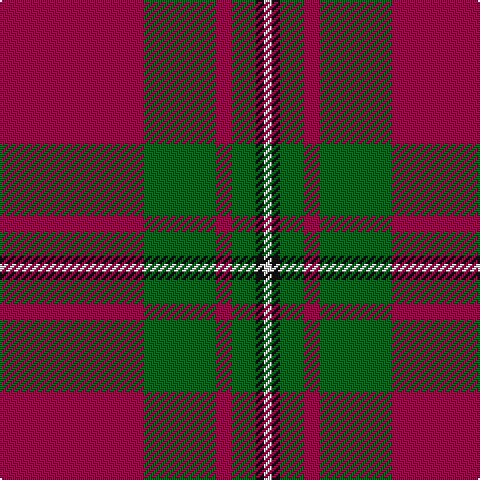

In pattern [RGRGKW](/stripes/rgrgkw/).

This was sourced from register-of-tartans.  It is a [6 stripe tartan](/stripes/stripes6/).

Original link https://www.tartanregister.gov.uk/tartanDetails.aspx?ref=2457

## Attestations

This cloth appears in 2 source records; the oldest owns this page.

- 01/01/2002 — MacGregor of Cardney (register-of-tartans, [record](https://www.tartanregister.gov.uk/tartanDetails.aspx?ref=2457))
- c1930 — MacGregor of Cardney - 1930 (Clan) (tartans-authority, [record](http://www.tartansauthority.com/tartan-ferret/display/1285/))

## Register references

External register numbers recorded for this tartan.

- Scottish Register of Tartans: [2457](https://www.tartanregister.gov.uk/tartanDetails.aspx?ref=2457)
- Scottish Tartans Authority (ITI): 1285
- Scottish Tartans World Register: 1285

## Thread count
R/72 G36 R8 G12 K4 LN/4

## Palette
Each colour and the base-6 reference it is a variant of.

| Colour | Shade | Base |
|---|---|---|
| G | <code style="background-color:#006818;">#006818</code> `oklch(45.0% 0.142 145.0)` <small>#006818</small> | G <code style="background-color:#006100;">#006100</code> |
| K | <code style="background-color:#101010;">#101010</code> `oklch(17.3% 0.000 89.9)` <small>#101010</small> | K <code style="background-color:#000000;">#000000</code> |
| LN | <code style="background-color:#E0E0E0;">#E0E0E0</code> `oklch(90.7% 0.000 89.9)` <small>#E0E0E0</small> | W <code style="background-color:#F7F7F7;">#F7F7F7</code> |
| R | <code style="background-color:#A00048;">#A00048</code> `oklch(45.4% 0.182 5.3)` <small>#A00048</small> | R <code style="background-color:#CC0000;">#CC0000</code> |

# Sample pattern

## Nearest tartans

The nearest existing variants by ΔTartan distance.

1. [MacGregor Hunting Glengyle Clan Tartan Tartan Number: 1285. Earliest known date: 1960 This is the usual MacGregor sett but with a darker crimson background colour. The story goes that Alasdair MacGregor of Cardney wanted to make tartan from the wool of his own sheep. His initial dyeing attempt produced a shocking pink colour, so he dyed the wool a second time to get this dark crimson colour. He liked the result so much that he had a bolt of cloth woven and the Cardney MacGregors have worn it ever since. The addition of the term 'Hunting' to the name is, apparently a commercial attribution. Notes from the STA, quoting Sir Malcolm MacGregor of MacGregor (2006) See products available Copyright © Blair Urquhart, Comrie, 2015](/setts/s6/m96g42m16g17k4lb6/) — ΔT 0.61
1. [MacGregor, Glengyle](/setts/s6/r96g42r16g17k4y6/) — ΔT 0.73
1. [Plummer (Personal)](/setts/s6/r100k15g48db5r7db16~x2/) — ΔT 0.99
1. [Buccleuch](/setts/s7/r107k9r5db41r5g51r14/) — ΔT 1.03
1. [Crawford (Clan)](/setts/s7/m6w2m30g12m3g12m3~x2/) — ΔT 1.12
1. [Broberg (Scania) (Personal)](/setts/s4/r80t40k5lo6/) — ΔT 1.16
1. [Crawford](/setts/s7/m6lb2m30g12m3g12m3~x2/) — ΔT 1.16
1. [Robertson - 1988 (Corporate)](/setts/s7/r2db1r16db4r1g10r1~x4/) — ΔT 1.18
1. [MacKintosh D](/setts/s6/r22db5r2dg11r3db1~x2/) — ΔT 1.19
1. [Grant of Lurg](/setts/s6/r2db10r2g10r25w2~x2/) — ΔT 1.21

## Neighbour map

Every grey dot is one of 14299 variants placed by the first two principal components of the ΔTartan feature space (44% of its variance). Red is this tartan; blue dots are its nearest — click one to open its page.

<svg viewBox="0 0 640 380" role="img" style="max-width:100%;height:auto;border:1px solid #e0e0e0;border-radius:4px;display:block" xmlns="http://www.w3.org/2000/svg"><image href="/nn/cloud.v1.png" width="640" height="380"/><a href="/setts/s6/m96g42m16g17k4lb6/"><circle cx="429.7" cy="167.8" r="4" fill="#3465a4"><title>MacGregor Hunting Glengyle Clan Tartan Tartan Number: 1285. Earliest known date: 1960 This is the usual MacGregor sett but with a darker crimson background colour. The story goes that Alasdair MacGregor of Cardney wanted to make tartan from the wool of his own sheep. His initial dyeing attempt produced a shocking pink colour, so he dyed the wool a second time to get this dark crimson colour. He liked the result so much that he had a bolt of cloth woven and the Cardney MacGregors have worn it ever since. The addition of the term 'Hunting' to the name is, apparently a commercial attribution. Notes from the STA, quoting Sir Malcolm MacGregor of MacGregor (2006) See products available Copyright © Blair Urquhart, Comrie, 2015</title></circle></a><a href="/setts/s6/r96g42r16g17k4y6/"><circle cx="422.6" cy="167.4" r="4" fill="#3465a4"><title>MacGregor, Glengyle</title></circle></a><a href="/setts/s6/r100k15g48db5r7db16~x2/"><circle cx="356.2" cy="163.3" r="4" fill="#3465a4"><title>Plummer (Personal)</title></circle></a><a href="/setts/s7/r107k9r5db41r5g51r14/"><circle cx="352.2" cy="153.4" r="4" fill="#3465a4"><title>Buccleuch</title></circle></a><a href="/setts/s7/m6w2m30g12m3g12m3~x2/"><circle cx="420.8" cy="200.3" r="4" fill="#3465a4"><title>Crawford (Clan)</title></circle></a><a href="/setts/s4/r80t40k5lo6/"><circle cx="406.5" cy="203.6" r="4" fill="#3465a4"><title>Broberg (Scania) (Personal)</title></circle></a><a href="/setts/s7/m6lb2m30g12m3g12m3~x2/"><circle cx="426.8" cy="203.4" r="4" fill="#3465a4"><title>Crawford</title></circle></a><a href="/setts/s7/r2db1r16db4r1g10r1~x4/"><circle cx="375.6" cy="177.4" r="4" fill="#3465a4"><title>Robertson - 1988 (Corporate)</title></circle></a><a href="/setts/s6/r22db5r2dg11r3db1~x2/"><circle cx="428.4" cy="191.6" r="4" fill="#3465a4"><title>MacKintosh D</title></circle></a><a href="/setts/s6/r2db10r2g10r25w2~x2/"><circle cx="328.3" cy="179.0" r="4" fill="#3465a4"><title>Grant of Lurg</title></circle></a><circle cx="396.4" cy="173.1" r="5" fill="#c00000"/></svg>

ID: /setts/s6/m18g9m2g3k1w1~x4/
