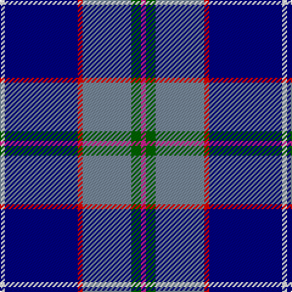

In pattern [RGBRBW](/stripes/rgbrbw/).

This was sourced from register-of-tartans.  It is a [6 stripe tartan](/stripes/stripes6/).

Original link https://www.tartanregister.gov.uk/tartanDetails.aspx?ref=10127

## Register references

External register numbers recorded for this tartan.

- Scottish Register of Tartans: [10127](https://www.tartanregister.gov.uk/tartanDetails.aspx?ref=10127)

## Thread count
W/4 DB60 R4 N40 G8 LR/4

## Palette
Each colour and its ΔE from the base-6 reference it is a variant of.

| Colour | Shade | Base | ΔE (OKLab) |
|---|---|---|---|
| DB | <code style="background-color:#000080;">#000080</code> `#000080` | B <code style="background-color:#2A418A;">#2A418A</code> | 0.14 |
| G | <code style="background-color:#006400;">#006400</code> `#006400` | G <code style="background-color:#006100;">#006100</code> | 0.01 |
| LR | <code style="background-color:#D02090;">#D02090</code> `#D02090` | R <code style="background-color:#CC0000;">#CC0000</code> | 0.16 |
| N | <code style="background-color:#778899;">#778899</code> `#778899` | B <code style="background-color:#2A418A;">#2A418A</code> | 0.24 |
| R | <code style="background-color:#FF0000;">#FF0000</code> `#FF0000` | R <code style="background-color:#CC0000;">#CC0000</code> | 0.11 |
| W | <code style="background-color:#FFFFFF;">#FFFFFF</code> `#FFFFFF` | W <code style="background-color:#F7F7F7;">#F7F7F7</code> | 0.02 |

# Sample pattern

## Nearest tartans

The nearest existing variants by ΔTartan distance.

1. [U.S. Forces Thurso (Military)](/setts/s7/db40r3k10lo2lr15w2lr4~x2/) — ΔT 0.82
1. [Shearer (2016)](/setts/s6/k4n4dt32r4t17w2~x2/) — ΔT 1.01
1. [Wrigglesworth (Name)](/setts/s7/db30b10lb10db5m3ly3g3~x2/) — ΔT 1.06
1. [Peterson, Oren (Name)](/setts/s6/w1db15r1o10g2lp1~x4/) — ΔT 1.19
1. [Los Angeles](/setts/s8/ly4db24t5g2db3k5t33r2~x2/) — ΔT 1.23
1. [Unidentified #23](/setts/s7/db35r2k16ly2b25w2b6~x2/) — ΔT 1.23
1. [US Forces (Thurso) Regimental Tartan Tartan Number: 549. Earliest known date: 1986 Originally listed as MacNeil, this sett was identified by Ken Dalgliesh, weaver in Selkirk, in 1999. See products available Copyright © Blair Urquhart, Comrie, 2015](/setts/s7/db35r2k16ly2t25w2t6~x2/) — ΔT 1.24
1. [Isle of Harris (District)](/setts/s6/t3k2g2k1db10w1~x8/) — ΔT 1.25
1. [Aberdeen Academy of Performing Arts](/setts/s6/db4p2dp3db24b24w3~x2/) — ΔT 1.27
1. [Lambert, Patrice (Personal)](/setts/s8/w1p3g6k1db12ly1db2ly1~x4/) — ΔT 1.29

## Neighbour map

Every grey dot is one of 14299 variants placed by the first two principal components of the ΔTartan feature space (44% of its variance). Red is this tartan; blue dots are its nearest — click one to open its page.

<svg viewBox="0 0 640 380" role="img" style="max-width:100%;height:auto;border:1px solid #e0e0e0;border-radius:4px;display:block" xmlns="http://www.w3.org/2000/svg"><image href="/nn/cloud.v1.png" width="640" height="380"/><a href="/setts/s7/db40r3k10lo2lr15w2lr4~x2/"><circle cx="259.8" cy="120.5" r="4" fill="#3465a4"><title>U.S. Forces Thurso (Military)</title></circle></a><a href="/setts/s6/k4n4dt32r4t17w2~x2/"><circle cx="249.5" cy="150.3" r="4" fill="#3465a4"><title>Shearer (2016)</title></circle></a><a href="/setts/s7/db30b10lb10db5m3ly3g3~x2/"><circle cx="238.7" cy="159.6" r="4" fill="#3465a4"><title>Wrigglesworth (Name)</title></circle></a><a href="/setts/s6/w1db15r1o10g2lp1~x4/"><circle cx="270.1" cy="149.8" r="4" fill="#3465a4"><title>Peterson, Oren (Name)</title></circle></a><a href="/setts/s8/ly4db24t5g2db3k5t33r2~x2/"><circle cx="251.2" cy="128.4" r="4" fill="#3465a4"><title>Los Angeles</title></circle></a><a href="/setts/s7/db35r2k16ly2b25w2b6~x2/"><circle cx="177.9" cy="138.7" r="4" fill="#3465a4"><title>Unidentified #23</title></circle></a><a href="/setts/s7/db35r2k16ly2t25w2t6~x2/"><circle cx="198.9" cy="146.7" r="4" fill="#3465a4"><title>US Forces (Thurso) Regimental Tartan Tartan Number: 549. Earliest known date: 1986 Originally listed as MacNeil, this sett was identified by Ken Dalgliesh, weaver in Selkirk, in 1999. See products available Copyright © Blair Urquhart, Comrie, 2015</title></circle></a><a href="/setts/s6/t3k2g2k1db10w1~x8/"><circle cx="243.4" cy="184.7" r="4" fill="#3465a4"><title>Isle of Harris (District)</title></circle></a><a href="/setts/s6/db4p2dp3db24b24w3~x2/"><circle cx="264.6" cy="188.0" r="4" fill="#3465a4"><title>Aberdeen Academy of Performing Arts</title></circle></a><a href="/setts/s8/w1p3g6k1db12ly1db2ly1~x4/"><circle cx="203.3" cy="133.0" r="4" fill="#3465a4"><title>Lambert, Patrice (Personal)</title></circle></a><circle cx="246.2" cy="144.0" r="5" fill="#c00000"/></svg>

ID: /setts/s6/m1g2t10r1db15w1~x4/
