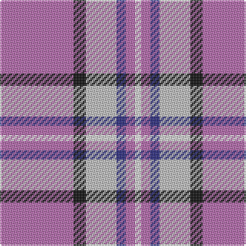

**Bands:** [RKWBRW](/stripes/rkwbrw/) · **Stripes:** [M K LB DB M W](/stripes/stripes6/) M K LB DB M W

This was sourced from tartans-authority.  It is a [6 band tartan](/bands/bands6/).

Original link http://www.tartansauthority.com/tartan-ferret/display/3856/

## Thread count
P/48 K8 N20 DB6 P6 W/4

## Palette
Each colour and its ΔE from the base-6 reference it is a variant of.

| Colour | Shade | Base | ΔE (OKLab) |
|---|---|---|---|
| DB | <code style="background-color:#2C2C80;">#2C2C80</code> `#2C2C80` | B <code style="background-color:#2A418A;">#2A418A</code> | 0.06 |
| K | <code style="background-color:#101010;">#101010</code> `#101010` | K <code style="background-color:#000000;">#000000</code> | 0.17 |
| N | <code style="background-color:#C0C0C0;">#C0C0C0</code> `#C0C0C0` | W <code style="background-color:#F7F7F7;">#F7F7F7</code> | 0.17 |
| P | <code style="background-color:#B468AC;">#B468AC</code> `#B468AC` | R <code style="background-color:#CC0000;">#CC0000</code> | 0.21 |
| W | <code style="background-color:#FCFCFC;">#FCFCFC</code> `#FCFCFC` | W <code style="background-color:#F7F7F7;">#F7F7F7</code> | 0.01 |

# Sample pattern

## Nearest tartans

The nearest existing variants by ΔTartan distance.

1. [St. Andrew's Links Dress (Corporate)](/setts/s7/lr30lp4lr3dp2r2dp24w2~x2/) — ΔT 1.00
1. [Cramer (Personal)](/setts/s6/dp24k4lb10db3dp3w2~x2/) — ΔT 1.43
1. [Tartan Lassie (Fashion)](/setts/s6/w3b23lr44b26g4ly2~x2/) — ΔT 1.45
1. [Unnamed C21st (Lady's Jacket) (Fash)](/setts/s7/m3dg8m3db8m20w2m2~x4/) — ΔT 1.52
1. [Loughborough Sport](/setts/s7/r15n3w10n7dp40w3dp6~x2/) — ΔT 1.57
1. [Ayllu Thuban](/setts/s5/p46k6g9ly9r4/) — ΔT 1.64
1. [Prehospital EMS (Corporate)](/setts/s5/k1w7lo7b16ly1~x4/) — ΔT 1.65
1. [MacPherson Dress Purple](/setts/s7/w5k3w31dp26w4dp10t4~x2/) — ΔT 1.67
1. [MacPherson, dress (purple)](/setts/s7/w5k3w31p26w4p10t4~x2/) — ΔT 1.71
1. [Longniddry Dress (Dance)](/setts/s8/dp42lb2w2lb2dp5t12w32dp4~x2/) — ΔT 1.78

## Neighbour map

Every grey dot is one of 14313 variants placed by the first two principal components of the ΔTartan feature space (44% of its variance). Red is this tartan; blue dots are its nearest — click one to open its page.

<svg viewBox="0 0 640 380" role="img" style="max-width:100%;height:auto;border:1px solid #e0e0e0;border-radius:4px;display:block" xmlns="http://www.w3.org/2000/svg"><image href="/nn/cloud.v1.png" width="640" height="380"/><a href="/setts/s7/lr30lp4lr3dp2r2dp24w2~x2/"><circle cx="284.1" cy="130.1" r="4" fill="#3465a4"><title>St. Andrew's Links Dress (Corporate)</title></circle></a><a href="/setts/s6/dp24k4lb10db3dp3w2~x2/"><circle cx="299.3" cy="156.0" r="4" fill="#3465a4"><title>Cramer (Personal)</title></circle></a><a href="/setts/s6/w3b23lr44b26g4ly2~x2/"><circle cx="290.9" cy="148.9" r="4" fill="#3465a4"><title>Tartan Lassie (Fashion)</title></circle></a><a href="/setts/s7/m3dg8m3db8m20w2m2~x4/"><circle cx="334.7" cy="185.3" r="4" fill="#3465a4"><title>Unnamed C21st (Lady's Jacket) (Fash)</title></circle></a><a href="/setts/s7/r15n3w10n7dp40w3dp6~x2/"><circle cx="291.9" cy="154.3" r="4" fill="#3465a4"><title>Loughborough Sport</title></circle></a><a href="/setts/s5/p46k6g9ly9r4/"><circle cx="310.0" cy="157.3" r="4" fill="#3465a4"><title>Ayllu Thuban</title></circle></a><a href="/setts/s5/k1w7lo7b16ly1~x4/"><circle cx="237.7" cy="163.3" r="4" fill="#3465a4"><title>Prehospital EMS (Corporate)</title></circle></a><a href="/setts/s7/w5k3w31dp26w4dp10t4~x2/"><circle cx="251.9" cy="164.4" r="4" fill="#3465a4"><title>MacPherson Dress Purple</title></circle></a><a href="/setts/s7/w5k3w31p26w4p10t4~x2/"><circle cx="250.6" cy="163.3" r="4" fill="#3465a4"><title>MacPherson, dress (purple)</title></circle></a><a href="/setts/s8/dp42lb2w2lb2dp5t12w32dp4~x2/"><circle cx="293.3" cy="121.9" r="4" fill="#3465a4"><title>Longniddry Dress (Dance)</title></circle></a><circle cx="308.4" cy="159.0" r="5" fill="#c00000"/></svg>

ID: /setts/s6/m24k4lb10db3m3w2~x2/
