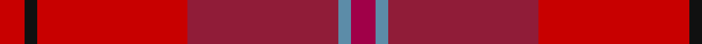
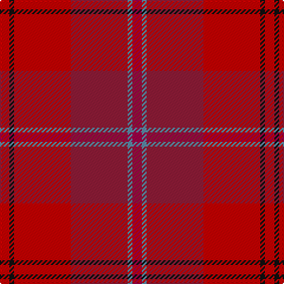

**Bands:** [RBRRKR](/stripes/rbrrkr/) · **Stripes:** [M T R R K R](/stripes/stripes6/) M T R R K R

This was sourced from tartans-authority.  It is a [6 band tartan](/bands/bands6/).

Original link http://www.tartansauthority.com/tartan-ferret/display/4001/

## Thread count
R/8 K4 R48 DR48 B4 Ra/8

## Palette
Each colour and its ΔE from the base-6 reference it is a variant of.

| Colour | Shade | Base | ΔE (OKLab) |
|---|---|---|---|
| B | <code style="background-color:#5C8CA8;">#5C8CA8</code> `#5C8CA8` | B <code style="background-color:#2A418A;">#2A418A</code> | 0.23 |
| DR | <code style="background-color:#901C38;">#901C38</code> `#901C38` | R <code style="background-color:#CC0000;">#CC0000</code> | 0.13 |
| K | <code style="background-color:#101010;">#101010</code> `#101010` | K <code style="background-color:#000000;">#000000</code> | 0.17 |
| R | <code style="background-color:#C80000;">#C80000</code> `#C80000` | R <code style="background-color:#CC0000;">#CC0000</code> | 0.01 |
| Ra | <code style="background-color:#A00048;">#A00048</code> `#A00048` | R <code style="background-color:#CC0000;">#CC0000</code> | 0.12 |

# Sample pattern

## Nearest tartans

The nearest existing variants by ΔTartan distance.

1. [Grelloch](/setts/s10/r2k1r12r12t1m2t1r12r12k1~x4/) — ΔT 1.12
1. [MacNab (Smith)](/setts/s5/m24g1t1g2r24~x4/) — ΔT 1.51
1. [MacNab 4](/setts/s5/r24g2t1g1r24~x2/) — ΔT 1.53
1. [Tune Hotels](/setts/s9/r3r18r6r15r4r3r4r7w2~x2/) — ΔT 2.29
1. [Hyland Day (Personal)](/setts/s8/lo3do2dy29do6dy4r26dy2r3~x2/) — ΔT 2.39
1. [MacNab WI 1](/setts/s5/dr24dg1b1dg2r24~x2/) — ΔT 2.45
1. [Tune Hotels Corporate Tartan Tartan Number: 10742. Earliest known date: 04/09/2012 The Tune Hotels tartan was commissioned in 2012 to celebrate the launch of the first Tune Hotel in Scotland. Founded by prominent Malaysian entrepreneur, Tony Fernandes, Tune Hotels is a value hotel brand providing high quality, affordably priced accommodation. With hotels located across Southeast Asia and the United Kingdom and new hotels opening in areas such as Australia, China and India, this initial Scottish addition marks an important new stage in the company’s growth. As the first Scottish Tune Hotel will be based in Edinburgh, the City of Edinburgh Tartan presented itself as a great starting point and base sett for the new design. A simple but bold colour palette of tonal reds and white not only creates a striking appearance but also reflects the clean and contemporary feel of the brand’s identity. See products available Copyright © Blair Urquhart, Comrie, 2015](/setts/s9/r3r18r6r15r4r3r4r7k2~x2/) — ΔT 2.46
1. [Stirling of Keir (Clan)](/setts/s4/g1dr10r10g1~x6/) — ΔT 2.48
1. [Redwoods](/setts/s9/y4r18dy2r2dy5k2dy15r1y4~x2/) — ΔT 2.57
1. [MacNab - 1800 (Portrait)](/setts/s5/r96g3lb3g6r95/) — ΔT 2.59

## Neighbour map

Every grey dot is one of 14313 variants placed by the first two principal components of the ΔTartan feature space (44% of its variance). Red is this tartan; blue dots are its nearest — click one to open its page.

<svg viewBox="0 0 640 380" role="img" style="max-width:100%;height:auto;border:1px solid #e0e0e0;border-radius:4px;display:block" xmlns="http://www.w3.org/2000/svg"><image href="/nn/cloud.v1.png" width="640" height="380"/><a href="/setts/s10/r2k1r12r12t1m2t1r12r12k1~x4/"><circle cx="394.9" cy="206.2" r="4" fill="#3465a4"><title>Grelloch</title></circle></a><a href="/setts/s5/m24g1t1g2r24~x4/"><circle cx="475.1" cy="218.2" r="4" fill="#3465a4"><title>MacNab (Smith)</title></circle></a><a href="/setts/s5/r24g2t1g1r24~x2/"><circle cx="473.0" cy="219.8" r="4" fill="#3465a4"><title>MacNab 4</title></circle></a><a href="/setts/s9/r3r18r6r15r4r3r4r7w2~x2/"><circle cx="349.2" cy="222.1" r="4" fill="#3465a4"><title>Tune Hotels</title></circle></a><a href="/setts/s8/lo3do2dy29do6dy4r26dy2r3~x2/"><circle cx="342.2" cy="198.5" r="4" fill="#3465a4"><title>Hyland Day (Personal)</title></circle></a><a href="/setts/s5/dr24dg1b1dg2r24~x2/"><circle cx="448.4" cy="214.5" r="4" fill="#3465a4"><title>MacNab WI 1</title></circle></a><a href="/setts/s9/r3r18r6r15r4r3r4r7k2~x2/"><circle cx="341.1" cy="219.3" r="4" fill="#3465a4"><title>Tune Hotels Corporate Tartan Tartan Number: 10742. Earliest known date: 04/09/2012 The Tune Hotels tartan was commissioned in 2012 to celebrate the launch of the first Tune Hotel in Scotland. Founded by prominent Malaysian entrepreneur, Tony Fernandes, Tune Hotels is a value hotel brand providing high quality, affordably priced accommodation. With hotels located across Southeast Asia and the United Kingdom and new hotels opening in areas such as Australia, China and India, this initial Scottish addition marks an important new stage in the company’s growth. As the first Scottish Tune Hotel will be based in Edinburgh, the City of Edinburgh Tartan presented itself as a great starting point and base sett for the new design. A simple but bold colour palette of tonal reds and white not only creates a striking appearance but also reflects the clean and contemporary feel of the brand’s identity. See products available Copyright © Blair Urquhart, Comrie, 2015</title></circle></a><a href="/setts/s4/g1dr10r10g1~x6/"><circle cx="453.3" cy="314.2" r="4" fill="#3465a4"><title>Stirling of Keir (Clan)</title></circle></a><a href="/setts/s9/y4r18dy2r2dy5k2dy15r1y4~x2/"><circle cx="412.3" cy="233.1" r="4" fill="#3465a4"><title>Redwoods</title></circle></a><a href="/setts/s5/r96g3lb3g6r95/"><circle cx="466.9" cy="183.6" r="4" fill="#3465a4"><title>MacNab - 1800 (Portrait)</title></circle></a><circle cx="410.0" cy="226.5" r="5" fill="#c00000"/></svg>

ID: /setts/s6/m2t1r12r12k1r2~x4/
