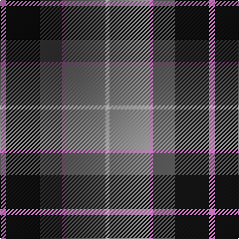

This page is one **sett** — a single exact thread-count. It belongs to the [tartan](/tartans/p3k17n11p2na20ln2/)
(the same proportion at any scale), whose colour order is pattern [RKBRRW](/stripes/rkbrrw/).

Sourced from tartans-authority.  It is a [6 stripe tartan](/stripes/stripes6/).

Original link http://www.tartansauthority.com/tartan-ferret/display/7559/

## Thread count
P/6 K34 N22 P4 Na40 LN/4

## Palette
Each colour and the base-6 reference it is a variant of.

| Colour | Shade | Base |
|---|---|---|
| K | <code style="background-color:#101010;">#101010</code> `oklch(17.3% 0.000 89.9)` <small>#101010</small> | K <code style="background-color:#000000;">#000000</code> |
| LN | <code style="background-color:#E0E0E0;">#E0E0E0</code> `oklch(90.7% 0.000 89.9)` <small>#E0E0E0</small> | W <code style="background-color:#F7F7F7;">#F7F7F7</code> |
| N | <code style="background-color:#484848;">#484848</code> `oklch(40.2% 0.000 89.9)` <small>#484848</small> | B <code style="background-color:#2A418A;">#2A418A</code> |
| Na | <code style="background-color:#888888;">#888888</code> `oklch(62.7% 0.000 89.9)` <small>#888888</small> | R <code style="background-color:#CC0000;">#CC0000</code> |
| P | <code style="background-color:#B468AC;">#B468AC</code> `oklch(62.5% 0.131 330.9)` <small>#B468AC</small> | R <code style="background-color:#CC0000;">#CC0000</code> |

# Sample pattern

## Nearest tartans

The nearest existing variants by ΔTartan distance, with this tartan at the top so the swatches line up against it.

ΔTartan

Tartan

Sett

—

<a href="/ttd/edit/#slug=m3k17n11m2o20w2~x2">Commonwealth Games Council (Corp.)</a> <a class="nn-out" href="/setts/s6/m3k17n11m2o20w2~x2/" title="open its dictionary page">↗</a>

0.73

<a href="/ttd/edit/#slug=w15y98db72r25db8ly15">Afternoon Tea / Darjeeling</a> <a class="nn-out" href="/setts/s6/w15y98db72r25db8ly15/" title="open its dictionary page">↗</a>

0.74

<a href="/ttd/edit/#slug=m15dt8y25dt72n98w15">Afternoon Tea / Black Tea</a> <a class="nn-out" href="/setts/s6/m15dt8y25dt72n98w15/" title="open its dictionary page">↗</a>

0.76

<a href="/ttd/edit/#slug=t4n19lr2k19n2lr25lb2~x2">Ritchie, Stephen James (Personal)</a> <a class="nn-out" href="/setts/s7/t4n19lr2k19n2lr25lb2~x2/" title="open its dictionary page">↗</a>

0.80

<a href="/ttd/edit/#slug=r2o8db2t4k4t1~x6">Thom(p)son's, Fancy</a> <a class="nn-out" href="/setts/s6/r2o8db2t4k4t1~x6/" title="open its dictionary page">↗</a>

0.83

<a href="/ttd/edit/#slug=db6g27db3k19dp27w3~x2">Gold Brothers</a> <a class="nn-out" href="/setts/s6/db6g27db3k19dp27w3~x2/" title="open its dictionary page">↗</a>

0.85

<a href="/ttd/edit/#slug=r10db6g24db24r6ly3">Canine All Dogs (Fashion)</a> <a class="nn-out" href="/setts/s6/r10db6g24db24r6ly3/" title="open its dictionary page">↗</a>

0.88

<a href="/ttd/edit/#slug=dg3db12w1dg12r12dg2~x2">Patterson, John (Personal)</a> <a class="nn-out" href="/setts/s6/dg3db12w1dg12r12dg2~x2/" title="open its dictionary page">↗</a>

0.89

<a href="/ttd/edit/#slug=g3db12w1dg12r12dg2~x2">Patterson, John (Personal)</a> <a class="nn-out" href="/setts/s6/g3db12w1dg12r12dg2~x2/" title="open its dictionary page">↗</a>

0.92

<a href="/ttd/edit/#slug=db30ly3dy11ly3o33r6~x2">Balfour Family Tartan Tartan Number: 683. Earliest known date: 1984 Presented by William Balfour. See products available Copyright © Blair Urquhart, Comrie, 2015</a> <a class="nn-out" href="/setts/s6/db30ly3dy11ly3o33r6~x2/" title="open its dictionary page">↗</a>

0.93

<a href="/ttd/edit/#slug=r21r3r3r3r3db19g22lt3~x2">Akins Clan (Personal)</a> <a class="nn-out" href="/setts/s8/r21r3r3r3r3db19g22lt3~x2/" title="open its dictionary page">↗</a>

## Neighbour map

Every grey dot is one of 14299 variants placed by the first two principal components of the ΔTartan feature space (44% of its variance). Red is this tartan; blue dots are its nearest — click one to open its page.

<svg viewBox="0 0 640 380" role="img" style="max-width:100%;height:auto;border:1px solid #e0e0e0;border-radius:4px;display:block" xmlns="http://www.w3.org/2000/svg"><image href="/nn/cloud.v1.png" width="640" height="380"/><a href="/setts/s6/w15y98db72r25db8ly15/"><circle cx="203.2" cy="180.3" r="4" fill="#3465a4"><title>Afternoon Tea / Darjeeling</title></circle></a><a href="/setts/s6/m15dt8y25dt72n98w15/"><circle cx="211.7" cy="182.8" r="4" fill="#3465a4"><title>Afternoon Tea / Black Tea</title></circle></a><a href="/setts/s7/t4n19lr2k19n2lr25lb2~x2/"><circle cx="175.6" cy="167.6" r="4" fill="#3465a4"><title>Ritchie, Stephen James (Personal)</title></circle></a><a href="/setts/s6/r2o8db2t4k4t1~x6/"><circle cx="135.4" cy="210.8" r="4" fill="#3465a4"><title>Thom(p)son's, Fancy</title></circle></a><a href="/setts/s6/db6g27db3k19dp27w3~x2/"><circle cx="141.0" cy="206.8" r="4" fill="#3465a4"><title>Gold Brothers</title></circle></a><a href="/setts/s6/r10db6g24db24r6ly3/"><circle cx="142.2" cy="214.1" r="4" fill="#3465a4"><title>Canine All Dogs (Fashion)</title></circle></a><a href="/setts/s6/dg3db12w1dg12r12dg2~x2/"><circle cx="163.3" cy="195.6" r="4" fill="#3465a4"><title>Patterson, John (Personal)</title></circle></a><a href="/setts/s6/g3db12w1dg12r12dg2~x2/"><circle cx="169.2" cy="199.7" r="4" fill="#3465a4"><title>Patterson, John (Personal)</title></circle></a><a href="/setts/s6/db30ly3dy11ly3o33r6~x2/"><circle cx="199.1" cy="187.5" r="4" fill="#3465a4"><title>Balfour Family Tartan Tartan Number: 683. Earliest known date: 1984 Presented by William Balfour. See products available Copyright © Blair Urquhart, Comrie, 2015</title></circle></a><a href="/setts/s8/r21r3r3r3r3db19g22lt3~x2/"><circle cx="145.6" cy="181.3" r="4" fill="#3465a4"><title>Akins Clan (Personal)</title></circle></a><circle cx="160.2" cy="191.2" r="5" fill="#c00000"/></svg>

ID: /setts/s6/m3k17n11m2o20w2~x2/
