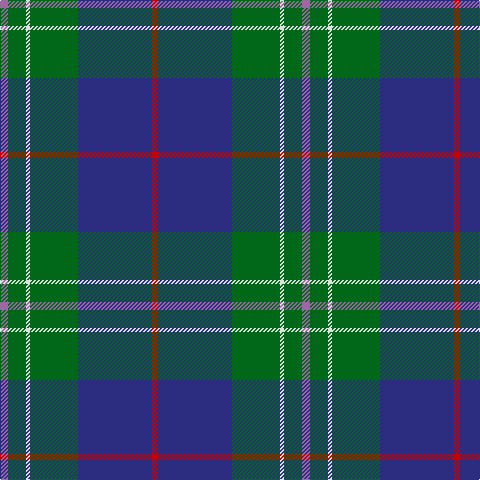

**Bands:** [RBGWGR](/stripes/rbgwgr/) · **Stripes:** [R DB G W G M](/stripes/stripes6/) R DB G W G M

This was sourced from house-of-tartan.  It is a [6 band tartan](/bands/bands6/).

Original link http://www.house-of-tartan.scotland.net/house/TartanViewjs.asp?colr=Def&tnam=3903

## Thread count
LP/8 G18 LN4 G48 DB74 R/6

## Palette
Each colour and its ΔE from the base-6 reference it is a variant of.

| Colour | Shade | Base | ΔE (OKLab) |
|---|---|---|---|
| DB | <code style="background-color:#2C2C80;">#2C2C80</code> `#2C2C80` | B <code style="background-color:#2A418A;">#2A418A</code> | 0.06 |
| G | <code style="background-color:#006818;">#006818</code> `#006818` | G <code style="background-color:#006100;">#006100</code> | 0.02 |
| LN | <code style="background-color:#E0E0E0;">#E0E0E0</code> `#E0E0E0` | W <code style="background-color:#F7F7F7;">#F7F7F7</code> | 0.07 |
| LP | <code style="background-color:#9C68A4;">#9C68A4</code> `#9C68A4` | R <code style="background-color:#CC0000;">#CC0000</code> | 0.21 |
| P | <code style="background-color:#840068;">#840068</code> `#840068` | B <code style="background-color:#2A418A;">#2A418A</code> | 0.19 |
| R | <code style="background-color:#C80000;">#C80000</code> `#C80000` | R <code style="background-color:#CC0000;">#CC0000</code> | 0.01 |

# Sample pattern

## Nearest tartans

The nearest existing variants by ΔTartan distance.

1. [Douglas Clan Tartan Tartan Number: 1032. Earliest known date: 1831 Wilson's sent a list of tartans to Logan about 1830 stating that 'No 148' had been sold as Douglas for a 'considerable' time. Logan included the Douglas tartan even though he said that no family tartans appeared in his book. The distinction between clans and families is obscure. There are many historic references to the 'Border Clans' which would certainly describe the Douglas'. There is also a black and grey sett for the clan which first appeared in the Vestiarium Scoticum in 1842. The present chiefship is vacant on account of the compound surnames of the eligible claimants. Lord Lyon will not recognise 'double barrel' names. See products available Copyright © Blair Urquhart, Comrie, 2015](/setts/s5/k3db3g23db21w2~x2/) — ΔT 1.00
1. [Dollar Academy (1999) (Corporate)](/setts/s8/w2db19k4db4k4g9db2k1~x4/) — ΔT 1.02
1. [Laurie Clan Tartan Tartan Number: 3201. Earliest known date: 2000 One of a set of three similar designs for Laurie, Lawrie and Lowry, designed by Peter MacDonald for Iain Laurie. See products available Copyright © Blair Urquhart, Comrie, 2015](/setts/s7/dp6r2dp1g25db16k2db4~x2/) — ΔT 1.03
1. [Heckenberg Htg (Personal)](/setts/s7/db3g13t1r3t1db10ly1~x2/) — ΔT 1.05
1. [Phoenix Police Honor Guard](/setts/s5/db10k3t65dg56ly6/) — ΔT 1.06
1. [Ferguson of Atholl Clan](/setts/s7/b24k8g8r2g8k1w2~x2/) — ΔT 1.07
1. [MacWilliam](/setts/s8/dy2g12k10r1b16r2b16r1~x4/) — ΔT 1.08
1. [Pride of Yorkland (Fashion)](/setts/s6/g35k3db26k4db4w3~x2/) — ΔT 1.08
1. [McFadden (Personal)](/setts/s8/db18dp2db16k13g3k2g42lo3~x2/) — ΔT 1.13
1. [Lowry](/setts/s7/dp6ly2dp1g25db16k2db4~x2/) — ΔT 1.13

## Neighbour map

Every grey dot is one of 14313 variants placed by the first two principal components of the ΔTartan feature space (44% of its variance). Red is this tartan; blue dots are its nearest — click one to open its page.

<svg viewBox="0 0 640 380" role="img" style="max-width:100%;height:auto;border:1px solid #e0e0e0;border-radius:4px;display:block" xmlns="http://www.w3.org/2000/svg"><image href="/nn/cloud.v1.png" width="640" height="380"/><a href="/setts/s5/k3db3g23db21w2~x2/"><circle cx="258.6" cy="212.6" r="4" fill="#3465a4"><title>Douglas Clan Tartan Tartan Number: 1032. Earliest known date: 1831 Wilson's sent a list of tartans to Logan about 1830 stating that 'No 148' had been sold as Douglas for a 'considerable' time. Logan included the Douglas tartan even though he said that no family tartans appeared in his book. The distinction between clans and families is obscure. There are many historic references to the 'Border Clans' which would certainly describe the Douglas'. There is also a black and grey sett for the clan which first appeared in the Vestiarium Scoticum in 1842. The present chiefship is vacant on account of the compound surnames of the eligible claimants. Lord Lyon will not recognise 'double barrel' names. See products available Copyright © Blair Urquhart, Comrie, 2015</title></circle></a><a href="/setts/s8/w2db19k4db4k4g9db2k1~x4/"><circle cx="284.2" cy="169.8" r="4" fill="#3465a4"><title>Dollar Academy (1999) (Corporate)</title></circle></a><a href="/setts/s7/dp6r2dp1g25db16k2db4~x2/"><circle cx="299.7" cy="166.2" r="4" fill="#3465a4"><title>Laurie Clan Tartan Tartan Number: 3201. Earliest known date: 2000 One of a set of three similar designs for Laurie, Lawrie and Lowry, designed by Peter MacDonald for Iain Laurie. See products available Copyright © Blair Urquhart, Comrie, 2015</title></circle></a><a href="/setts/s7/db3g13t1r3t1db10ly1~x2/"><circle cx="236.5" cy="178.7" r="4" fill="#3465a4"><title>Heckenberg Htg (Personal)</title></circle></a><a href="/setts/s5/db10k3t65dg56ly6/"><circle cx="285.2" cy="181.4" r="4" fill="#3465a4"><title>Phoenix Police Honor Guard</title></circle></a><a href="/setts/s7/b24k8g8r2g8k1w2~x2/"><circle cx="253.7" cy="157.0" r="4" fill="#3465a4"><title>Ferguson of Atholl Clan</title></circle></a><a href="/setts/s8/dy2g12k10r1b16r2b16r1~x4/"><circle cx="274.5" cy="180.8" r="4" fill="#3465a4"><title>MacWilliam</title></circle></a><a href="/setts/s6/g35k3db26k4db4w3~x2/"><circle cx="252.7" cy="188.1" r="4" fill="#3465a4"><title>Pride of Yorkland (Fashion)</title></circle></a><a href="/setts/s8/db18dp2db16k13g3k2g42lo3~x2/"><circle cx="270.5" cy="160.1" r="4" fill="#3465a4"><title>McFadden (Personal)</title></circle></a><a href="/setts/s7/dp6ly2dp1g25db16k2db4~x2/"><circle cx="304.0" cy="169.6" r="4" fill="#3465a4"><title>Lowry</title></circle></a><circle cx="299.4" cy="180.5" r="5" fill="#c00000"/></svg>

ID: /setts/s6/m4g9w2g24db37r3~x2/
