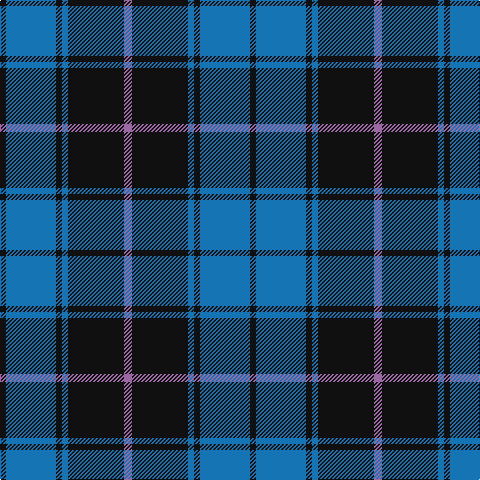

This page is one **sett** — a single exact thread-count. It belongs to the [tartan](/tartans/lp4k28b3k3b25k3/)
(the same proportion at any scale), whose colour order is pattern [KBKBKR](/stripes/kbkbkr/).

Sourced from tartans-authority.  It is a [6 stripe tartan](/stripes/stripes6/).

Original link http://www.tartansauthority.com/tartan-ferret/display/3977/

## Thread count
LP/8 K56 B6 K6 B50 K/6

## Palette
Each colour and the base-6 reference it is a variant of.

| Colour | Shade | Base |
|---|---|---|
| B | <code style="background-color:#1474B4;">#1474B4</code> `oklch(54.0% 0.129 245.1)` <small>#1474B4</small> | B <code style="background-color:#2A418A;">#2A418A</code> |
| K | <code style="background-color:#101010;">#101010</code> `oklch(17.3% 0.000 89.9)` <small>#101010</small> | K <code style="background-color:#000000;">#000000</code> |
| LP | <code style="background-color:#9C68A4;">#9C68A4</code> `oklch(59.4% 0.107 322.0)` <small>#9C68A4</small> | R <code style="background-color:#CC0000;">#CC0000</code> |

# Sample pattern

## Nearest tartans

The nearest existing variants by ΔTartan distance, with this tartan at the top so the swatches line up against it.

ΔTartan

Tartan

Sett

—

<a href="/ttd/edit/#slug=m4k28b3k3b25k3~x2">Slanj (Corporate)</a> <a class="nn-out" href="/setts/s6/m4k28b3k3b25k3~x2/" title="open its dictionary page">↗</a>

1.09

<a href="/ttd/edit/#slug=k28b3k3b25k3b25k3b3k28m4~x2">Slanj</a> <a class="nn-out" href="/setts/s10/k28b3k3b25k3b25k3b3k28m4~x2/" title="open its dictionary page">↗</a>

1.09

<a href="/ttd/edit/#slug=k10t1k2t1k4t10g1t2~x4">Martin's Own</a> <a class="nn-out" href="/setts/s8/k10t1k2t1k4t10g1t2~x4/" title="open its dictionary page">↗</a>

1.10

<a href="/ttd/edit/#slug=dt5b5dt30w4dt4b18w3dt3~x2">Salem Scottish Dancers (Corporate)</a> <a class="nn-out" href="/setts/s8/dt5b5dt30w4dt4b18w3dt3~x2/" title="open its dictionary page">↗</a>

1.21

<a href="/ttd/edit/#slug=db24g3db3g3lo2g18r2~x2">Greenways Marketing Intl (Corporate)</a> <a class="nn-out" href="/setts/s7/db24g3db3g3lo2g18r2~x2/" title="open its dictionary page">↗</a>

1.22

<a href="/ttd/edit/#slug=k4ly1k20b20k1b4~x4">Oakleigh (Corporate)</a> <a class="nn-out" href="/setts/s6/k4ly1k20b20k1b4~x4/" title="open its dictionary page">↗</a>

1.25

<a href="/ttd/edit/#slug=k10n10k60w9k7n36w6k6">Salem Scottish Dancer's Wee Bluet</a> <a class="nn-out" href="/setts/s8/k10n10k60w9k7n36w6k6/" title="open its dictionary page">↗</a>

1.29

<a href="/ttd/edit/#slug=k51g5r15g37k17r6g7~x2">Cadence Design Systems (Corporate)</a> <a class="nn-out" href="/setts/s7/k51g5r15g37k17r6g7~x2/" title="open its dictionary page">↗</a>

1.30

<a href="/ttd/edit/#slug=db51dg5r15dg37db17r6dg5~x2">Cadence</a> <a class="nn-out" href="/setts/s7/db51dg5r15dg37db17r6dg5~x2/" title="open its dictionary page">↗</a>

1.31

<a href="/ttd/edit/#slug=k9n3k28n25w2~x2">Press &amp; Journal</a> <a class="nn-out" href="/setts/s5/k9n3k28n25w2~x2/" title="open its dictionary page">↗</a>

1.38

<a href="/ttd/edit/#slug=r2g3db2g14db14lr2~x2">Irving of Bonshaw Tower (Personal)</a> <a class="nn-out" href="/setts/s6/r2g3db2g14db14lr2~x2/" title="open its dictionary page">↗</a>

## Neighbour map

Every grey dot is one of 14299 variants placed by the first two principal components of the ΔTartan feature space (44% of its variance). Red is this tartan; blue dots are its nearest — click one to open its page.

<svg viewBox="0 0 640 380" role="img" style="max-width:100%;height:auto;border:1px solid #e0e0e0;border-radius:4px;display:block" xmlns="http://www.w3.org/2000/svg"><image href="/nn/cloud.v1.png" width="640" height="380"/><a href="/setts/s10/k28b3k3b25k3b25k3b3k28m4~x2/"><circle cx="317.8" cy="213.7" r="4" fill="#3465a4"><title>Slanj</title></circle></a><a href="/setts/s8/k10t1k2t1k4t10g1t2~x4/"><circle cx="310.1" cy="208.0" r="4" fill="#3465a4"><title>Martin's Own</title></circle></a><a href="/setts/s8/dt5b5dt30w4dt4b18w3dt3~x2/"><circle cx="329.2" cy="203.2" r="4" fill="#3465a4"><title>Salem Scottish Dancers (Corporate)</title></circle></a><a href="/setts/s7/db24g3db3g3lo2g18r2~x2/"><circle cx="312.4" cy="196.9" r="4" fill="#3465a4"><title>Greenways Marketing Intl (Corporate)</title></circle></a><a href="/setts/s6/k4ly1k20b20k1b4~x4/"><circle cx="353.1" cy="199.9" r="4" fill="#3465a4"><title>Oakleigh (Corporate)</title></circle></a><a href="/setts/s8/k10n10k60w9k7n36w6k6/"><circle cx="316.2" cy="203.3" r="4" fill="#3465a4"><title>Salem Scottish Dancer's Wee Bluet</title></circle></a><a href="/setts/s7/k51g5r15g37k17r6g7~x2/"><circle cx="279.2" cy="226.8" r="4" fill="#3465a4"><title>Cadence Design Systems (Corporate)</title></circle></a><a href="/setts/s7/db51dg5r15dg37db17r6dg5~x2/"><circle cx="311.2" cy="239.5" r="4" fill="#3465a4"><title>Cadence</title></circle></a><a href="/setts/s5/k9n3k28n25w2~x2/"><circle cx="370.8" cy="241.7" r="4" fill="#3465a4"><title>Press &amp; Journal</title></circle></a><a href="/setts/s6/r2g3db2g14db14lr2~x2/"><circle cx="256.3" cy="230.2" r="4" fill="#3465a4"><title>Irving of Bonshaw Tower (Personal)</title></circle></a><circle cx="323.6" cy="227.2" r="5" fill="#c00000"/></svg>

ID: /setts/s6/m4k28b3k3b25k3~x2/
