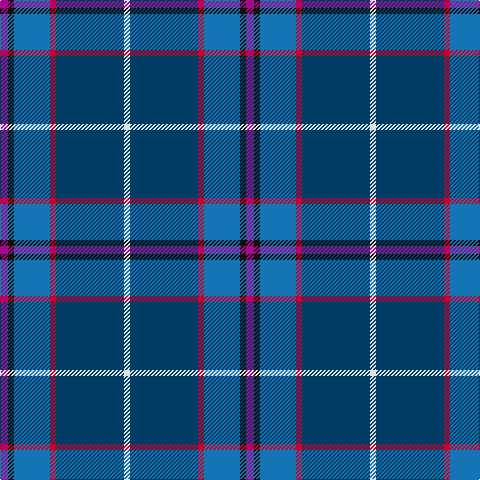

**Bands:** [RKBRBW](/stripes/rkbrbw/) · **Stripes:** [M K B R DT W](/stripes/stripes6/) M K B R DT W

This was sourced from tartans-authority.  It is a [6 band tartan](/bands/bands6/).

Original link http://www.tartansauthority.com/tartan-ferret/display/10319/

## Thread count
P/8 K6 B36 R6 DB68 LN/6

## Palette
Each colour and its ΔE from the base-6 reference it is a variant of.

| Colour | Shade | Base | ΔE (OKLab) |
|---|---|---|---|
| B | <code style="background-color:#1474B4;">#1474B4</code> `#1474B4` | B <code style="background-color:#2A418A;">#2A418A</code> | 0.15 |
| DB | <code style="background-color:#003C64;">#003C64</code> `#003C64` | B <code style="background-color:#2A418A;">#2A418A</code> | 0.08 |
| K | <code style="background-color:#101010;">#101010</code> `#101010` | K <code style="background-color:#000000;">#000000</code> | 0.17 |
| LN | <code style="background-color:#E0E0E0;">#E0E0E0</code> `#E0E0E0` | W <code style="background-color:#F7F7F7;">#F7F7F7</code> | 0.07 |
| P | <code style="background-color:#A8088C;">#A8088C</code> `#A8088C` | R <code style="background-color:#CC0000;">#CC0000</code> | 0.19 |
| R | <code style="background-color:#C8002C;">#C8002C</code> `#C8002C` | R <code style="background-color:#CC0000;">#CC0000</code> | 0.03 |

# Sample pattern

## Nearest tartans

The nearest existing variants by ΔTartan distance.

1. [Wrigglesworth Family Canada (Personal)](/setts/s7/db30n10y10db5r3ly3g3~x2/) — ΔT 0.88
1. [Blue Ridge Highlands Heritage](/setts/s8/t27db9lb3g6db33lb3dr3ly2~x2/) — ΔT 0.97
1. [Spirit of Fife (Corporate)](/setts/s8/dg10w2dt3g2m14dt26dg2dt6~x2/) — ΔT 0.99
1. [Peterson, Oren (Name)](/setts/s6/w1db15r1o10g2lp1~x4/) — ΔT 1.03
1. [Ferster, James Carney (Personal)](/setts/s6/b12dt35lb4w3k11r5~x2/) — ΔT 1.10
1. [Shearer (2016)](/setts/s6/k4n4dt32r4t17w2~x2/) — ΔT 1.18
1. [Kansai St Andrews Society](/setts/s10/db30w2r3w2db14lr3dg14db18r2db3~x2/) — ΔT 1.22
1. [Aberdeen Academy of Performing Arts](/setts/s6/db4p2dp3db24b24w3~x2/) — ΔT 1.24
1. [Pride of the Nation (Fashion)](/setts/s8/t12db6t50db39p12dp6p6w4/) — ΔT 1.25
1. [Wrigglesworth (Name)](/setts/s7/db30b10lb10db5m3ly3g3~x2/) — ΔT 1.25

## Neighbour map

Every grey dot is one of 14299 variants placed by the first two principal components of the ΔTartan feature space (44% of its variance). Red is this tartan; blue dots are its nearest — click one to open its page.

<svg viewBox="0 0 640 380" role="img" style="max-width:100%;height:auto;border:1px solid #e0e0e0;border-radius:4px;display:block" xmlns="http://www.w3.org/2000/svg"><image href="/nn/cloud.v1.png" width="640" height="380"/><a href="/setts/s7/db30n10y10db5r3ly3g3~x2/"><circle cx="275.5" cy="181.3" r="4" fill="#3465a4"><title>Wrigglesworth Family Canada (Personal)</title></circle></a><a href="/setts/s8/t27db9lb3g6db33lb3dr3ly2~x2/"><circle cx="263.6" cy="146.0" r="4" fill="#3465a4"><title>Blue Ridge Highlands Heritage</title></circle></a><a href="/setts/s8/dg10w2dt3g2m14dt26dg2dt6~x2/"><circle cx="252.4" cy="167.7" r="4" fill="#3465a4"><title>Spirit of Fife (Corporate)</title></circle></a><a href="/setts/s6/w1db15r1o10g2lp1~x4/"><circle cx="270.1" cy="149.8" r="4" fill="#3465a4"><title>Peterson, Oren (Name)</title></circle></a><a href="/setts/s6/b12dt35lb4w3k11r5~x2/"><circle cx="220.4" cy="172.6" r="4" fill="#3465a4"><title>Ferster, James Carney (Personal)</title></circle></a><a href="/setts/s6/k4n4dt32r4t17w2~x2/"><circle cx="249.5" cy="150.3" r="4" fill="#3465a4"><title>Shearer (2016)</title></circle></a><a href="/setts/s10/db30w2r3w2db14lr3dg14db18r2db3~x2/"><circle cx="282.6" cy="148.6" r="4" fill="#3465a4"><title>Kansai St Andrews Society</title></circle></a><a href="/setts/s6/db4p2dp3db24b24w3~x2/"><circle cx="264.6" cy="188.0" r="4" fill="#3465a4"><title>Aberdeen Academy of Performing Arts</title></circle></a><a href="/setts/s8/t12db6t50db39p12dp6p6w4/"><circle cx="217.4" cy="153.1" r="4" fill="#3465a4"><title>Pride of the Nation (Fashion)</title></circle></a><a href="/setts/s7/db30b10lb10db5m3ly3g3~x2/"><circle cx="238.7" cy="159.6" r="4" fill="#3465a4"><title>Wrigglesworth (Name)</title></circle></a><circle cx="276.1" cy="175.6" r="5" fill="#c00000"/></svg>

ID: /setts/s6/m4k3b18r3dt34w3~x2/
