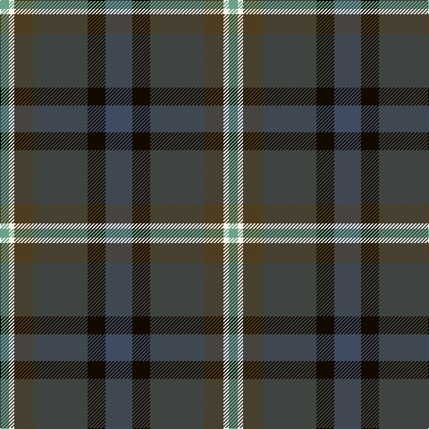

**Bands:** [BKBGWY](/stripes/bkbgwy/) · **Stripes:** [N K DT DY W LG](/stripes/stripes6/) N K DT DY W LG

This was sourced from house-of-tartan.  It is a [6 band tartan](/bands/bands6/).

Original link http://www.house-of-tartan.scotland.net/house/TartanViewjs.asp?colr=Def&tnam=10708

## Thread count
LG/10 W6 T22 N60 K20 Na/30

## Palette
Each colour and its ΔE from the base-6 reference it is a variant of.

| Colour | Shade | Base | ΔE (OKLab) |
|---|---|---|---|
| K | <code style="background-color:#120A01;">#120A01</code> `#120A01` | K <code style="background-color:#000000;">#000000</code> | 0.15 |
| LG | <code style="background-color:#6AA28C;">#6AA28C</code> `#6AA28C` | Y <code style="background-color:#F2BF00;">#F2BF00</code> | 0.23 |
| N | <code style="background-color:#3F4441;">#3F4441</code> `#3F4441` | B <code style="background-color:#2A418A;">#2A418A</code> | 0.13 |
| Na | <code style="background-color:#3F4B60;">#3F4B60</code> `#3F4B60` | B <code style="background-color:#2A418A;">#2A418A</code> | 0.09 |
| T | <code style="background-color:#4E3D20;">#4E3D20</code> `#4E3D20` | G <code style="background-color:#006100;">#006100</code> | 0.14 |
| W | <code style="background-color:#F7F1E8;">#F7F1E8</code> `#F7F1E8` | W <code style="background-color:#F7F7F7;">#F7F7F7</code> | 0.02 |

# Sample pattern

## Nearest tartans

The nearest existing variants by ΔTartan distance.

1. [Meeson Hunting](/setts/s6/k26n10dt19r6ly2db9~x2/) — ΔT 1.16
1. [Waterford, County (District)](/setts/s6/dg24lo2y16db7do16r5~x2/) — ΔT 1.17
1. [Haughfoot (Commemorative)](/setts/s6/r4k15t4dt15dg24y4~x2/) — ΔT 1.20
1. [Staley (2014)](/setts/s6/db9w2dg25do10k15dp4~x2/) — ΔT 1.21
1. [Cowie](/setts/s6/r3dt24k7db11g11ly2~x2/) — ΔT 1.26
1. [Blairmore House (Corporate)](/setts/s8/db17lb2db2r2db2do12dg16lo3~x4/) — ΔT 1.41
1. [Haut Family (by Dundee)](/setts/s6/dt46dp15k12n8g8dp8~x2/) — ΔT 1.45
1. [Lyle and Scott](/setts/s6/dg5b2dg9dt19r9ly2~x2/) — ΔT 1.46
1. [Patel Name Tartan Tartan Number: 10924. Earliest known date: 2013 Designed for the Patel family using colours associated with the Gujarat, a state in the North-West coast of India known locally as Jewel of the West. See products available Copyright © Blair Urquhart, Comrie, 2015](/setts/s9/dg3lo2o10dg10db20dg12r3db10w2~x2/) — ΔT 1.47
1. [Vass (Personal)](/setts/s5/db6w1dy6dy12r2~x4/) — ΔT 1.49

## Neighbour map

Every grey dot is one of 14313 variants placed by the first two principal components of the ΔTartan feature space (44% of its variance). Red is this tartan; blue dots are its nearest — click one to open its page.

<svg viewBox="0 0 640 380" role="img" style="max-width:100%;height:auto;border:1px solid #e0e0e0;border-radius:4px;display:block" xmlns="http://www.w3.org/2000/svg"><image href="/nn/cloud.v1.png" width="640" height="380"/><a href="/setts/s6/k26n10dt19r6ly2db9~x2/"><circle cx="180.9" cy="214.2" r="4" fill="#3465a4"><title>Meeson Hunting</title></circle></a><a href="/setts/s6/dg24lo2y16db7do16r5~x2/"><circle cx="181.5" cy="222.6" r="4" fill="#3465a4"><title>Waterford, County (District)</title></circle></a><a href="/setts/s6/r4k15t4dt15dg24y4~x2/"><circle cx="157.3" cy="244.6" r="4" fill="#3465a4"><title>Haughfoot (Commemorative)</title></circle></a><a href="/setts/s6/db9w2dg25do10k15dp4~x2/"><circle cx="208.9" cy="228.7" r="4" fill="#3465a4"><title>Staley (2014)</title></circle></a><a href="/setts/s6/r3dt24k7db11g11ly2~x2/"><circle cx="196.9" cy="207.6" r="4" fill="#3465a4"><title>Cowie</title></circle></a><a href="/setts/s8/db17lb2db2r2db2do12dg16lo3~x4/"><circle cx="193.4" cy="198.3" r="4" fill="#3465a4"><title>Blairmore House (Corporate)</title></circle></a><a href="/setts/s6/dt46dp15k12n8g8dp8~x2/"><circle cx="240.4" cy="238.5" r="4" fill="#3465a4"><title>Haut Family (by Dundee)</title></circle></a><a href="/setts/s6/dg5b2dg9dt19r9ly2~x2/"><circle cx="220.3" cy="225.4" r="4" fill="#3465a4"><title>Lyle and Scott</title></circle></a><a href="/setts/s9/dg3lo2o10dg10db20dg12r3db10w2~x2/"><circle cx="220.0" cy="209.9" r="4" fill="#3465a4"><title>Patel Name Tartan Tartan Number: 10924. Earliest known date: 2013 Designed for the Patel family using colours associated with the Gujarat, a state in the North-West coast of India known locally as Jewel of the West. See products available Copyright © Blair Urquhart, Comrie, 2015</title></circle></a><a href="/setts/s5/db6w1dy6dy12r2~x4/"><circle cx="252.8" cy="234.5" r="4" fill="#3465a4"><title>Vass (Personal)</title></circle></a><circle cx="192.4" cy="219.6" r="5" fill="#c00000"/></svg>

ID: /setts/s6/n15k10dt30dy11w3lg5~x2/
