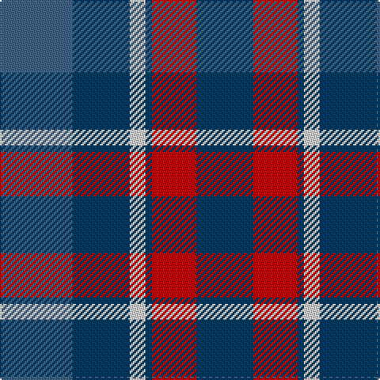

In pattern [BBWBRB](/stripes/bbwbrb/).

This was sourced from register-of-tartans.  It is a [6 stripe tartan](/stripes/stripes6/).

Original link https://www.tartanregister.gov.uk/tartanDetails.aspx?ref=10376

## Register references

External register numbers recorded for this tartan.

- Scottish Register of Tartans: [10376](https://www.tartanregister.gov.uk/tartanDetails.aspx?ref=10376)

## Thread count
Ba/46 DB36 LN10 DB4 R28 DB/36

## Palette
Each colour and the base-6 reference it is a variant of.

| Colour | Shade | Base |
|---|---|---|
| B | <code style="background-color:#5C8CA8;">#5C8CA8</code> `oklch(61.7% 0.067 235.0)` <small>#5C8CA8</small> | B <code style="background-color:#2A418A;">#2A418A</code> |
| Ba | <code style="background-color:#406488;">#406488</code> `oklch(49.2% 0.071 249.5)` <small>#406488</small> | B <code style="background-color:#2A418A;">#2A418A</code> |
| DB | <code style="background-color:#003C64;">#003C64</code> `oklch(34.5% 0.089 246.0)` <small>#003C64</small> | B <code style="background-color:#2A418A;">#2A418A</code> |
| DR | <code style="background-color:#780028;">#780028</code> `oklch(36.5% 0.146 12.8)` <small>#780028</small> | R <code style="background-color:#CC0000;">#CC0000</code> |
| LN | <code style="background-color:#E0E0E0;">#E0E0E0</code> `oklch(90.7% 0.000 89.9)` <small>#E0E0E0</small> | W <code style="background-color:#F7F7F7;">#F7F7F7</code> |
| R | <code style="background-color:#C80000;">#C80000</code> `oklch(52.3% 0.215 29.2)` <small>#C80000</small> | R <code style="background-color:#CC0000;">#CC0000</code> |

# Sample pattern

## Nearest tartans

The nearest existing variants by ΔTartan distance.

1. [Pitt (Name)](/setts/s6/b23dt18w5dt2r14dt18~x2/) — ΔT 0.75
1. [Donnolly](/setts/s6/db3g21db3o21db35w3~x2/) — ΔT 1.27
1. [Joker Fancy Tartan Tartan Number: 6769. Earliest known date: 2005 I have a photo of a fabric swatch that I am trying to match as close as possible. I have been commissioned to make a life size mannequin of Jack Nicholson as the Joker and he wore plaid/tartan pants. I could send you some photos through email and possibly you could help me. Thanks, Andy Garringer USA, January 2008. (96 threads @ 40 epi heavyweight = 2.5 inch repeat) See products available Copyright © Blair Urquhart, Comrie, 2015](/setts/s6/b11k1b3k5dp9lo1~x2/) — ΔT 1.30
1. [Granger (Personal)](/setts/s6/db40k4db12k21g27w4~x2/) — ΔT 1.30
1. [Unidentified (Sock Tie)](/setts/s5/db27o9w3dy16r7~x2/) — ΔT 1.31
1. [Bethlehem, City of](/setts/s5/dg3r1dg9o10db3~x4/) — ΔT 1.35
1. [Bareback (Corporate)](/setts/s6/n6k6n21k16db36ly4/) — ΔT 1.35
1. [Tilburg (District)](/setts/s5/db9ly9db9t23r3~x2/) — ΔT 1.35
1. [Newall (Dumbarton) (Personal)](/setts/s7/t30dp15w4dg12w9t8w3~x2/) — ΔT 1.44
1. [Hebrides #8](/setts/s8/db7r3g7r1g7r3db7t1~x2/) — ΔT 1.45

## Neighbour map

Every grey dot is one of 14299 variants placed by the first two principal components of the ΔTartan feature space (44% of its variance). Red is this tartan; blue dots are its nearest — click one to open its page.

<svg viewBox="0 0 640 380" role="img" style="max-width:100%;height:auto;border:1px solid #e0e0e0;border-radius:4px;display:block" xmlns="http://www.w3.org/2000/svg"><image href="/nn/cloud.v1.png" width="640" height="380"/><a href="/setts/s6/b23dt18w5dt2r14dt18~x2/"><circle cx="223.8" cy="233.8" r="4" fill="#3465a4"><title>Pitt (Name)</title></circle></a><a href="/setts/s6/db3g21db3o21db35w3~x2/"><circle cx="265.1" cy="207.2" r="4" fill="#3465a4"><title>Donnolly</title></circle></a><a href="/setts/s6/b11k1b3k5dp9lo1~x2/"><circle cx="263.8" cy="228.3" r="4" fill="#3465a4"><title>Joker Fancy Tartan Tartan Number: 6769. Earliest known date: 2005 I have a photo of a fabric swatch that I am trying to match as close as possible. I have been commissioned to make a life size mannequin of Jack Nicholson as the Joker and he wore plaid/tartan pants. I could send you some photos through email and possibly you could help me. Thanks, Andy Garringer USA, January 2008. (96 threads @ 40 epi heavyweight = 2.5 inch repeat) See products available Copyright © Blair Urquhart, Comrie, 2015</title></circle></a><a href="/setts/s6/db40k4db12k21g27w4~x2/"><circle cx="253.9" cy="238.5" r="4" fill="#3465a4"><title>Granger (Personal)</title></circle></a><a href="/setts/s5/db27o9w3dy16r7~x2/"><circle cx="195.4" cy="224.4" r="4" fill="#3465a4"><title>Unidentified (Sock Tie)</title></circle></a><a href="/setts/s5/dg3r1dg9o10db3~x4/"><circle cx="256.4" cy="242.7" r="4" fill="#3465a4"><title>Bethlehem, City of</title></circle></a><a href="/setts/s6/n6k6n21k16db36ly4/"><circle cx="233.0" cy="240.3" r="4" fill="#3465a4"><title>Bareback (Corporate)</title></circle></a><a href="/setts/s5/db9ly9db9t23r3~x2/"><circle cx="194.6" cy="245.3" r="4" fill="#3465a4"><title>Tilburg (District)</title></circle></a><a href="/setts/s7/t30dp15w4dg12w9t8w3~x2/"><circle cx="214.2" cy="206.4" r="4" fill="#3465a4"><title>Newall (Dumbarton) (Personal)</title></circle></a><a href="/setts/s8/db7r3g7r1g7r3db7t1~x2/"><circle cx="193.7" cy="247.0" r="4" fill="#3465a4"><title>Hebrides #8</title></circle></a><circle cx="243.7" cy="243.1" r="5" fill="#c00000"/></svg>

ID: /setts/s6/n23dt18w5dt2r14dt18~x2/
