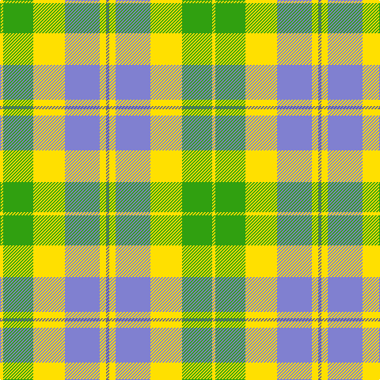

In pattern [BYBYGY](/stripes/bybygy/).

This was sourced from weddslist.  It is a [6 stripe tartan](/stripes/stripes6/).

Original link http://www.weddslist.com/cgi-bin/tartans/pg.pl?source=sts

## Thread count
Y/4 G38 Y40 B44 Y8 Ba/4

## Palette
Each colour and the base-6 reference it is a variant of.

| Colour | Shade | Base |
|---|---|---|
| B | <code style="background-color:#8080D0;">#8080D0</code> `oklch(63.4% 0.119 282.5)` <small>#8080D0</small> | B <code style="background-color:#2A418A;">#2A418A</code> |
| Ba | <code style="background-color:#606090;">#606090</code> `oklch(50.9% 0.076 283.4)` <small>#606090</small> | B <code style="background-color:#2A418A;">#2A418A</code> |
| G | <code style="background-color:#30A010;">#30A010</code> `oklch(61.9% 0.195 140.5)` <small>#30A010</small> | G <code style="background-color:#006100;">#006100</code> |
| Y | <code style="background-color:#FFE000;">#FFE000</code> `oklch(90.5% 0.188 99.1)` <small>#FFE000</small> | Y <code style="background-color:#F2BF00;">#F2BF00</code> |

# Sample pattern

## Nearest tartans

The nearest existing variants by ΔTartan distance.

1. [Aviemore, Check](/setts/s8/g2o10g11ly4o1w18g2o1~x2/) — ΔT 1.22
1. [Birnham, Blue (Dance)](/setts/s6/k3w25g16w3n25w3~x2/) — ΔT 1.45
1. [Lake Ainslie Heritage](/setts/s7/lb8w16g18r2ly4r1lb4~x2/) — ΔT 1.46
1. [Aviemore Check](/setts/s8/g2dy10g11ly4dy1w18g2dy1~x2/) — ΔT 1.53
1. [MacDiarmid, dress](/setts/s9/w38r12w37g32k3w4k3g32r4/) — ΔT 1.65
1. [MacIntosh, dress](/setts/s6/r3w8db4g14r4db2~x2/) — ΔT 1.68
1. [Unidentfied (Ligioner Highland Games](/setts/s6/do4g25lo10g3lo18r4~x2/) — ΔT 1.70
1. [Supporter.com](/setts/s7/t60g9r7ly12g33ly33t26/) — ΔT 1.70
1. [Bannock Bane M.406](/setts/s8/dg4dy3dg21dy2w14o22dy3o4~x2/) — ΔT 1.70
1. [MacPherson Dress Green (Dance)](/setts/s7/w5r3w26g20w3g8ly3~x2/) — ΔT 1.70

## Neighbour map

Every grey dot is one of 14299 variants placed by the first two principal components of the ΔTartan feature space (44% of its variance). Red is this tartan; blue dots are its nearest — click one to open its page.

<svg viewBox="0 0 640 380" role="img" style="max-width:100%;height:auto;border:1px solid #e0e0e0;border-radius:4px;display:block" xmlns="http://www.w3.org/2000/svg"><image href="/nn/cloud.v1.png" width="640" height="380"/><a href="/setts/s8/g2o10g11ly4o1w18g2o1~x2/"><circle cx="201.6" cy="152.2" r="4" fill="#3465a4"><title>Aviemore, Check</title></circle></a><a href="/setts/s6/k3w25g16w3n25w3~x2/"><circle cx="180.6" cy="199.4" r="4" fill="#3465a4"><title>Birnham, Blue (Dance)</title></circle></a><a href="/setts/s7/lb8w16g18r2ly4r1lb4~x2/"><circle cx="155.8" cy="148.5" r="4" fill="#3465a4"><title>Lake Ainslie Heritage</title></circle></a><a href="/setts/s8/g2dy10g11ly4dy1w18g2dy1~x2/"><circle cx="188.0" cy="146.7" r="4" fill="#3465a4"><title>Aviemore Check</title></circle></a><a href="/setts/s9/w38r12w37g32k3w4k3g32r4/"><circle cx="224.6" cy="162.0" r="4" fill="#3465a4"><title>MacDiarmid, dress</title></circle></a><a href="/setts/s6/r3w8db4g14r4db2~x2/"><circle cx="151.1" cy="216.1" r="4" fill="#3465a4"><title>MacIntosh, dress</title></circle></a><a href="/setts/s6/do4g25lo10g3lo18r4~x2/"><circle cx="222.4" cy="205.2" r="4" fill="#3465a4"><title>Unidentfied (Ligioner Highland Games</title></circle></a><a href="/setts/s7/t60g9r7ly12g33ly33t26/"><circle cx="208.7" cy="216.5" r="4" fill="#3465a4"><title>Supporter.com</title></circle></a><a href="/setts/s8/dg4dy3dg21dy2w14o22dy3o4~x2/"><circle cx="181.0" cy="178.6" r="4" fill="#3465a4"><title>Bannock Bane M.406</title></circle></a><a href="/setts/s7/w5r3w26g20w3g8ly3~x2/"><circle cx="245.8" cy="183.0" r="4" fill="#3465a4"><title>MacPherson Dress Green (Dance)</title></circle></a><circle cx="185.8" cy="194.7" r="5" fill="#c00000"/></svg>

ID: /setts/s6/n2ly4b22ly20g19ly2~x2/
