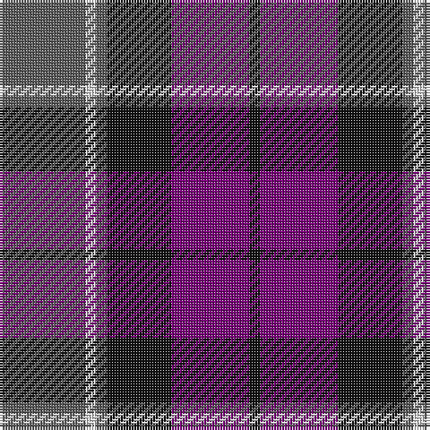

This page is one **sett** — a single exact thread-count. It belongs to the [tartan](/tartans/n32w4n4k24dp29k4/)
(the same proportion at any scale), whose colour order is pattern [BWBKBK](/stripes/bwbkbk/).

Sourced from tartans-authority.  It is a [6 stripe tartan](/stripes/stripes6/).

Original link http://www.tartansauthority.com/tartan-ferret/display/8067/

## Thread count
N/32 LN4 N4 K24 P29 K/4

## Palette

Palette: <strong>Tartan Register</strong> <small style="color:#888">(3 of 4 colours)</small>
<table><thead><tr><th>Colour</th><th>Threads</th><th>Shade</th><th>Base</th><th>OKLCh</th></tr></thead><tbody><tr><td>N/</td><td style="text-align:right;font-variant-numeric:tabular-nums">32</td><td><code style="background-color:#5C5C5C;">#5C5C5C</code> <small style="color:#888">#5C5C5C</small></td><td>B <code style="background-color:#2A418A;">#2A418A</code></td><td><small style="color:#888">oklch(47.5% 0.000 89.9)</small></td></tr><tr><td>LN</td><td style="text-align:right;font-variant-numeric:tabular-nums">4</td><td><code style="background-color:#E0E0E0;">#E0E0E0</code> <small style="color:#888">#E0E0E0</small></td><td>W <code style="background-color:#F7F7F7;">#F7F7F7</code></td><td><small style="color:#888">oklch(90.7% 0.000 89.9)</small></td></tr><tr><td>N</td><td style="text-align:right;font-variant-numeric:tabular-nums">4</td><td><code style="background-color:#5C5C5C;">#5C5C5C</code> <small style="color:#888">#5C5C5C</small></td><td>B <code style="background-color:#2A418A;">#2A418A</code></td><td><small style="color:#888">oklch(47.5% 0.000 89.9)</small></td></tr><tr><td>K</td><td style="text-align:right;font-variant-numeric:tabular-nums">24</td><td><code style="background-color:#101010;">#101010</code> <small style="color:#888">#101010</small></td><td>K <code style="background-color:#000000;">#000000</code></td><td><small style="color:#888">oklch(17.3% 0.000 89.9)</small></td></tr><tr><td>P</td><td style="text-align:right;font-variant-numeric:tabular-nums">29</td><td><code style="background-color:#780078;">#780078</code> <small style="color:#888">#780078</small></td><td>B <code style="background-color:#2A418A;">#2A418A</code></td><td><small style="color:#888">oklch(40.2% 0.185 328.4)</small></td></tr><tr><td>K/</td><td style="text-align:right;font-variant-numeric:tabular-nums">4</td><td><code style="background-color:#101010;">#101010</code> <small style="color:#888">#101010</small></td><td>K <code style="background-color:#000000;">#000000</code></td><td><small style="color:#888">oklch(17.3% 0.000 89.9)</small></td></tr></tbody></table>

# Sample pattern

## Nearest tartans

The nearest existing variants by ΔTartan distance, with this tartan at the top so the swatches line up against it.

ΔTartan

Tartan

Sett

—

<a href="/ttd/edit/#slug=n32w4n4k24dp29k4">Grammar School at Leeds (School)</a> <a class="nn-out" href="/setts/s6/n32w4n4k24dp29k4/" title="open its dictionary page">↗</a>

0.83

<a href="/ttd/edit/#slug=db1n8w1db4m8w1~x6">Little's Chauffeur Drive</a> <a class="nn-out" href="/setts/s6/db1n8w1db4m8w1~x6/" title="open its dictionary page">↗</a>

0.88

<a href="/ttd/edit/#slug=db5k1dg1k1r3k1~x4">Clerk</a> <a class="nn-out" href="/setts/s6/db5k1dg1k1r3k1~x4/" title="open its dictionary page">↗</a>

0.96

<a href="/ttd/edit/#slug=t1r6db1t3k3t1~x8">MacTavish #2</a> <a class="nn-out" href="/setts/s6/t1r6db1t3k3t1~x8/" title="open its dictionary page">↗</a>

1.02

<a href="/ttd/edit/#slug=dp3k1dp8k6dg8k1w2~x2">Baillie (Highland Society)</a> <a class="nn-out" href="/setts/s7/dp3k1dp8k6dg8k1w2~x2/" title="open its dictionary page">↗</a>

1.03

<a href="/ttd/edit/#slug=db3db1g5db3r9db1r1db2~x4">Unidentified #61</a> <a class="nn-out" href="/setts/s8/db3db1g5db3r9db1r1db2~x4/" title="open its dictionary page">↗</a>

1.15

<a href="/ttd/edit/#slug=r2b1db8b8o8b1o1~x2">Over Mountain</a> <a class="nn-out" href="/setts/s7/r2b1db8b8o8b1o1~x2/" title="open its dictionary page">↗</a>

1.16

<a href="/ttd/edit/#slug=n6k6n21k16db36ly4">Bareback (Corporate)</a> <a class="nn-out" href="/setts/s6/n6k6n21k16db36ly4/" title="open its dictionary page">↗</a>

1.18

<a href="/ttd/edit/#slug=k3dg17ly2k18dp17dg3~x2">Wilson's No.100</a> <a class="nn-out" href="/setts/s6/k3dg17ly2k18dp17dg3~x2/" title="open its dictionary page">↗</a>

1.18

<a href="/ttd/edit/#slug=db31t4db6k19r20ly4~x2">Fife (McGill)</a> <a class="nn-out" href="/setts/s6/db31t4db6k19r20ly4~x2/" title="open its dictionary page">↗</a>

1.22

<a href="/ttd/edit/#slug=db1o8w1db4r8w1~x6">Little's (Corporate)</a> <a class="nn-out" href="/setts/s6/db1o8w1db4r8w1~x6/" title="open its dictionary page">↗</a>

## Neighbour map

Every grey dot is one of 14299 variants placed by the first two principal components of the ΔTartan feature space (44% of its variance). Red is this tartan; blue dots are its nearest — click one to open its page.

<svg viewBox="0 0 640 380" role="img" style="max-width:100%;height:auto;border:1px solid #e0e0e0;border-radius:4px;display:block" xmlns="http://www.w3.org/2000/svg"><image href="/nn/cloud.v1.png" width="640" height="380"/><a href="/setts/s6/db1n8w1db4m8w1~x6/"><circle cx="208.4" cy="228.8" r="4" fill="#3465a4"><title>Little's Chauffeur Drive</title></circle></a><a href="/setts/s6/db5k1dg1k1r3k1~x4/"><circle cx="195.5" cy="242.1" r="4" fill="#3465a4"><title>Clerk</title></circle></a><a href="/setts/s6/t1r6db1t3k3t1~x8/"><circle cx="192.7" cy="234.6" r="4" fill="#3465a4"><title>MacTavish #2</title></circle></a><a href="/setts/s7/dp3k1dp8k6dg8k1w2~x2/"><circle cx="177.2" cy="225.7" r="4" fill="#3465a4"><title>Baillie (Highland Society)</title></circle></a><a href="/setts/s8/db3db1g5db3r9db1r1db2~x4/"><circle cx="217.9" cy="207.9" r="4" fill="#3465a4"><title>Unidentified #61</title></circle></a><a href="/setts/s7/r2b1db8b8o8b1o1~x2/"><circle cx="171.2" cy="206.4" r="4" fill="#3465a4"><title>Over Mountain</title></circle></a><a href="/setts/s6/n6k6n21k16db36ly4/"><circle cx="233.0" cy="240.3" r="4" fill="#3465a4"><title>Bareback (Corporate)</title></circle></a><a href="/setts/s6/k3dg17ly2k18dp17dg3~x2/"><circle cx="204.3" cy="239.3" r="4" fill="#3465a4"><title>Wilson's No.100</title></circle></a><a href="/setts/s6/db31t4db6k19r20ly4~x2/"><circle cx="188.6" cy="209.0" r="4" fill="#3465a4"><title>Fife (McGill)</title></circle></a><a href="/setts/s6/db1o8w1db4r8w1~x6/"><circle cx="183.9" cy="208.6" r="4" fill="#3465a4"><title>Little's (Corporate)</title></circle></a><circle cx="207.5" cy="228.9" r="5" fill="#c00000"/></svg>

ID: /setts/s6/n32w4n4k24dp29k4/
