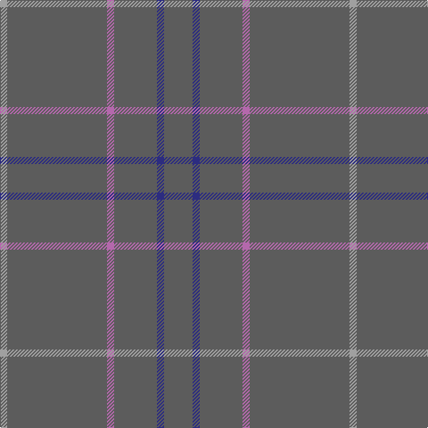

This page is one **sett** — a single exact thread-count. It belongs to the [tartan](/tartans/na4db1na6p1na14n1/)
(the same proportion at any scale), whose colour order is pattern [BBBRBY](/stripes/bbbrby/).

Sourced from register-of-tartans.  It is a [6 stripe tartan](/stripes/stripes6/).

Original link https://www.tartanregister.gov.uk/tartanDetails.aspx?ref=5543

## Register references

External register numbers recorded for this tartan.

- Scottish Register of Tartans: [5543](https://www.tartanregister.gov.uk/tartanDetails.aspx?ref=5543)
- Scottish Tartans Authority (ITI): 7503

## Thread count
Na/32 DB8 Na48 P8 Na112 N/8

## Palette
Each colour and the base-6 reference it is a variant of.

| Colour | Shade | Base |
|---|---|---|
| DB | <code style="background-color:#2C2C80;">#2C2C80</code> `oklch(35.0% 0.138 276.6)` <small>#2C2C80</small> | B <code style="background-color:#2A418A;">#2A418A</code> |
| N | <code style="background-color:#A0A0A0;">#A0A0A0</code> `oklch(70.6% 0.000 89.9)` <small>#A0A0A0</small> | Y <code style="background-color:#F2BF00;">#F2BF00</code> |
| Na | <code style="background-color:#5C5C5C;">#5C5C5C</code> `oklch(47.5% 0.000 89.9)` <small>#5C5C5C</small> | B <code style="background-color:#2A418A;">#2A418A</code> |
| P | <code style="background-color:#B468AC;">#B468AC</code> `oklch(62.5% 0.131 330.9)` <small>#B468AC</small> | R <code style="background-color:#CC0000;">#CC0000</code> |

# Sample pattern

## Nearest tartans

The nearest existing variants by ΔTartan distance, with this tartan at the top so the swatches line up against it.

ΔTartan

Tartan

Sett

—

<a href="/ttd/edit/#slug=n4db1n6m1n14lr1~x8">Torridon Tweed</a> <a class="nn-out" href="/setts/s6/n4db1n6m1n14lr1~x8/" title="open its dictionary page">↗</a>

2.61

<a href="/ttd/edit/#slug=o96db8o8w3o8g3o8r3~x2">Burnett, of Leys hunting</a> <a class="nn-out" href="/setts/s8/o96db8o8w3o8g3o8r3~x2/" title="open its dictionary page">↗</a>

2.61

<a href="/ttd/edit/#slug=o64g6o2g3o2g6o64dr2o2dr6~x2">Connacht</a> <a class="nn-out" href="/setts/s10/o64g6o2g3o2g6o64dr2o2dr6~x2/" title="open its dictionary page">↗</a>

2.73

<a href="/ttd/edit/#slug=n88dy3lo2k2k1~x2">Eternity Fashion Tartan Tartan Number: 10214. Earliest known date: 01/02/2010 This tartan was designed for day wear grey tweed jackets. It has been shown in the Dedicated to Wedding magazine (April 2010). Perfection leads to eternity is the goal for all eternal marriage. See products available Copyright © Blair Urquhart, Comrie, 2015</a> <a class="nn-out" href="/setts/s5/n88dy3lo2k2k1~x2/" title="open its dictionary page">↗</a>

2.76

<a href="/ttd/edit/#slug=r1y19w1~x2">Dunbar of Pitgaveny</a> <a class="nn-out" href="/setts/s3/r1y19w1~x2/" title="open its dictionary page">↗</a>

2.77

<a href="/ttd/edit/#slug=n88dy3lo2k2lr1~x2">Eternity (Fashion)</a> <a class="nn-out" href="/setts/s5/n88dy3lo2k2lr1~x2/" title="open its dictionary page">↗</a>

2.80

<a href="/ttd/edit/#slug=db16m4db3r1~x2">Elliot</a> <a class="nn-out" href="/setts/s4/db16m4db3r1~x2/" title="open its dictionary page">↗</a>

2.82

<a href="/ttd/edit/#slug=o19w1o19m1~x2">Dunbar of Pitgaveny</a> <a class="nn-out" href="/setts/s4/o19w1o19m1~x2/" title="open its dictionary page">↗</a>

3.04

<a href="/ttd/edit/#slug=do13k2do38k13do28k8do17k2do17k4do11">Bute Heather, Black (Fashion)</a> <a class="nn-out" href="/setts/s11/do13k2do38k13do28k8do17k2do17k4do11/" title="open its dictionary page">↗</a>

3.07

<a href="/ttd/edit/#slug=db16dr4db3r1~x6">Elliot Clan Tartan Tartan Number: 596. Earliest known date: pre 1906 The Elliot tartan was first recorded by H. Whyte in his book, 'The Tartans of the Clans and Septs of Scotland' (1906), along with many others in use at the time. The colouring is unique among traditional tartans, being described as maroon and blue. The Elliots are a 'Border Clan', founders of the Minto family. The Chiefship once belonged to to the Elliots of Redheugh but passed to the Elliots of Stobs near Hawick in Roxburghshire. The present Chief is Mrs Margaret Elliot of that Ilk. See products available Copyright © Blair Urquhart, Comrie, 2015</a> <a class="nn-out" href="/setts/s4/db16dr4db3r1~x6/" title="open its dictionary page">↗</a>

3.12

<a href="/ttd/edit/#slug=r13y3r4y56n4y4~x2">Auchairne grey</a> <a class="nn-out" href="/setts/s6/r13y3r4y56n4y4~x2/" title="open its dictionary page">↗</a>

## Neighbour map

Every grey dot is one of 14299 variants placed by the first two principal components of the ΔTartan feature space (44% of its variance). Red is this tartan; blue dots are its nearest — click one to open its page.

<svg viewBox="0 0 640 380" role="img" style="max-width:100%;height:auto;border:1px solid #e0e0e0;border-radius:4px;display:block" xmlns="http://www.w3.org/2000/svg"><image href="/nn/cloud.v1.png" width="640" height="380"/><a href="/setts/s8/o96db8o8w3o8g3o8r3~x2/"><circle cx="626.0" cy="155.4" r="4" fill="#3465a4"><title>Burnett, of Leys hunting</title></circle></a><a href="/setts/s10/o64g6o2g3o2g6o64dr2o2dr6~x2/"><circle cx="626.0" cy="189.0" r="4" fill="#3465a4"><title>Connacht</title></circle></a><a href="/setts/s5/n88dy3lo2k2k1~x2/"><circle cx="626.0" cy="176.3" r="4" fill="#3465a4"><title>Eternity Fashion Tartan Tartan Number: 10214. Earliest known date: 01/02/2010 This tartan was designed for day wear grey tweed jackets. It has been shown in the Dedicated to Wedding magazine (April 2010). Perfection leads to eternity is the goal for all eternal marriage. See products available Copyright © Blair Urquhart, Comrie, 2015</title></circle></a><a href="/setts/s3/r1y19w1~x2/"><circle cx="626.0" cy="258.2" r="4" fill="#3465a4"><title>Dunbar of Pitgaveny</title></circle></a><a href="/setts/s5/n88dy3lo2k2lr1~x2/"><circle cx="626.0" cy="193.5" r="4" fill="#3465a4"><title>Eternity (Fashion)</title></circle></a><a href="/setts/s4/db16m4db3r1~x2/"><circle cx="626.0" cy="291.2" r="4" fill="#3465a4"><title>Elliot</title></circle></a><a href="/setts/s4/o19w1o19m1~x2/"><circle cx="626.0" cy="275.8" r="4" fill="#3465a4"><title>Dunbar of Pitgaveny</title></circle></a><a href="/setts/s11/do13k2do38k13do28k8do17k2do17k4do11/"><circle cx="626.0" cy="298.2" r="4" fill="#3465a4"><title>Bute Heather, Black (Fashion)</title></circle></a><a href="/setts/s4/db16dr4db3r1~x6/"><circle cx="626.0" cy="305.3" r="4" fill="#3465a4"><title>Elliot Clan Tartan Tartan Number: 596. Earliest known date: pre 1906 The Elliot tartan was first recorded by H. Whyte in his book, 'The Tartans of the Clans and Septs of Scotland' (1906), along with many others in use at the time. The colouring is unique among traditional tartans, being described as maroon and blue. The Elliots are a 'Border Clan', founders of the Minto family. The Chiefship once belonged to to the Elliots of Redheugh but passed to the Elliots of Stobs near Hawick in Roxburghshire. The present Chief is Mrs Margaret Elliot of that Ilk. See products available Copyright © Blair Urquhart, Comrie, 2015</title></circle></a><a href="/setts/s6/r13y3r4y56n4y4~x2/"><circle cx="609.4" cy="217.6" r="4" fill="#3465a4"><title>Auchairne grey</title></circle></a><circle cx="626.0" cy="270.0" r="5" fill="#c00000"/></svg>

ID: /setts/s6/n4db1n6m1n14lr1~x8/
