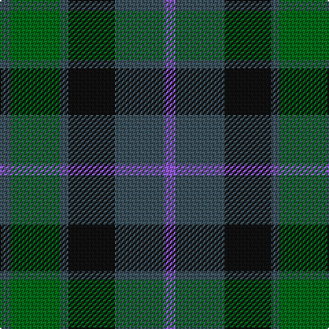

In pattern [BBKBGB](/stripes/bbkbgb/).

This was sourced from register-of-tartans.  It is a [6 stripe tartan](/stripes/stripes6/).

Original link https://www.tartanregister.gov.uk/tartanDetails.aspx?ref=3705

## Register references

External register numbers recorded for this tartan.

- Scottish Register of Tartans: [3705](https://www.tartanregister.gov.uk/tartanDetails.aspx?ref=3705)
- Scottish Tartans Authority (ITI): 2510
- Scottish Tartans World Register: 2510

## Thread count
N/8 G36 N6 K34 N36 P/8

## Palette
Each colour and its ΔE from the base-6 reference it is a variant of.

| Colour | Shade | Base | ΔE (OKLab) |
|---|---|---|---|
| G | <code style="background-color:#006818;">#006818</code> `#006818` | G <code style="background-color:#006100;">#006100</code> | 0.02 |
| K | <code style="background-color:#101010;">#101010</code> `#101010` | K <code style="background-color:#000000;">#000000</code> | 0.17 |
| N | <code style="background-color:#3C505C;">#3C505C</code> `#3C505C` | B <code style="background-color:#2A418A;">#2A418A</code> | 0.10 |
| P | <code style="background-color:#9058D8;">#9058D8</code> `#9058D8` | B <code style="background-color:#2A418A;">#2A418A</code> | 0.21 |

# Sample pattern

## Nearest tartans

The nearest existing variants by ΔTartan distance.

1. [Scottish Airports (Corporate)](/setts/s6/dp4n18k17n3g18n4~x2/) — ΔT 0.40
1. [MacKay (Bonner)](/setts/s6/dg1db5dg1k5dg6ly1~x2/) — ΔT 0.69
1. [Murray #3](/setts/s6/db2k2db12k8dg11r2~x2/) — ΔT 0.72
1. [Ferguson of Balquhidder #3](/setts/s6/k3dg12k12r2db12k3~x2/) — ΔT 0.77
1. [Callum Beg (Fashion)](/setts/s6/g1db6k6g6r1g1~x6/) — ΔT 0.84
1. [Tennant (Yules)](/setts/s7/r1dy7g7db7g7db7r1~x8/) — ΔT 0.90
1. [Graham of Montrose](/setts/s6/k4dg19k16w2db15dg4~x2/) — ΔT 0.94
1. [MacCallum](/setts/s7/g21k6t3g11k17db17k3~x2/) — ΔT 0.96
1. [Blaylock Annandale (Name)](/setts/s7/g24db6t3k6db12k15g4~x2/) — ΔT 0.96
1. [Scotsman](/setts/s7/g21k14g9db21k3db12dp3~x2/) — ΔT 0.97

## Neighbour map

Every grey dot is one of 14299 variants placed by the first two principal components of the ΔTartan feature space (44% of its variance). Red is this tartan; blue dots are its nearest — click one to open its page.

<svg viewBox="0 0 640 380" role="img" style="max-width:100%;height:auto;border:1px solid #e0e0e0;border-radius:4px;display:block" xmlns="http://www.w3.org/2000/svg"><image href="/nn/cloud.v1.png" width="640" height="380"/><a href="/setts/s6/dp4n18k17n3g18n4~x2/"><circle cx="222.8" cy="280.7" r="4" fill="#3465a4"><title>Scottish Airports (Corporate)</title></circle></a><a href="/setts/s6/dg1db5dg1k5dg6ly1~x2/"><circle cx="212.9" cy="265.6" r="4" fill="#3465a4"><title>MacKay (Bonner)</title></circle></a><a href="/setts/s6/db2k2db12k8dg11r2~x2/"><circle cx="217.4" cy="272.4" r="4" fill="#3465a4"><title>Murray #3</title></circle></a><a href="/setts/s6/k3dg12k12r2db12k3~x2/"><circle cx="225.1" cy="280.0" r="4" fill="#3465a4"><title>Ferguson of Balquhidder #3</title></circle></a><a href="/setts/s6/g1db6k6g6r1g1~x6/"><circle cx="197.7" cy="260.1" r="4" fill="#3465a4"><title>Callum Beg (Fashion)</title></circle></a><a href="/setts/s7/r1dy7g7db7g7db7r1~x8/"><circle cx="208.3" cy="280.5" r="4" fill="#3465a4"><title>Tennant (Yules)</title></circle></a><a href="/setts/s6/k4dg19k16w2db15dg4~x2/"><circle cx="222.9" cy="254.1" r="4" fill="#3465a4"><title>Graham of Montrose</title></circle></a><a href="/setts/s7/g21k6t3g11k17db17k3~x2/"><circle cx="205.9" cy="262.1" r="4" fill="#3465a4"><title>MacCallum</title></circle></a><a href="/setts/s7/g24db6t3k6db12k15g4~x2/"><circle cx="212.8" cy="248.1" r="4" fill="#3465a4"><title>Blaylock Annandale (Name)</title></circle></a><a href="/setts/s7/g21k14g9db21k3db12dp3~x2/"><circle cx="210.7" cy="268.8" r="4" fill="#3465a4"><title>Scotsman</title></circle></a><circle cx="211.4" cy="275.0" r="5" fill="#c00000"/></svg>

ID: /setts/s6/n4g18n3k17n18p4~x2/
