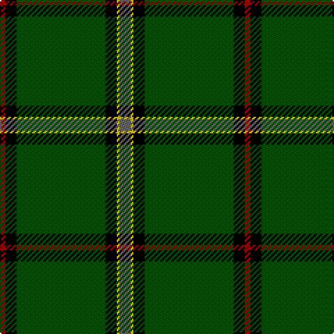

This page is one **sett** — a single exact thread-count. It belongs to the [tartan](/tartans/n4ly1k4dg32k4r2/)
(the same proportion at any scale), whose colour order is pattern [BYKGKR](/stripes/bykgkr/).

Sourced from tartans-authority.  It is a [6 stripe tartan](/stripes/stripes6/).

Original link http://www.tartansauthority.com/tartan-ferret/display/2582/

## Also known as

This cloth is also recorded under:

- Tough Personal

3 attestations — the source records this cloth was collapsed from (oldest owns this page)

<ul>
<li>1997 — Tough (Personal) (tartans-authority, <a href="http://www.tartansauthority.com/tartan-ferret/display/2582/">record</a>)</li>
<li>01/01/1998 — Tough (Personal) (register-of-tartans, <a href="https://www.tartanregister.gov.uk/tartanDetails.aspx?ref=4142">record</a>)</li>
<li>undated — Tough Personal Tartan Tartan Number: 5099. Earliest known date: 1997 A private family tartan designed in by Peter E. MacDonald in May 1997 for Kenneth Tough, Glasgow whose family came from Aberdeenshire hence the use of the Tribe of Mar tartan as a basis for this sett. The family has interests in salmon farming and grey was therefore added to show this connection. See products available Copyright © Blair Urquhart, Comrie, 2015 (house-of-tartan, <a href="http://www.house-of-tartan.scotland.net/house/TartanViewjs.asp?colr=Def&tnam=5099">record</a>)</li>
</ul>

## Register references

External register numbers recorded for this tartan.

- Scottish Register of Tartans: [4142](https://www.tartanregister.gov.uk/tartanDetails.aspx?ref=4142)
- Scottish Tartans Authority (ITI): 2582
- Scottish Tartans World Register: 2582

## Thread count
N/8 Y2 K8 G64 K8 DR/4

## Palette

Palette: <strong>Tartan Register</strong> <small style="color:#888">(3 of 5 colours)</small>
<table><thead><tr><th>Colour</th><th>Threads</th><th>Shade</th><th>Base</th><th>OKLCh</th></tr></thead><tbody><tr><td>N/</td><td style="text-align:right;font-variant-numeric:tabular-nums">8</td><td><code style="background-color:#646464;">#646464</code> <small style="color:#888">#646464</small></td><td>B <code style="background-color:#2A418A;">#2A418A</code></td><td><small style="color:#888">oklch(50.3% 0.000 89.9)</small></td></tr><tr><td>Y</td><td style="text-align:right;font-variant-numeric:tabular-nums">2</td><td><code style="background-color:#DCBC00;">#DCBC00</code> <small style="color:#888">#DCBC00</small></td><td>Y <code style="background-color:#F2BF00;">#F2BF00</code></td><td><small style="color:#888">oklch(79.9% 0.165 96.7)</small></td></tr><tr><td>K</td><td style="text-align:right;font-variant-numeric:tabular-nums">8</td><td><code style="background-color:#000000;">#000000</code> <small style="color:#888">#000000</small></td><td>K <code style="background-color:#000000;">#000000</code></td><td><small style="color:#888">oklch(0.0% 0.000 0.0)</small></td></tr><tr><td>G</td><td style="text-align:right;font-variant-numeric:tabular-nums">64</td><td><code style="background-color:#004C00;">#004C00</code> <small style="color:#888">#004C00</small></td><td>G <code style="background-color:#006100;">#006100</code></td><td><small style="color:#888">oklch(36.1% 0.123 142.5)</small></td></tr><tr><td>K</td><td style="text-align:right;font-variant-numeric:tabular-nums">8</td><td><code style="background-color:#000000;">#000000</code> <small style="color:#888">#000000</small></td><td>K <code style="background-color:#000000;">#000000</code></td><td><small style="color:#888">oklch(0.0% 0.000 0.0)</small></td></tr><tr><td>DR/</td><td style="text-align:right;font-variant-numeric:tabular-nums">4</td><td><code style="background-color:#8C0000;">#8C0000</code> <small style="color:#888">#8C0000</small></td><td>R <code style="background-color:#CC0000;">#CC0000</code></td><td><small style="color:#888">oklch(40.2% 0.165 29.2)</small></td></tr></tbody></table>

# Sample pattern

## Nearest tartans

The nearest existing variants by ΔTartan distance, with this tartan at the top so the swatches line up against it.

ΔTartan

Tartan

Sett

—

<a href="/ttd/edit/#slug=n4ly1k4dg32k4r2~x2">Tough (Personal)</a> <a class="nn-out" href="/setts/s6/n4ly1k4dg32k4r2~x2/" title="open its dictionary page">↗</a>

0.92

<a href="/ttd/edit/#slug=y5ly1k5dg46k5r3~x2">Touch</a> <a class="nn-out" href="/setts/s6/y5ly1k5dg46k5r3~x2/" title="open its dictionary page">↗</a>

1.11

<a href="/ttd/edit/#slug=r5k3r9dg56t4dg2w3">MTV</a> <a class="nn-out" href="/setts/s7/r5k3r9dg56t4dg2w3/" title="open its dictionary page">↗</a>

1.28

<a href="/ttd/edit/#slug=dg40k3w1k5r1k2ri10~x2">Aviemore Highland (Corporate)</a> <a class="nn-out" href="/setts/s7/dg40k3w1k5r1k2ri10~x2/" title="open its dictionary page">↗</a>

1.30

<a href="/ttd/edit/#slug=g10loi3w2k2g8k22g43lo4~x2">Celtic Pride</a> <a class="nn-out" href="/setts/s8/g10loi3w2k2g8k22g43lo4~x2/" title="open its dictionary page">↗</a>

1.33

<a href="/ttd/edit/#slug=db6w3r3g55k10r3~x4">Military Medical Memorial (USA)</a> <a class="nn-out" href="/setts/s6/db6w3r3g55k10r3~x4/" title="open its dictionary page">↗</a>

1.38

<a href="/ttd/edit/#slug=dr5k3dr9dg56t4dg2w3">MTV</a> <a class="nn-out" href="/setts/s7/dr5k3dr9dg56t4dg2w3/" title="open its dictionary page">↗</a>

1.39

<a href="/ttd/edit/#slug=dg78dt13ly6r3ly5dg6dt9ly6~x2">Walterström (2014)</a> <a class="nn-out" href="/setts/s8/dg78dt13ly6r3ly5dg6dt9ly6~x2/" title="open its dictionary page">↗</a>

1.41

<a href="/ttd/edit/#slug=k75g26lr2g4lo5~x2">Perry Hunting (Green) (Personal)</a> <a class="nn-out" href="/setts/s5/k75g26lr2g4lo5~x2/" title="open its dictionary page">↗</a>

1.43

<a href="/ttd/edit/#slug=dg60ly16m8t2o3~x2">Isle of Raasay</a> <a class="nn-out" href="/setts/s5/dg60ly16m8t2o3~x2/" title="open its dictionary page">↗</a>

1.45

<a href="/ttd/edit/#slug=k3g2k3g18r2db2lo1~x4">Selvon-Bruce (Personal)</a> <a class="nn-out" href="/setts/s7/k3g2k3g18r2db2lo1~x4/" title="open its dictionary page">↗</a>

## Neighbour map

Every grey dot is one of 14359 variants placed by the first two principal components of the ΔTartan feature space (44% of its variance). Red is this tartan; blue dots are its nearest — click one to open its page.

<svg viewBox="0 0 640 380" role="img" style="max-width:100%;height:auto;border:1px solid #e0e0e0;border-radius:4px;display:block" xmlns="http://www.w3.org/2000/svg"><image href="/nn/cloud.v1.png" width="640" height="380"/><a href="/setts/s6/y5ly1k5dg46k5r3~x2/"><circle cx="482.0" cy="129.0" r="4" fill="#3465a4"><title>Touch</title></circle></a><a href="/setts/s7/r5k3r9dg56t4dg2w3/"><circle cx="470.0" cy="132.0" r="4" fill="#3465a4"><title>MTV</title></circle></a><a href="/setts/s7/dg40k3w1k5r1k2ri10~x2/"><circle cx="420.3" cy="110.2" r="4" fill="#3465a4"><title>Aviemore Highland (Corporate)</title></circle></a><a href="/setts/s8/g10loi3w2k2g8k22g43lo4~x2/"><circle cx="382.5" cy="151.5" r="4" fill="#3465a4"><title>Celtic Pride</title></circle></a><a href="/setts/s6/db6w3r3g55k10r3~x4/"><circle cx="410.7" cy="150.4" r="4" fill="#3465a4"><title>Military Medical Memorial (USA)</title></circle></a><a href="/setts/s7/dr5k3dr9dg56t4dg2w3/"><circle cx="478.3" cy="138.6" r="4" fill="#3465a4"><title>MTV</title></circle></a><a href="/setts/s8/dg78dt13ly6r3ly5dg6dt9ly6~x2/"><circle cx="426.6" cy="136.8" r="4" fill="#3465a4"><title>Walterström (2014)</title></circle></a><a href="/setts/s5/k75g26lr2g4lo5~x2/"><circle cx="465.7" cy="167.1" r="4" fill="#3465a4"><title>Perry Hunting (Green) (Personal)</title></circle></a><a href="/setts/s5/dg60ly16m8t2o3~x2/"><circle cx="424.2" cy="151.8" r="4" fill="#3465a4"><title>Isle of Raasay</title></circle></a><a href="/setts/s7/k3g2k3g18r2db2lo1~x4/"><circle cx="378.6" cy="155.2" r="4" fill="#3465a4"><title>Selvon-Bruce (Personal)</title></circle></a><circle cx="441.6" cy="143.2" r="5" fill="#c00000"/></svg>

ID: /setts/s6/n4ly1k4dg32k4r2~x2/
