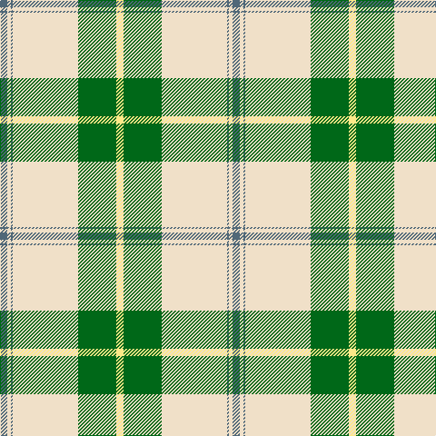

This page is one **sett** — a single exact thread-count. It belongs to the [tartan](/tartans/n4w2n1w36g21ly4/)
(the same proportion at any scale), whose colour order is pattern [BWBWGY](/stripes/bwbwgy/).

Sourced from tartans-authority.  It is a [6 stripe tartan](/stripes/stripes6/).

Original link http://www.tartansauthority.com/tartan-ferret/display/7601/

## Also known as

This cloth is also recorded under:

- Skye, Green

2 attestations — the source records this cloth was collapsed from (oldest owns this page)

<ul>
<li>March 2008 — Skye, Green (Dance) (tartans-authority, <a href="http://www.tartansauthority.com/tartan-ferret/display/7601/">record</a>)</li>
<li>undated — Skye Green (register-of-tartans, <a href="https://www.tartanregister.gov.uk/tartanDetails.aspx?ref=5625">record</a>)</li>
</ul>

## Register references

External register numbers recorded for this tartan.

- Scottish Register of Tartans: [5625](https://www.tartanregister.gov.uk/tartanDetails.aspx?ref=5625)
- Scottish Tartans Authority (ITI): 7601

## Thread count
N/8 W4 N2 W72 G42 LY/8

## Palette

Palette: <strong>Tartan Register</strong> <small style="color:#888">(2 of 4 colours)</small>
<table><thead><tr><th>Colour</th><th>Threads</th><th>Shade</th><th>Base</th><th>OKLCh</th></tr></thead><tbody><tr><td>N/</td><td style="text-align:right;font-variant-numeric:tabular-nums">8</td><td><code style="background-color:#506878;">#506878</code> <small style="color:#888">#506878</small></td><td>B <code style="background-color:#2A418A;">#2A418A</code></td><td><small style="color:#888">oklch(50.4% 0.038 237.7)</small></td></tr><tr><td>W</td><td style="text-align:right;font-variant-numeric:tabular-nums">4</td><td><code style="background-color:#F0E0C8;">#F0E0C8</code> <small style="color:#888">#F0E0C8</small></td><td>W <code style="background-color:#F7F7F7;">#F7F7F7</code></td><td><small style="color:#888">oklch(91.3% 0.036 78.1)</small></td></tr><tr><td>N</td><td style="text-align:right;font-variant-numeric:tabular-nums">2</td><td><code style="background-color:#506878;">#506878</code> <small style="color:#888">#506878</small></td><td>B <code style="background-color:#2A418A;">#2A418A</code></td><td><small style="color:#888">oklch(50.4% 0.038 237.7)</small></td></tr><tr><td>W</td><td style="text-align:right;font-variant-numeric:tabular-nums">72</td><td><code style="background-color:#F0E0C8;">#F0E0C8</code> <small style="color:#888">#F0E0C8</small></td><td>W <code style="background-color:#F7F7F7;">#F7F7F7</code></td><td><small style="color:#888">oklch(91.3% 0.036 78.1)</small></td></tr><tr><td>G</td><td style="text-align:right;font-variant-numeric:tabular-nums">42</td><td><code style="background-color:#006818;">#006818</code> <small style="color:#888">#006818</small></td><td>G <code style="background-color:#006100;">#006100</code></td><td><small style="color:#888">oklch(45.0% 0.142 145.0)</small></td></tr><tr><td>LY/</td><td style="text-align:right;font-variant-numeric:tabular-nums">8</td><td><code style="background-color:#FCE888;">#FCE888</code> <small style="color:#888">#FCE888</small></td><td>Y <code style="background-color:#F2BF00;">#F2BF00</code></td><td><small style="color:#888">oklch(92.7% 0.119 97.9)</small></td></tr></tbody></table>

# Sample pattern

## Nearest tartans

The nearest existing variants by ΔTartan distance, with this tartan at the top so the swatches line up against it.

ΔTartan

Tartan

Sett

—

<a href="/ttd/edit/#slug=n4w2n1w36g21ly4~x2">Skye, Green (Dance)</a> <a class="nn-out" href="/setts/s6/n4w2n1w36g21ly4~x2/" title="open its dictionary page">↗</a>

0.97

<a href="/ttd/edit/#slug=w44dg18w6dg11dt1o4~x2">Westfalia Dress (Corporate)</a> <a class="nn-out" href="/setts/s6/w44dg18w6dg11dt1o4~x2/" title="open its dictionary page">↗</a>

1.05

<a href="/ttd/edit/#slug=w47g20w6g8k1r3~x2">MacGregor, Green</a> <a class="nn-out" href="/setts/s6/w47g20w6g8k1r3~x2/" title="open its dictionary page">↗</a>

1.34

<a href="/ttd/edit/#slug=w52g22w6g8k1r3~x2">MacGregor - 1975 (Dance, Green)</a> <a class="nn-out" href="/setts/s6/w52g22w6g8k1r3~x2/" title="open its dictionary page">↗</a>

1.43

<a href="/ttd/edit/#slug=w52dg22w6dg8k1r3~x2">MacGregor Dress Green (Dance)</a> <a class="nn-out" href="/setts/s6/w52dg22w6dg8k1r3~x2/" title="open its dictionary page">↗</a>

1.43

<a href="/ttd/edit/#slug=dg44w18dg6w11dt1o4~x2">Westfalia (Corporate)</a> <a class="nn-out" href="/setts/s6/dg44w18dg6w11dt1o4~x2/" title="open its dictionary page">↗</a>

1.53

<a href="/ttd/edit/#slug=g42ly1w2ly1g5dg12w32g4~x2">Longniddry Green Error (Dance)</a> <a class="nn-out" href="/setts/s8/g42ly1w2ly1g5dg12w32g4~x2/" title="open its dictionary page">↗</a>

1.59

<a href="/ttd/edit/#slug=w2g1w20g20k1g1ly2~x4">Cunningham Dress Green (Dance) Fashion Tartan Tartan Number: 6532. Earliest known date: 01/01/1988 A dancers' tartan now woven by D C Dalgliesh of Selkirk /Threadcount and colours aren't 100% original. Generated manually./ See products available Copyright © Blair Urquhart, Comrie, 2015</a> <a class="nn-out" href="/setts/s7/w2g1w20g20k1g1ly2~x4/" title="open its dictionary page">↗</a>

1.59

<a href="/ttd/edit/#slug=g3lo16w4k6g28lo1g3~x4">Pollock</a> <a class="nn-out" href="/setts/s7/g3lo16w4k6g28lo1g3~x4/" title="open its dictionary page">↗</a>

1.60

<a href="/ttd/edit/#slug=k5w2ly36t47r3~x2">Oliver Dress Pink</a> <a class="nn-out" href="/setts/s5/k5w2ly36t47r3~x2/" title="open its dictionary page">↗</a>

1.63

<a href="/ttd/edit/#slug=w5g2w34g34k2g2ly4~x2">Cunningham Dress Green (Dance)</a> <a class="nn-out" href="/setts/s7/w5g2w34g34k2g2ly4~x2/" title="open its dictionary page">↗</a>

## Neighbour map

Every grey dot is one of 14299 variants placed by the first two principal components of the ΔTartan feature space (44% of its variance). Red is this tartan; blue dots are its nearest — click one to open its page.

<svg viewBox="0 0 640 380" role="img" style="max-width:100%;height:auto;border:1px solid #e0e0e0;border-radius:4px;display:block" xmlns="http://www.w3.org/2000/svg"><image href="/nn/cloud.v1.png" width="640" height="380"/><a href="/setts/s6/w44dg18w6dg11dt1o4~x2/"><circle cx="359.3" cy="115.6" r="4" fill="#3465a4"><title>Westfalia Dress (Corporate)</title></circle></a><a href="/setts/s6/w47g20w6g8k1r3~x2/"><circle cx="396.5" cy="116.2" r="4" fill="#3465a4"><title>MacGregor, Green</title></circle></a><a href="/setts/s6/w52g22w6g8k1r3~x2/"><circle cx="388.7" cy="102.3" r="4" fill="#3465a4"><title>MacGregor - 1975 (Dance, Green)</title></circle></a><a href="/setts/s6/w52dg22w6dg8k1r3~x2/"><circle cx="384.9" cy="100.6" r="4" fill="#3465a4"><title>MacGregor Dress Green (Dance)</title></circle></a><a href="/setts/s6/dg44w18dg6w11dt1o4~x2/"><circle cx="362.7" cy="127.4" r="4" fill="#3465a4"><title>Westfalia (Corporate)</title></circle></a><a href="/setts/s8/g42ly1w2ly1g5dg12w32g4~x2/"><circle cx="303.8" cy="103.7" r="4" fill="#3465a4"><title>Longniddry Green Error (Dance)</title></circle></a><a href="/setts/s7/w2g1w20g20k1g1ly2~x4/"><circle cx="311.4" cy="141.6" r="4" fill="#3465a4"><title>Cunningham Dress Green (Dance) Fashion Tartan Tartan Number: 6532. Earliest known date: 01/01/1988 A dancers' tartan now woven by D C Dalgliesh of Selkirk /Threadcount and colours aren't 100% original. Generated manually./ See products available Copyright © Blair Urquhart, Comrie, 2015</title></circle></a><a href="/setts/s7/g3lo16w4k6g28lo1g3~x4/"><circle cx="337.5" cy="145.0" r="4" fill="#3465a4"><title>Pollock</title></circle></a><a href="/setts/s5/k5w2ly36t47r3~x2/"><circle cx="290.0" cy="144.0" r="4" fill="#3465a4"><title>Oliver Dress Pink</title></circle></a><a href="/setts/s7/w5g2w34g34k2g2ly4~x2/"><circle cx="282.3" cy="140.6" r="4" fill="#3465a4"><title>Cunningham Dress Green (Dance)</title></circle></a><circle cx="336.9" cy="121.0" r="5" fill="#c00000"/></svg>

ID: /setts/s6/n4w2n1w36g21ly4~x2/
