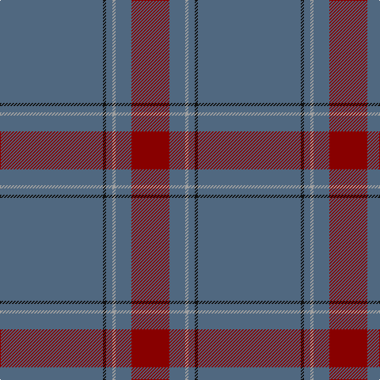

This page is one **sett** — a single exact thread-count. It belongs to the [tartan](/tartans/n65k2n4lr2n10r24/)
(the same proportion at any scale), whose colour order is pattern [BKBYBR](/stripes/bkbybr/).

Sourced from tartans-authority.  It is a [6 stripe tartan](/stripes/stripes6/).

Original link http://www.tartansauthority.com/tartan-ferret/display/10200/

## Register references

External register numbers recorded for this tartan.

- Scottish Register of Tartans: [10200](https://www.tartanregister.gov.uk/tartanDetails?ref=10200)
- Scottish Tartans Authority (ITI): 10200

## Thread count
B/130 K4 B8 N4 B20 DR/48

## Palette

Palette: <strong>Tartan Register</strong> <small style="color:#888">(3 of 4 colours)</small>
<table><thead><tr><th>Colour</th><th>Threads</th><th>Shade</th><th>Base</th><th>OKLCh</th></tr></thead><tbody><tr><td>B/</td><td style="text-align:right;font-variant-numeric:tabular-nums">130</td><td><code style="background-color:#506880;">#506880</code> <small style="color:#888">#506880</small></td><td>B <code style="background-color:#2A418A;">#2A418A</code></td><td><small style="color:#888">oklch(50.8% 0.048 248.8)</small></td></tr><tr><td>K</td><td style="text-align:right;font-variant-numeric:tabular-nums">4</td><td><code style="background-color:#101010;">#101010</code> <small style="color:#888">#101010</small></td><td>K <code style="background-color:#000000;">#000000</code></td><td><small style="color:#888">oklch(17.3% 0.000 89.9)</small></td></tr><tr><td>B</td><td style="text-align:right;font-variant-numeric:tabular-nums">8</td><td><code style="background-color:#506880;">#506880</code> <small style="color:#888">#506880</small></td><td>B <code style="background-color:#2A418A;">#2A418A</code></td><td><small style="color:#888">oklch(50.8% 0.048 248.8)</small></td></tr><tr><td>N</td><td style="text-align:right;font-variant-numeric:tabular-nums">4</td><td><code style="background-color:#A0A0A0;">#A0A0A0</code> <small style="color:#888">#A0A0A0</small></td><td>Y <code style="background-color:#F2BF00;">#F2BF00</code></td><td><small style="color:#888">oklch(70.6% 0.000 89.9)</small></td></tr><tr><td>B</td><td style="text-align:right;font-variant-numeric:tabular-nums">20</td><td><code style="background-color:#506880;">#506880</code> <small style="color:#888">#506880</small></td><td>B <code style="background-color:#2A418A;">#2A418A</code></td><td><small style="color:#888">oklch(50.8% 0.048 248.8)</small></td></tr><tr><td>DR/</td><td style="text-align:right;font-variant-numeric:tabular-nums">48</td><td><code style="background-color:#880000;">#880000</code> <small style="color:#888">#880000</small></td><td>R <code style="background-color:#CC0000;">#CC0000</code></td><td><small style="color:#888">oklch(39.4% 0.162 29.2)</small></td></tr></tbody></table>

# Sample pattern

## Nearest tartans

The nearest existing variants by ΔTartan distance, with this tartan at the top so the swatches line up against it.

ΔTartan

Tartan

Sett

—

<a href="/ttd/edit/#slug=n65k2n4lr2n10r24~x2">Norsemen (Corporate)</a> <a class="nn-out" href="/setts/s6/n65k2n4lr2n10r24~x2/" title="open its dictionary page">↗</a>

1.10

<a href="/setts/s6/n65ki2n4k2n10r24~x2/">Norsemen, The</a>

1.45

<a href="/ttd/edit/#slug=db2n2lb1n18lb2r2~x4">St. Giles Cathedral (Corporate)</a> <a class="nn-out" href="/setts/s6/db2n2lb1n18lb2r2~x4/" title="open its dictionary page">↗</a>

1.52

<a href="/ttd/edit/#slug=db3y1w1y25w1y1p3~x2">St Giles, Check</a> <a class="nn-out" href="/setts/s7/db3y1w1y25w1y1p3~x2/" title="open its dictionary page">↗</a>

1.60

<a href="/ttd/edit/#slug=r2n2k2n28k8n9k1lo2~x2">Highland Autumn (Fashion)</a> <a class="nn-out" href="/setts/s8/r2n2k2n28k8n9k1lo2~x2/" title="open its dictionary page">↗</a>

1.70

<a href="/ttd/edit/#slug=db13k3db20o70db20o30w3~x2">Unidentified 21</a> <a class="nn-out" href="/setts/s7/db13k3db20o70db20o30w3~x2/" title="open its dictionary page">↗</a>

1.74

<a href="/ttd/edit/#slug=y60g13y9r8ly4~x2">Ballantyne (Personal)</a> <a class="nn-out" href="/setts/s5/y60g13y9r8ly4~x2/" title="open its dictionary page">↗</a>

1.76

<a href="/ttd/edit/#slug=n44do4n1k1n4y4k1db4do4~x2">Fermanagh (1990)</a> <a class="nn-out" href="/setts/s9/n44do4n1k1n4y4k1db4do4~x2/" title="open its dictionary page">↗</a>

1.76

<a href="/ttd/edit/#slug=n18w2k1w4g13n40r2~x2">Puxty-Dunne (Personal)</a> <a class="nn-out" href="/setts/s7/n18w2k1w4g13n40r2~x2/" title="open its dictionary page">↗</a>

1.82

<a href="/ttd/edit/#slug=do6o1do40n1do12o12n6o2r2o4~x2">Dark Lochnagar</a> <a class="nn-out" href="/setts/s10/do6o1do40n1do12o12n6o2r2o4~x2/" title="open its dictionary page">↗</a>

1.84

<a href="/ttd/edit/#slug=r13y3r4y56n4y4~x2">Auchairne grey</a> <a class="nn-out" href="/setts/s6/r13y3r4y56n4y4~x2/" title="open its dictionary page">↗</a>

## Neighbour map

Every grey dot is one of 14359 variants placed by the first two principal components of the ΔTartan feature space (44% of its variance). Red is this tartan; blue dots are its nearest — click one to open its page.

<svg viewBox="0 0 640 380" role="img" style="max-width:100%;height:auto;border:1px solid #e0e0e0;border-radius:4px;display:block" xmlns="http://www.w3.org/2000/svg"><image href="/nn/cloud.v1.png" width="640" height="380"/><a href="/setts/s6/n65ki2n4k2n10r24~x2/"><circle cx="551.6" cy="177.2" r="4" fill="#3465a4"><title>Norsemen, The</title></circle></a><a href="/setts/s6/db2n2lb1n18lb2r2~x4/"><circle cx="520.7" cy="185.5" r="4" fill="#3465a4"><title>St. Giles Cathedral (Corporate)</title></circle></a><a href="/setts/s7/db3y1w1y25w1y1p3~x2/"><circle cx="573.3" cy="153.6" r="4" fill="#3465a4"><title>St Giles, Check</title></circle></a><a href="/setts/s8/r2n2k2n28k8n9k1lo2~x2/"><circle cx="517.4" cy="164.8" r="4" fill="#3465a4"><title>Highland Autumn (Fashion)</title></circle></a><a href="/setts/s7/db13k3db20o70db20o30w3~x2/"><circle cx="460.1" cy="203.3" r="4" fill="#3465a4"><title>Unidentified 21</title></circle></a><a href="/setts/s5/y60g13y9r8ly4~x2/"><circle cx="526.7" cy="226.0" r="4" fill="#3465a4"><title>Ballantyne (Personal)</title></circle></a><a href="/setts/s9/n44do4n1k1n4y4k1db4do4~x2/"><circle cx="577.7" cy="128.5" r="4" fill="#3465a4"><title>Fermanagh (1990)</title></circle></a><a href="/setts/s7/n18w2k1w4g13n40r2~x2/"><circle cx="507.2" cy="150.1" r="4" fill="#3465a4"><title>Puxty-Dunne (Personal)</title></circle></a><a href="/setts/s10/do6o1do40n1do12o12n6o2r2o4~x2/"><circle cx="503.0" cy="146.8" r="4" fill="#3465a4"><title>Dark Lochnagar</title></circle></a><a href="/setts/s6/r13y3r4y56n4y4~x2/"><circle cx="608.4" cy="217.5" r="4" fill="#3465a4"><title>Auchairne grey</title></circle></a><circle cx="578.6" cy="186.4" r="5" fill="#c00000"/></svg>

ID: /setts/s6/n65k2n4lr2n10r24~x2/
