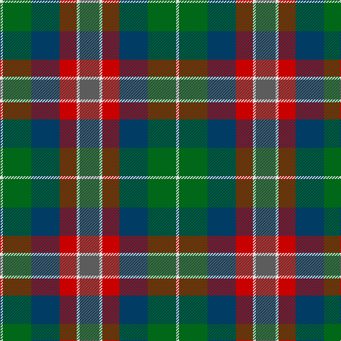

**Bands:** [BWRBGW](/stripes/bwrbgw/) · **Stripes:** [N W R DT G W](/stripes/stripes6/) N W R DT G W

This was sourced from tartans-authority.  It is a [6 band tartan](/bands/bands6/).

Original link http://www.tartansauthority.com/tartan-ferret/display/10765/

## Thread count
LN/4 G40 DB40 R24 LN4 N/28

## Palette
Each colour and its ΔE from the base-6 reference it is a variant of.

| Colour | Shade | Base | ΔE (OKLab) |
|---|---|---|---|
| DB | <code style="background-color:#003C64;">#003C64</code> `#003C64` | B <code style="background-color:#2A418A;">#2A418A</code> | 0.08 |
| G | <code style="background-color:#006818;">#006818</code> `#006818` | G <code style="background-color:#006100;">#006100</code> | 0.02 |
| LN | <code style="background-color:#E0E0E0;">#E0E0E0</code> `#E0E0E0` | W <code style="background-color:#F7F7F7;">#F7F7F7</code> | 0.07 |
| N | <code style="background-color:#5C5C5C;">#5C5C5C</code> `#5C5C5C` | B <code style="background-color:#2A418A;">#2A418A</code> | 0.15 |
| R | <code style="background-color:#C80000;">#C80000</code> `#C80000` | R <code style="background-color:#CC0000;">#CC0000</code> | 0.01 |

# Sample pattern

## Nearest tartans

The nearest existing variants by ΔTartan distance.

1. [Rothesay](/setts/s7/g4n12lo2k10y10lo3y2~x2/) — ΔT 1.05
1. [Wicklow County Crest (Fashion)](/setts/s9/db16db7lo4db2lo16db2y24db8lr11~x2/) — ΔT 1.14
1. [Casely (Name)](/setts/s6/r4g11k11g2n11ly3~x4/) — ΔT 1.15
1. [Thompson's Fancy Personal Tartan Tartan Number: 286. Earliest known date: pre 2003 Designed for his own use. See products available Copyright © Blair Urquhart, Comrie, 2015](/setts/s6/r2dy8db2t4k4t1~x6/) — ΔT 1.17
1. [Canine All Dogs (Fashion)](/setts/s6/r10db6g24db24r6ly3/) — ΔT 1.21
1. [McHale (Personal)](/setts/s6/y15k10n30o11w3y5~x2/) — ΔT 1.22
1. [Jardine #2](/setts/s5/dy9o9y9r1t1~x4/) — ΔT 1.25
1. [Casely](/setts/s6/r4g11k11g2n11y3~x4/) — ΔT 1.26
1. [Orkney (District?)](/setts/s8/r9g3b19k3g19r13k3lo3~x2/) — ΔT 1.29
1. [Atlantic, Ancient](/setts/s6/w3db17o16db2dg17ly2~x2/) — ΔT 1.30

## Neighbour map

Every grey dot is one of 14313 variants placed by the first two principal components of the ΔTartan feature space (44% of its variance). Red is this tartan; blue dots are its nearest — click one to open its page.

<svg viewBox="0 0 640 380" role="img" style="max-width:100%;height:auto;border:1px solid #e0e0e0;border-radius:4px;display:block" xmlns="http://www.w3.org/2000/svg"><image href="/nn/cloud.v1.png" width="640" height="380"/><a href="/setts/s7/g4n12lo2k10y10lo3y2~x2/"><circle cx="104.7" cy="228.6" r="4" fill="#3465a4"><title>Rothesay</title></circle></a><a href="/setts/s9/db16db7lo4db2lo16db2y24db8lr11~x2/"><circle cx="106.5" cy="181.6" r="4" fill="#3465a4"><title>Wicklow County Crest (Fashion)</title></circle></a><a href="/setts/s6/r4g11k11g2n11ly3~x4/"><circle cx="98.3" cy="243.0" r="4" fill="#3465a4"><title>Casely (Name)</title></circle></a><a href="/setts/s6/r2dy8db2t4k4t1~x6/"><circle cx="163.2" cy="225.2" r="4" fill="#3465a4"><title>Thompson's Fancy Personal Tartan Tartan Number: 286. Earliest known date: pre 2003 Designed for his own use. See products available Copyright © Blair Urquhart, Comrie, 2015</title></circle></a><a href="/setts/s6/r10db6g24db24r6ly3/"><circle cx="142.1" cy="214.0" r="4" fill="#3465a4"><title>Canine All Dogs (Fashion)</title></circle></a><a href="/setts/s6/y15k10n30o11w3y5~x2/"><circle cx="200.7" cy="217.9" r="4" fill="#3465a4"><title>McHale (Personal)</title></circle></a><a href="/setts/s5/dy9o9y9r1t1~x4/"><circle cx="162.8" cy="221.3" r="4" fill="#3465a4"><title>Jardine #2</title></circle></a><a href="/setts/s6/r4g11k11g2n11y3~x4/"><circle cx="132.8" cy="263.4" r="4" fill="#3465a4"><title>Casely</title></circle></a><a href="/setts/s8/r9g3b19k3g19r13k3lo3~x2/"><circle cx="151.6" cy="221.2" r="4" fill="#3465a4"><title>Orkney (District?)</title></circle></a><a href="/setts/s6/w3db17o16db2dg17ly2~x2/"><circle cx="119.5" cy="197.5" r="4" fill="#3465a4"><title>Atlantic, Ancient</title></circle></a><circle cx="130.7" cy="222.3" r="5" fill="#c00000"/></svg>

ID: /setts/s6/n7w1r6dt10g10w1~x4/
