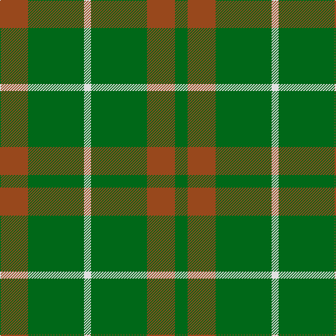

In pattern [GRGWGR](/stripes/grgwgr/).

This was sourced from register-of-tartans.  It is a [6 stripe tartan](/stripes/stripes6/).

Original link https://www.tartanregister.gov.uk/tartanDetails.aspx?ref=3248

## Register references

External register numbers recorded for this tartan.

- Scottish Register of Tartans: [3248](https://www.tartanregister.gov.uk/tartanDetails.aspx?ref=3248)
- Scottish Tartans Authority (ITI): 2464
- Scottish Tartans World Register: 2464

## Thread count
T/40 G80 LN10 G80 T40 G/18

## Palette
Each colour and its ΔE from the base-6 reference it is a variant of.

| Colour | Shade | Base | ΔE (OKLab) |
|---|---|---|---|
| G | <code style="background-color:#006818;">#006818</code> `#006818` | G <code style="background-color:#006100;">#006100</code> | 0.02 |
| LN | <code style="background-color:#E0E0E0;">#E0E0E0</code> `#E0E0E0` | W <code style="background-color:#F7F7F7;">#F7F7F7</code> | 0.07 |
| T | <code style="background-color:#98481C;">#98481C</code> `#98481C` | R <code style="background-color:#CC0000;">#CC0000</code> | 0.11 |

# Sample pattern

## Nearest tartans

The nearest existing variants by ΔTartan distance.

1. [O'Neill, Red](/setts/s6/g46o20g9o20g46lg5~x2/) — ΔT 0.55
1. [O'Neill, Red (Corporate?)](/setts/s4/g9o20g46lg5~x2/) — ΔT 1.18
1. [O'Neill (Australia) (Name)](/setts/s4/g9o20g40w5~x2/) — ΔT 1.24
1. [Scott Autumn (Fashion)](/setts/s7/dg16ly3dg14r16dg2r2dg3~x2/) — ΔT 1.53
1. [Confederate Artillery (Military)](/setts/s6/r2g12o3g8o14g2~x2/) — ΔT 1.62
1. [Ledford Family Tartan Tartan Number: 835. Earliest known date: 1987 A quantity of this cloth was woven in 1998 for a Ledford family in the USA. See products available Copyright © Blair Urquhart, Comrie, 2015](/setts/s3/g9o4ly1~x4/) — ΔT 1.71
1. [Highland Spring (Green)](/setts/s4/g7r3g23m7~x2/) — ΔT 1.72
1. [Ledford](/setts/s3/dg9y4lo1~x8/) — ΔT 1.73
1. [O'Neill](/setts/s4/g9lo20g40w5~x2/) — ΔT 1.76
1. [North Dakota State University (Corp.](/setts/s6/lo11g5lo10g4g26lo4~x2/) — ΔT 1.79

## Neighbour map

Every grey dot is one of 14299 variants placed by the first two principal components of the ΔTartan feature space (44% of its variance). Red is this tartan; blue dots are its nearest — click one to open its page.

<svg viewBox="0 0 640 380" role="img" style="max-width:100%;height:auto;border:1px solid #e0e0e0;border-radius:4px;display:block" xmlns="http://www.w3.org/2000/svg"><image href="/nn/cloud.v1.png" width="640" height="380"/><a href="/setts/s6/g46o20g9o20g46lg5~x2/"><circle cx="455.5" cy="286.0" r="4" fill="#3465a4"><title>O'Neill, Red</title></circle></a><a href="/setts/s4/g9o20g46lg5~x2/"><circle cx="463.7" cy="288.5" r="4" fill="#3465a4"><title>O'Neill, Red (Corporate?)</title></circle></a><a href="/setts/s4/g9o20g40w5~x2/"><circle cx="413.2" cy="286.9" r="4" fill="#3465a4"><title>O'Neill (Australia) (Name)</title></circle></a><a href="/setts/s7/dg16ly3dg14r16dg2r2dg3~x2/"><circle cx="406.4" cy="262.3" r="4" fill="#3465a4"><title>Scott Autumn (Fashion)</title></circle></a><a href="/setts/s6/r2g12o3g8o14g2~x2/"><circle cx="385.1" cy="298.1" r="4" fill="#3465a4"><title>Confederate Artillery (Military)</title></circle></a><a href="/setts/s3/g9o4ly1~x4/"><circle cx="415.8" cy="303.5" r="4" fill="#3465a4"><title>Ledford Family Tartan Tartan Number: 835. Earliest known date: 1987 A quantity of this cloth was woven in 1998 for a Ledford family in the USA. See products available Copyright © Blair Urquhart, Comrie, 2015</title></circle></a><a href="/setts/s4/g7r3g23m7~x2/"><circle cx="474.2" cy="288.5" r="4" fill="#3465a4"><title>Highland Spring (Green)</title></circle></a><a href="/setts/s3/dg9y4lo1~x8/"><circle cx="421.5" cy="306.5" r="4" fill="#3465a4"><title>Ledford</title></circle></a><a href="/setts/s4/g9lo20g40w5~x2/"><circle cx="405.5" cy="281.2" r="4" fill="#3465a4"><title>O'Neill</title></circle></a><a href="/setts/s6/lo11g5lo10g4g26lo4~x2/"><circle cx="345.8" cy="279.6" r="4" fill="#3465a4"><title>North Dakota State University (Corp.</title></circle></a><circle cx="421.9" cy="295.0" r="5" fill="#c00000"/></svg>

ID: /setts/s6/o20g40w5g40o20g9~x2/
