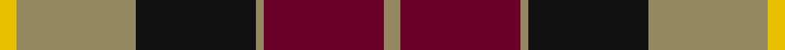
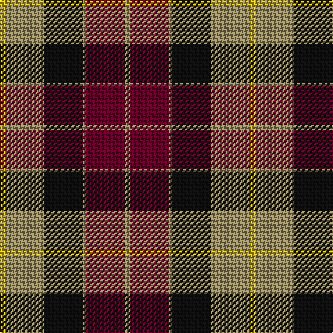

In pattern [RBRKRY](/stripes/rbrkry/).

This was sourced from register-of-tartans.  It is a [6 stripe tartan](/stripes/stripes6/).

Original link https://www.tartanregister.gov.uk/tartanDetails.aspx?ref=4397

## Register references

External register numbers recorded for this tartan.

- Scottish Register of Tartans: [4397](https://www.tartanregister.gov.uk/tartanDetails.aspx?ref=4397)
- Scottish Tartans Authority (ITI): 2098
- Scottish Tartans World Register: 2098

## Thread count
Y/4 LT28 K28 LT2 DR28 LT/4

## Palette
Each colour and the base-6 reference it is a variant of.

| Colour | Shade | Base |
|---|---|---|
| DB | <code style="background-color:#2C2C80;">#2C2C80</code> `oklch(35.0% 0.138 276.6)` <small>#2C2C80</small> | B <code style="background-color:#2A418A;">#2A418A</code> |
| DR | <code style="background-color:#680028;">#680028</code> `oklch(33.1% 0.133 8.3)` <small>#680028</small> | B <code style="background-color:#2A418A;">#2A418A</code> |
| G | <code style="background-color:#006818;">#006818</code> `oklch(45.0% 0.142 145.0)` <small>#006818</small> | G <code style="background-color:#006100;">#006100</code> |
| K | <code style="background-color:#101010;">#101010</code> `oklch(17.3% 0.000 89.9)` <small>#101010</small> | K <code style="background-color:#000000;">#000000</code> |
| LT | <code style="background-color:#948860;">#948860</code> `oklch(62.7% 0.058 93.4)` <small>#948860</small> | R <code style="background-color:#CC0000;">#CC0000</code> |
| Y | <code style="background-color:#E8C000;">#E8C000</code> `oklch(81.9% 0.168 93.7)` <small>#E8C000</small> | Y <code style="background-color:#F2BF00;">#F2BF00</code> |

# Sample pattern

## Nearest tartans

The nearest existing variants by ΔTartan distance.

1. [Logan - 1797 (Dark)](/setts/s7/k9lr4k1lr4dg15r4k1~x4/) — ΔT 0.77
1. [Prince Edward Island #2](/setts/s7/w2k1dg16k12r12k1w2~x2/) — ΔT 0.84
1. [Logan #3](/setts/s7/dp9lr4dp1lr4g15r4dp1~x4/) — ΔT 0.90
1. [Wcwm 1062](/setts/s7/g3r20g16k22lo6k3g2~x2/) — ΔT 0.92
1. [Cook (Name)](/setts/s7/dg12g6dg6r15k1r1k2~x2/) — ΔT 0.93
1. [Scottish Ballet](/setts/s6/ly5g22dp15dp11dp5g2~x2/) — ΔT 0.95
1. [Skene of Cromar (1885)](/setts/s5/db2r20dg20k21r1~x2/) — ΔT 0.96
1. [MacKintosh Geddes](/setts/s7/db1r5dg18r4db9r10w1~x4/) — ΔT 0.96
1. [Dickie](/setts/s8/g8r2g12k6g3db6r24k4~x2/) — ΔT 0.97
1. [Unidentified #15](/setts/s6/k6r2dg17r16k1t2~x2/) — ΔT 0.99

## Neighbour map

Every grey dot is one of 14299 variants placed by the first two principal components of the ΔTartan feature space (44% of its variance). Red is this tartan; blue dots are its nearest — click one to open its page.

<svg viewBox="0 0 640 380" role="img" style="max-width:100%;height:auto;border:1px solid #e0e0e0;border-radius:4px;display:block" xmlns="http://www.w3.org/2000/svg"><image href="/nn/cloud.v1.png" width="640" height="380"/><a href="/setts/s7/k9lr4k1lr4dg15r4k1~x4/"><circle cx="215.3" cy="185.3" r="4" fill="#3465a4"><title>Logan - 1797 (Dark)</title></circle></a><a href="/setts/s7/w2k1dg16k12r12k1w2~x2/"><circle cx="191.5" cy="167.4" r="4" fill="#3465a4"><title>Prince Edward Island #2</title></circle></a><a href="/setts/s7/dp9lr4dp1lr4g15r4dp1~x4/"><circle cx="211.1" cy="176.5" r="4" fill="#3465a4"><title>Logan #3</title></circle></a><a href="/setts/s7/g3r20g16k22lo6k3g2~x2/"><circle cx="179.7" cy="196.8" r="4" fill="#3465a4"><title>Wcwm 1062</title></circle></a><a href="/setts/s7/dg12g6dg6r15k1r1k2~x2/"><circle cx="253.2" cy="191.0" r="4" fill="#3465a4"><title>Cook (Name)</title></circle></a><a href="/setts/s6/ly5g22dp15dp11dp5g2~x2/"><circle cx="194.9" cy="212.8" r="4" fill="#3465a4"><title>Scottish Ballet</title></circle></a><a href="/setts/s5/db2r20dg20k21r1~x2/"><circle cx="216.8" cy="198.2" r="4" fill="#3465a4"><title>Skene of Cromar (1885)</title></circle></a><a href="/setts/s7/db1r5dg18r4db9r10w1~x4/"><circle cx="249.9" cy="180.0" r="4" fill="#3465a4"><title>MacKintosh Geddes</title></circle></a><a href="/setts/s8/g8r2g12k6g3db6r24k4~x2/"><circle cx="200.7" cy="180.3" r="4" fill="#3465a4"><title>Dickie</title></circle></a><a href="/setts/s6/k6r2dg17r16k1t2~x2/"><circle cx="258.7" cy="178.4" r="4" fill="#3465a4"><title>Unidentified #15</title></circle></a><circle cx="204.5" cy="193.2" r="5" fill="#c00000"/></svg>

ID: /setts/s6/o2dr14o1k14o14ly2~x2/
