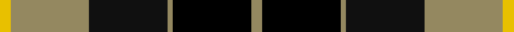
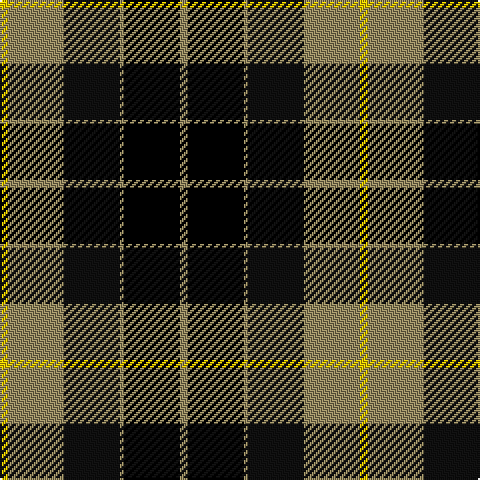

In pattern [RKRKRY](/stripes/rkrkry/).

This was sourced from tartans-authority.  It is a [6 stripe tartan](/stripes/stripes6/).

Original link http://www.tartansauthority.com/tartan-ferret/display/2098/

## Thread count
Y/4 LT28 Ka28 LT2 K28 LT/4

## Palette
Each colour and the base-6 reference it is a variant of.

| Colour | Shade | Base |
|---|---|---|
| DB | <code style="background-color:#2C2C80;">#2C2C80</code> `oklch(35.0% 0.138 276.6)` <small>#2C2C80</small> | B <code style="background-color:#2A418A;">#2A418A</code> |
| G | <code style="background-color:#006818;">#006818</code> `oklch(45.0% 0.142 145.0)` <small>#006818</small> | G <code style="background-color:#006100;">#006100</code> |
| K | <code style="background-color:#000000;">#000000</code> `oklch(0.0% 0.000 0.0)` <small>#000000</small> | K <code style="background-color:#000000;">#000000</code> |
| Ka | <code style="background-color:#101010;">#101010</code> `oklch(17.3% 0.000 89.9)` <small>#101010</small> | K <code style="background-color:#000000;">#000000</code> |
| LT | <code style="background-color:#948860;">#948860</code> `oklch(62.7% 0.058 93.4)` <small>#948860</small> | R <code style="background-color:#CC0000;">#CC0000</code> |
| Y | <code style="background-color:#E8C000;">#E8C000</code> `oklch(81.9% 0.168 93.7)` <small>#E8C000</small> | Y <code style="background-color:#F2BF00;">#F2BF00</code> |

# Sample pattern

## Nearest tartans

The nearest existing variants by ΔTartan distance.

1. [Wilson's, No 100](/setts/s6/k3g17ly2k18p17g3~x2/) — ΔT 0.77
1. [Wilson's No 158](/setts/s6/g21w2g4k17p14k3~x2/) — ΔT 0.79
1. [Wilson's, No 160](/setts/s6/g21ly2g4k16p14k3~x2/) — ΔT 0.82
1. [Wilson's, No 76](/setts/s6/k3g17w2k18p17g3~x2/) — ΔT 0.83
1. [Gunn](/setts/s6/r2g12k12g1db12g1~x2/) — ΔT 1.01
1. [Wilson's, No 150 "Coburg"](/setts/s6/g18t2g4k14p12k3~x2/) — ΔT 1.02
1. [MacNeil 8](/setts/s6/w2p33k33g33k6ly2~x2/) — ΔT 1.03
1. [Unnamed 6](/setts/s8/k16g16k2g16k16w2p16k1~x2/) — ΔT 1.08
1. [Ferguson of Balquhidder](/setts/s6/k2g12k12r1db12g2~x2/) — ΔT 1.09
1. [Gordon of Esslemont](/setts/s7/ly6g3ly3g22k23p23k4~x2/) — ΔT 1.14

## Neighbour map

Every grey dot is one of 14299 variants placed by the first two principal components of the ΔTartan feature space (44% of its variance). Red is this tartan; blue dots are its nearest — click one to open its page.

<svg viewBox="0 0 640 380" role="img" style="max-width:100%;height:auto;border:1px solid #e0e0e0;border-radius:4px;display:block" xmlns="http://www.w3.org/2000/svg"><image href="/nn/cloud.v1.png" width="640" height="380"/><a href="/setts/s6/k3g17ly2k18p17g3~x2/"><circle cx="155.9" cy="212.6" r="4" fill="#3465a4"><title>Wilson's, No 100</title></circle></a><a href="/setts/s6/g21w2g4k17p14k3~x2/"><circle cx="182.0" cy="208.3" r="4" fill="#3465a4"><title>Wilson's No 158</title></circle></a><a href="/setts/s6/g21ly2g4k16p14k3~x2/"><circle cx="185.1" cy="208.6" r="4" fill="#3465a4"><title>Wilson's, No 160</title></circle></a><a href="/setts/s6/k3g17w2k18p17g3~x2/"><circle cx="154.9" cy="212.3" r="4" fill="#3465a4"><title>Wilson's, No 76</title></circle></a><a href="/setts/s6/r2g12k12g1db12g1~x2/"><circle cx="173.1" cy="206.0" r="4" fill="#3465a4"><title>Gunn</title></circle></a><a href="/setts/s6/g18t2g4k14p12k3~x2/"><circle cx="177.0" cy="220.1" r="4" fill="#3465a4"><title>Wilson's, No 150 &quot;Coburg&quot;</title></circle></a><a href="/setts/s6/w2p33k33g33k6ly2~x2/"><circle cx="170.5" cy="168.0" r="4" fill="#3465a4"><title>MacNeil 8</title></circle></a><a href="/setts/s8/k16g16k2g16k16w2p16k1~x2/"><circle cx="192.6" cy="193.2" r="4" fill="#3465a4"><title>Unnamed 6</title></circle></a><a href="/setts/s6/k2g12k12r1db12g2~x2/"><circle cx="171.6" cy="211.8" r="4" fill="#3465a4"><title>Ferguson of Balquhidder</title></circle></a><a href="/setts/s7/ly6g3ly3g22k23p23k4~x2/"><circle cx="122.3" cy="201.6" r="4" fill="#3465a4"><title>Gordon of Esslemont</title></circle></a><circle cx="179.9" cy="192.8" r="5" fill="#c00000"/></svg>

ID: /setts/s6/o2k14o1k14o14ly2~x2/
