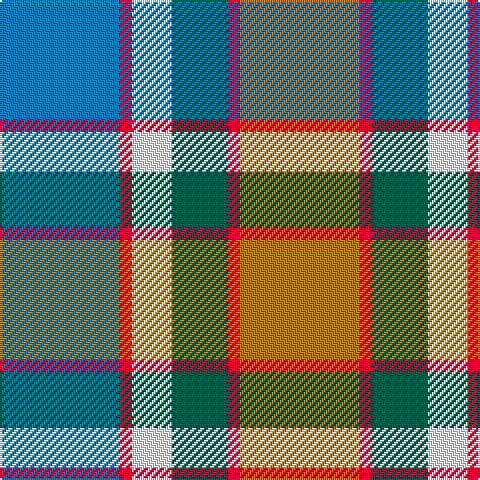

This page is one **sett** — a single exact thread-count. It belongs to the [tartan](/tartans/o30r3dg14w10r3b30/)
(the same proportion at any scale), whose colour order is pattern [BRWGRR](/stripes/brwgrr/).

Sourced from register-of-tartans.  It is a [6 stripe tartan](/stripes/stripes6/).

Original link https://www.tartanregister.gov.uk/tartanDetails.aspx?ref=11453

## Register references

External register numbers recorded for this tartan.

- Scottish Register of Tartans: [11453](https://www.tartanregister.gov.uk/tartanDetails.aspx?ref=11453)

## Thread count
B/60 R6 W20 G28 R6 LT/60

## Palette

Palette: <strong>Tartan Register</strong>
<table><thead><tr><th>Colour</th><th>Threads</th><th>Shade</th><th>Base</th><th>OKLCh</th></tr></thead><tbody><tr><td>B/</td><td style="text-align:right;font-variant-numeric:tabular-nums">60</td><td><code style="background-color:#1870A4;">#1870A4</code> <small style="color:#888">#1870A4</small></td><td>B <code style="background-color:#2A418A;">#2A418A</code></td><td><small style="color:#888">oklch(52.2% 0.113 241.2)</small></td></tr><tr><td>R</td><td style="text-align:right;font-variant-numeric:tabular-nums">6</td><td><code style="background-color:#C8002C;">#C8002C</code> <small style="color:#888">#C8002C</small></td><td>R <code style="background-color:#CC0000;">#CC0000</code></td><td><small style="color:#888">oklch(52.6% 0.212 22.0)</small></td></tr><tr><td>W</td><td style="text-align:right;font-variant-numeric:tabular-nums">20</td><td><code style="background-color:#FFFFFF;">#FFFFFF</code> <small style="color:#888">#FFFFFF</small></td><td>W <code style="background-color:#F7F7F7;">#F7F7F7</code></td><td><small style="color:#888">oklch(100.0% 0.000 89.9)</small></td></tr><tr><td>G</td><td style="text-align:right;font-variant-numeric:tabular-nums">28</td><td><code style="background-color:#005448;">#005448</code> <small style="color:#888">#005448</small></td><td>G <code style="background-color:#006100;">#006100</code></td><td><small style="color:#888">oklch(39.9% 0.073 178.8)</small></td></tr><tr><td>R</td><td style="text-align:right;font-variant-numeric:tabular-nums">6</td><td><code style="background-color:#C8002C;">#C8002C</code> <small style="color:#888">#C8002C</small></td><td>R <code style="background-color:#CC0000;">#CC0000</code></td><td><small style="color:#888">oklch(52.6% 0.212 22.0)</small></td></tr><tr><td>LT/</td><td style="text-align:right;font-variant-numeric:tabular-nums">60</td><td><code style="background-color:#B07430;">#B07430</code> <small style="color:#888">#B07430</small></td><td>R <code style="background-color:#CC0000;">#CC0000</code></td><td><small style="color:#888">oklch(61.0% 0.112 66.0)</small></td></tr></tbody></table>

# Sample pattern

## Nearest tartans

The nearest existing variants by ΔTartan distance, with this tartan at the top so the swatches line up against it.

ΔTartan

Tartan

Sett

—

<a href="/ttd/edit/#slug=o30r3dg14w10r3b30~x2">Cercle de Fermières Varennes</a> <a class="nn-out" href="/setts/s6/o30r3dg14w10r3b30~x2/" title="open its dictionary page">↗</a>

1.04

<a href="/ttd/edit/#slug=g4lo7r9lo9b20w2b2~x2">Tombow 140th Anniversary, The</a> <a class="nn-out" href="/setts/s7/g4lo7r9lo9b20w2b2~x2/" title="open its dictionary page">↗</a>

1.05

<a href="/ttd/edit/#slug=r2lo8db2y4k4y1~x6">Thompson (J.C.'s Fancy) (Personal)</a> <a class="nn-out" href="/setts/s6/r2lo8db2y4k4y1~x6/" title="open its dictionary page">↗</a>

1.18

<a href="/ttd/edit/#slug=db30ly3dy11ly3o33r6~x2">Balfour Family Tartan Tartan Number: 683. Earliest known date: 1984 Presented by William Balfour. See products available Copyright © Blair Urquhart, Comrie, 2015</a> <a class="nn-out" href="/setts/s6/db30ly3dy11ly3o33r6~x2/" title="open its dictionary page">↗</a>

1.22

<a href="/ttd/edit/#slug=t4n19lr2k19n2lr25lb2~x2">Ritchie, Stephen James (Personal)</a> <a class="nn-out" href="/setts/s7/t4n19lr2k19n2lr25lb2~x2/" title="open its dictionary page">↗</a>

1.23

<a href="/ttd/edit/#slug=o17y5db2w12db2ly4g7~x2">Ontario, Northern</a> <a class="nn-out" href="/setts/s7/o17y5db2w12db2ly4g7~x2/" title="open its dictionary page">↗</a>

1.26

<a href="/ttd/edit/#slug=m3g1t6k1g6m4k1lo1~x4">Orkney District Tartan Tartan Number: 2301. Earliest known date: 2000 Orkney District tartan was designed for the Westry Knitters, on Orkney, by Ronnie Hek. Four designs were advertised in the window of a shop on Orkney's mainland and the most popular was chosen as the official Orcadian tartan. See products available Copyright © Blair Urquhart, Comrie, 2015</a> <a class="nn-out" href="/setts/s8/m3g1t6k1g6m4k1lo1~x4/" title="open its dictionary page">↗</a>

1.27

<a href="/ttd/edit/#slug=db30ly3dy11ly3y33r6~x2">Balfour</a> <a class="nn-out" href="/setts/s6/db30ly3dy11ly3y33r6~x2/" title="open its dictionary page">↗</a>

1.30

<a href="/ttd/edit/#slug=r2ly1b8r1g7ly1r2~x6">Cercle de Fermieres de St-Elie . . .</a> <a class="nn-out" href="/setts/s7/r2ly1b8r1g7ly1r2~x6/" title="open its dictionary page">↗</a>

1.31

<a href="/ttd/edit/#slug=t30ly3t4k25y26k3y3r4~x2">Ogilvie Hunting Clan/Family Tartan Tartan Number: 6082. Earliest known date: pre 2000 Samples in STA Dalgety Collection labelled &quot;Restricted, Hunting Ogilvie, Family Only&quot;. However, the major weavers have this in their swatch books so the restriction mentioned above seems to have been lifted at some stage. See products available Copyright © Blair Urquhart, Comrie, 2015</a> <a class="nn-out" href="/setts/s8/t30ly3t4k25y26k3y3r4~x2/" title="open its dictionary page">↗</a>

1.32

<a href="/ttd/edit/#slug=m3k17n11m2o20w2~x2">Commonwealth Games Council (Corp.)</a> <a class="nn-out" href="/setts/s6/m3k17n11m2o20w2~x2/" title="open its dictionary page">↗</a>

## Neighbour map

Every grey dot is one of 14359 variants placed by the first two principal components of the ΔTartan feature space (44% of its variance). Red is this tartan; blue dots are its nearest — click one to open its page.

<svg viewBox="0 0 640 380" role="img" style="max-width:100%;height:auto;border:1px solid #e0e0e0;border-radius:4px;display:block" xmlns="http://www.w3.org/2000/svg"><image href="/nn/cloud.v1.png" width="640" height="380"/><a href="/setts/s7/g4lo7r9lo9b20w2b2~x2/"><circle cx="181.7" cy="182.6" r="4" fill="#3465a4"><title>Tombow 140th Anniversary, The</title></circle></a><a href="/setts/s6/r2lo8db2y4k4y1~x6/"><circle cx="143.6" cy="213.0" r="4" fill="#3465a4"><title>Thompson (J.C.'s Fancy) (Personal)</title></circle></a><a href="/setts/s6/db30ly3dy11ly3o33r6~x2/"><circle cx="198.6" cy="188.4" r="4" fill="#3465a4"><title>Balfour Family Tartan Tartan Number: 683. Earliest known date: 1984 Presented by William Balfour. See products available Copyright © Blair Urquhart, Comrie, 2015</title></circle></a><a href="/setts/s7/t4n19lr2k19n2lr25lb2~x2/"><circle cx="175.1" cy="168.6" r="4" fill="#3465a4"><title>Ritchie, Stephen James (Personal)</title></circle></a><a href="/setts/s7/o17y5db2w12db2ly4g7~x2/"><circle cx="104.5" cy="174.6" r="4" fill="#3465a4"><title>Ontario, Northern</title></circle></a><a href="/setts/s8/m3g1t6k1g6m4k1lo1~x4/"><circle cx="117.7" cy="213.1" r="4" fill="#3465a4"><title>Orkney District Tartan Tartan Number: 2301. Earliest known date: 2000 Orkney District tartan was designed for the Westry Knitters, on Orkney, by Ronnie Hek. Four designs were advertised in the window of a shop on Orkney's mainland and the most popular was chosen as the official Orcadian tartan. See products available Copyright © Blair Urquhart, Comrie, 2015</title></circle></a><a href="/setts/s6/db30ly3dy11ly3y33r6~x2/"><circle cx="214.0" cy="197.6" r="4" fill="#3465a4"><title>Balfour</title></circle></a><a href="/setts/s7/r2ly1b8r1g7ly1r2~x6/"><circle cx="184.9" cy="204.3" r="4" fill="#3465a4"><title>Cercle de Fermieres de St-Elie . . .</title></circle></a><a href="/setts/s8/t30ly3t4k25y26k3y3r4~x2/"><circle cx="158.7" cy="170.0" r="4" fill="#3465a4"><title>Ogilvie Hunting Clan/Family Tartan Tartan Number: 6082. Earliest known date: pre 2000 Samples in STA Dalgety Collection labelled &quot;Restricted, Hunting Ogilvie, Family Only&quot;. However, the major weavers have this in their swatch books so the restriction mentioned above seems to have been lifted at some stage. See products available Copyright © Blair Urquhart, Comrie, 2015</title></circle></a><a href="/setts/s6/m3k17n11m2o20w2~x2/"><circle cx="159.8" cy="192.3" r="4" fill="#3465a4"><title>Commonwealth Games Council (Corp.)</title></circle></a><circle cx="146.6" cy="195.3" r="5" fill="#c00000"/></svg>

ID: /setts/s6/o30r3dg14w10r3b30~x2/
