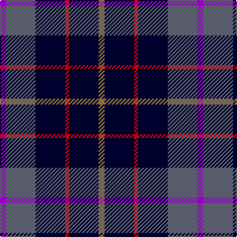

In pattern [BBKRKR](/stripes/bbkrkr/).

This was sourced from register-of-tartans.  It is a [6 stripe tartan](/stripes/stripes6/).

Original link https://www.tartanregister.gov.uk/tartanDetails.aspx?ref=10268

## Register references

External register numbers recorded for this tartan.

- Scottish Register of Tartans: [10268](https://www.tartanregister.gov.uk/tartanDetails.aspx?ref=10268)

## Thread count
P/6 N30 DB30 R4 DB30 LT/6

## Palette
Each colour and the base-6 reference it is a variant of.

| Colour | Shade | Base |
|---|---|---|
| DB | <code style="background-color:#000033;">#000033</code> `oklch(14.5% 0.101 264.1)` <small>#000033</small> | K <code style="background-color:#000000;">#000000</code> |
| LT | <code style="background-color:#A07C40;">#A07C40</code> `oklch(60.9% 0.090 78.5)` <small>#A07C40</small> | R <code style="background-color:#CC0000;">#CC0000</code> |
| N | <code style="background-color:#656879;">#656879</code> `oklch(52.1% 0.027 277.5)` <small>#656879</small> | B <code style="background-color:#2A418A;">#2A418A</code> |
| P | <code style="background-color:#AA00FF;">#AA00FF</code> `oklch(58.1% 0.299 307.0)` <small>#AA00FF</small> | B <code style="background-color:#2A418A;">#2A418A</code> |
| R | <code style="background-color:#FF0000;">#FF0000</code> `oklch(62.8% 0.258 29.2)` <small>#FF0000</small> | R <code style="background-color:#CC0000;">#CC0000</code> |

# Sample pattern

## Nearest tartans

The nearest existing variants by ΔTartan distance.

1. [Woodcock (2014)](/setts/s7/db30dp9dg6dp9r4db17w5~x2/) — ΔT 0.85
1. [Ancient Atlantic](/setts/s6/w1db6dy5k1db6ly1~x4/) — ΔT 1.03
1. [Grainger (Name)](/setts/s7/db36r4db6g18db15k18w4~x2/) — ΔT 1.05
1. [Baptist Union of Scotland](/setts/s6/lo4db23k4g16db23lb4/) — ΔT 1.13
1. [Massachusetts](/setts/s6/r1db12k5o3db5w1~x4/) — ΔT 1.13
1. [Massachusetts (Unofficial)](/setts/s6/r1db12k5lo3db5lb1~x4/) — ΔT 1.14
1. [College of Radiographers Corporate Tartan Tartan Number: 1274. Earliest known date: 1988 Marketed in Edinburgh around 1930s but no longer seen. See products available Copyright © Blair Urquhart, Comrie, 2015](/setts/s5/k15ly2k10db18w3~x2/) — ΔT 1.18
1. [College of Radiographers](/setts/s5/k15lo2k10db18lb3~x2/) — ΔT 1.25
1. [United Services, Planning Association](/setts/s8/db4dg2w2dg4db10r2db12ly3~x2/) — ΔT 1.34
1. [Ayrshire Tourist Board](/setts/s9/k10p3db4p3k7b3g8k17ly2~x2/) — ΔT 1.35

## Neighbour map

Every grey dot is one of 14299 variants placed by the first two principal components of the ΔTartan feature space (44% of its variance). Red is this tartan; blue dots are its nearest — click one to open its page.

<svg viewBox="0 0 640 380" role="img" style="max-width:100%;height:auto;border:1px solid #e0e0e0;border-radius:4px;display:block" xmlns="http://www.w3.org/2000/svg"><image href="/nn/cloud.v1.png" width="640" height="380"/><a href="/setts/s7/db30dp9dg6dp9r4db17w5~x2/"><circle cx="269.1" cy="208.0" r="4" fill="#3465a4"><title>Woodcock (2014)</title></circle></a><a href="/setts/s6/w1db6dy5k1db6ly1~x4/"><circle cx="271.9" cy="229.3" r="4" fill="#3465a4"><title>Ancient Atlantic</title></circle></a><a href="/setts/s7/db36r4db6g18db15k18w4~x2/"><circle cx="264.0" cy="213.6" r="4" fill="#3465a4"><title>Grainger (Name)</title></circle></a><a href="/setts/s6/lo4db23k4g16db23lb4/"><circle cx="274.8" cy="234.8" r="4" fill="#3465a4"><title>Baptist Union of Scotland</title></circle></a><a href="/setts/s6/r1db12k5o3db5w1~x4/"><circle cx="317.1" cy="193.6" r="4" fill="#3465a4"><title>Massachusetts</title></circle></a><a href="/setts/s6/r1db12k5lo3db5lb1~x4/"><circle cx="324.5" cy="198.6" r="4" fill="#3465a4"><title>Massachusetts (Unofficial)</title></circle></a><a href="/setts/s5/k15ly2k10db18w3~x2/"><circle cx="267.5" cy="244.6" r="4" fill="#3465a4"><title>College of Radiographers Corporate Tartan Tartan Number: 1274. Earliest known date: 1988 Marketed in Edinburgh around 1930s but no longer seen. See products available Copyright © Blair Urquhart, Comrie, 2015</title></circle></a><a href="/setts/s5/k15lo2k10db18lb3~x2/"><circle cx="273.8" cy="252.7" r="4" fill="#3465a4"><title>College of Radiographers</title></circle></a><a href="/setts/s8/db4dg2w2dg4db10r2db12ly3~x2/"><circle cx="197.2" cy="194.4" r="4" fill="#3465a4"><title>United Services, Planning Association</title></circle></a><a href="/setts/s9/k10p3db4p3k7b3g8k17ly2~x2/"><circle cx="235.2" cy="185.6" r="4" fill="#3465a4"><title>Ayrshire Tourist Board</title></circle></a><circle cx="252.0" cy="221.0" r="5" fill="#c00000"/></svg>

ID: /setts/s6/o3k15r2k15n15p3~x2/
