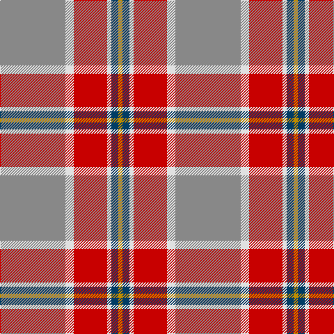

**Bands:** [RWRWBY](/stripes/rwrwby/) · **Stripes:** [O W R W DT LO](/stripes/stripes6/) O W R W DT LO

This was sourced from tartans-authority.  It is a [6 band tartan](/bands/bands6/).

Original link http://www.tartansauthority.com/tartan-ferret/display/10597/

## Thread count
N/94 LN12 R48 LN6 DB10 DY/6

## Palette
Each colour and its ΔE from the base-6 reference it is a variant of.

| Colour | Shade | Base | ΔE (OKLab) |
|---|---|---|---|
| DB | <code style="background-color:#003C64;">#003C64</code> `#003C64` | B <code style="background-color:#2A418A;">#2A418A</code> | 0.08 |
| DY | <code style="background-color:#BC8C00;">#BC8C00</code> `#BC8C00` | Y <code style="background-color:#F2BF00;">#F2BF00</code> | 0.16 |
| LN | <code style="background-color:#E0E0E0;">#E0E0E0</code> `#E0E0E0` | W <code style="background-color:#F7F7F7;">#F7F7F7</code> | 0.07 |
| N | <code style="background-color:#888888;">#888888</code> `#888888` | R <code style="background-color:#CC0000;">#CC0000</code> | 0.24 |
| R | <code style="background-color:#C80000;">#C80000</code> `#C80000` | R <code style="background-color:#CC0000;">#CC0000</code> | 0.01 |

# Sample pattern

## Nearest tartans

The nearest existing variants by ΔTartan distance.

1. [Duminiak (Trevose, Pennsylvania)](/setts/s6/y47w6r24w3dp5lo3~x2/) — ΔT 0.77
1. [Spragg (Name)](/setts/s7/r2g16r1r2r12ly1t1~x2/) — ΔT 0.93
1. [Dundhuin Gold](/setts/s6/o59t28ly5dg3w4ly5~x2/) — ΔT 1.14
1. [Un-named Dutch](/setts/s7/n2r10n10o3r2lr24w2~x2/) — ΔT 1.17
1. [Elbrick Dress (Personal)](/setts/s8/r6b22r6g20ly2r45b2w5~x2/) — ΔT 1.28
1. [Unidentified 35](/setts/s7/db4dr2db2w2dr9o27r4~x3/) — ΔT 1.38
1. [Bronte](/setts/s5/g24b2r25ly2k3~x2/) — ΔT 1.42
1. [Dundhuin Dress (Personal)](/setts/s5/o62t17ly12g8dg8~x2/) — ΔT 1.42
1. [Dundhuin](/setts/s6/lr6o5k2y18r28w2~x2/) — ΔT 1.48
1. [Spragg, Andrew](/setts/s7/r2dg16r1r2r12ly1y1~x2/) — ΔT 1.49

## Neighbour map

Every grey dot is one of 14299 variants placed by the first two principal components of the ΔTartan feature space (44% of its variance). Red is this tartan; blue dots are its nearest — click one to open its page.

<svg viewBox="0 0 640 380" role="img" style="max-width:100%;height:auto;border:1px solid #e0e0e0;border-radius:4px;display:block" xmlns="http://www.w3.org/2000/svg"><image href="/nn/cloud.v1.png" width="640" height="380"/><a href="/setts/s6/y47w6r24w3dp5lo3~x2/"><circle cx="335.4" cy="166.8" r="4" fill="#3465a4"><title>Duminiak (Trevose, Pennsylvania)</title></circle></a><a href="/setts/s7/r2g16r1r2r12ly1t1~x2/"><circle cx="299.2" cy="152.4" r="4" fill="#3465a4"><title>Spragg (Name)</title></circle></a><a href="/setts/s6/o59t28ly5dg3w4ly5~x2/"><circle cx="374.7" cy="160.3" r="4" fill="#3465a4"><title>Dundhuin Gold</title></circle></a><a href="/setts/s7/n2r10n10o3r2lr24w2~x2/"><circle cx="251.4" cy="170.0" r="4" fill="#3465a4"><title>Un-named Dutch</title></circle></a><a href="/setts/s8/r6b22r6g20ly2r45b2w5~x2/"><circle cx="308.8" cy="128.3" r="4" fill="#3465a4"><title>Elbrick Dress (Personal)</title></circle></a><a href="/setts/s7/db4dr2db2w2dr9o27r4~x3/"><circle cx="324.6" cy="160.6" r="4" fill="#3465a4"><title>Unidentified 35</title></circle></a><a href="/setts/s5/g24b2r25ly2k3~x2/"><circle cx="284.0" cy="182.7" r="4" fill="#3465a4"><title>Bronte</title></circle></a><a href="/setts/s5/o62t17ly12g8dg8~x2/"><circle cx="315.4" cy="209.5" r="4" fill="#3465a4"><title>Dundhuin Dress (Personal)</title></circle></a><a href="/setts/s6/lr6o5k2y18r28w2~x2/"><circle cx="258.0" cy="163.0" r="4" fill="#3465a4"><title>Dundhuin</title></circle></a><a href="/setts/s7/r2dg16r1r2r12ly1y1~x2/"><circle cx="302.5" cy="154.1" r="4" fill="#3465a4"><title>Spragg, Andrew</title></circle></a><circle cx="325.6" cy="158.5" r="5" fill="#c00000"/></svg>

ID: /setts/s6/o47w6r24w3dt5lo3~x2/
