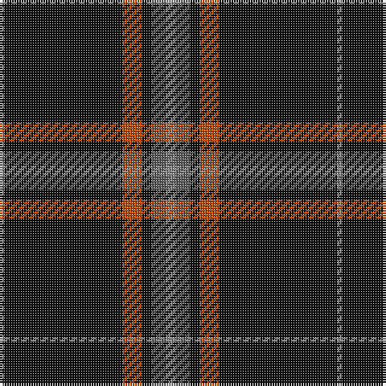

**Bands:** [RBKRKR](/stripes/rbkrkr/) · **Stripes:** [O N K O K O](/stripes/stripes6/) O N K O K O

This was sourced from tartans-authority.  It is a [6 band tartan](/bands/bands6/).

Original link http://www.tartansauthority.com/tartan-ferret/display/5816/

## Thread count
Na/2 K49 DO8 K4 N6 Na/4

## Palette
Each colour and its ΔE from the base-6 reference it is a variant of.

| Colour | Shade | Base | ΔE (OKLab) |
|---|---|---|---|
| DO | <code style="background-color:#B84C00;">#B84C00</code> `#B84C00` | R <code style="background-color:#CC0000;">#CC0000</code> | 0.08 |
| K | <code style="background-color:#101010;">#101010</code> `#101010` | K <code style="background-color:#000000;">#000000</code> | 0.17 |
| N | <code style="background-color:#5C5C5C;">#5C5C5C</code> `#5C5C5C` | B <code style="background-color:#2A418A;">#2A418A</code> | 0.15 |
| Na | <code style="background-color:#888888;">#888888</code> `#888888` | R <code style="background-color:#CC0000;">#CC0000</code> | 0.24 |

# Sample pattern

## Nearest tartans

The nearest existing variants by ΔTartan distance.

1. [Highland Brewing Company](/setts/s8/k42t2r3k5r16k8ly2k3~x2/) — ΔT 0.89
1. [Perry Dress (Personal)](/setts/s5/k65r27w2k4ly5~x2/) — ΔT 1.15
1. [Harley Davidson](/setts/s10/k49o8k4n6o4n6k4o8k49o2/) — ΔT 1.20
1. [Laird Abdullah (Personal)](/setts/s8/k10n2k2n8k40r4k5r2~x2/) — ΔT 1.24
1. [degli Uberti, Baron of Cartsburn (Personal)](/setts/s8/db8r1k6r1lo8r1k45lo1~x2/) — ΔT 1.27
1. [Rogues (United States), The](/setts/s4/ly3k50n12r3~x2/) — ΔT 1.29
1. [Perry Hunting (Green) (Personal)](/setts/s5/k75g26lr2g4lo5~x2/) — ΔT 1.36
1. [Friends of Nordegg (Corporate)](/setts/s5/k50db6r6o6w3~x2/) — ΔT 1.37
1. [Perry Ancient (Personal)](/setts/s5/k75y26y3k4ly6~x2/) — ΔT 1.38
1. [Dellen](/setts/s6/k80r6dg3r12k2w2~x2/) — ΔT 1.39

## Neighbour map

Every grey dot is one of 14313 variants placed by the first two principal components of the ΔTartan feature space (44% of its variance). Red is this tartan; blue dots are its nearest — click one to open its page.

<svg viewBox="0 0 640 380" role="img" style="max-width:100%;height:auto;border:1px solid #e0e0e0;border-radius:4px;display:block" xmlns="http://www.w3.org/2000/svg"><image href="/nn/cloud.v1.png" width="640" height="380"/><a href="/setts/s8/k42t2r3k5r16k8ly2k3~x2/"><circle cx="481.7" cy="161.9" r="4" fill="#3465a4"><title>Highland Brewing Company</title></circle></a><a href="/setts/s5/k65r27w2k4ly5~x2/"><circle cx="457.4" cy="164.5" r="4" fill="#3465a4"><title>Perry Dress (Personal)</title></circle></a><a href="/setts/s10/k49o8k4n6o4n6k4o8k49o2/"><circle cx="508.4" cy="154.9" r="4" fill="#3465a4"><title>Harley Davidson</title></circle></a><a href="/setts/s8/k10n2k2n8k40r4k5r2~x2/"><circle cx="538.7" cy="174.2" r="4" fill="#3465a4"><title>Laird Abdullah (Personal)</title></circle></a><a href="/setts/s8/db8r1k6r1lo8r1k45lo1~x2/"><circle cx="500.0" cy="118.6" r="4" fill="#3465a4"><title>degli Uberti, Baron of Cartsburn (Personal)</title></circle></a><a href="/setts/s4/ly3k50n12r3~x2/"><circle cx="466.0" cy="200.6" r="4" fill="#3465a4"><title>Rogues (United States), The</title></circle></a><a href="/setts/s5/k75g26lr2g4lo5~x2/"><circle cx="466.5" cy="166.9" r="4" fill="#3465a4"><title>Perry Hunting (Green) (Personal)</title></circle></a><a href="/setts/s5/k50db6r6o6w3~x2/"><circle cx="418.9" cy="164.9" r="4" fill="#3465a4"><title>Friends of Nordegg (Corporate)</title></circle></a><a href="/setts/s5/k75y26y3k4ly6~x2/"><circle cx="463.0" cy="182.7" r="4" fill="#3465a4"><title>Perry Ancient (Personal)</title></circle></a><a href="/setts/s6/k80r6dg3r12k2w2~x2/"><circle cx="583.1" cy="141.9" r="4" fill="#3465a4"><title>Dellen</title></circle></a><circle cx="489.8" cy="164.7" r="5" fill="#c00000"/></svg>

ID: /setts/s6/o4n6k4o8k49o2/
