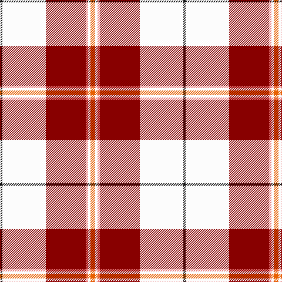

**Bands:** [KWRRWR](/stripes/kwrrwr/) · **Stripes:** [K W R R W O](/stripes/stripes6/) K W R R W O

This was sourced from tartans-authority.  It is a [6 band tartan](/bands/bands6/).

Original link http://www.tartansauthority.com/tartan-ferret/display/8558/

## Thread count
O/8 W4 LR4 DR68 W74 K/4

## Palette
Each colour and its ΔE from the base-6 reference it is a variant of.

| Colour | Shade | Base | ΔE (OKLab) |
|---|---|---|---|
| DR | <code style="background-color:#880000;">#880000</code> `#880000` | R <code style="background-color:#CC0000;">#CC0000</code> | 0.15 |
| K | <code style="background-color:#101010;">#101010</code> `#101010` | K <code style="background-color:#000000;">#000000</code> | 0.17 |
| LR | <code style="background-color:#E87878;">#E87878</code> `#E87878` | R <code style="background-color:#CC0000;">#CC0000</code> | 0.19 |
| O | <code style="background-color:#E86000;">#E86000</code> `#E86000` | R <code style="background-color:#CC0000;">#CC0000</code> | 0.14 |
| W | <code style="background-color:#FCFCFC;">#FCFCFC</code> `#FCFCFC` | W <code style="background-color:#F7F7F7;">#F7F7F7</code> | 0.01 |

# Sample pattern

## Nearest tartans

The nearest existing variants by ΔTartan distance.

1. [Tomomi](/setts/s5/w15r20ly2g1lg1~x4/) — ΔT 0.98
1. [Cunningham Dress Burgundy (Dance)](/setts/s7/w5r2w34r34k2r2ly4~x2/) — ΔT 1.00
1. [Cunningham Dress](/setts/s7/w5r2w34r34k2r2db4~x2/) — ΔT 1.04
1. [Torridon, Burgundy (Dance)](/setts/s7/w3lg2w30r30n2r2lg3~x2/) — ΔT 1.09
1. [Torridon, Cherry (Dance)](/setts/s7/r3r2db2r30w30db2w3~x2/) — ΔT 1.24
1. [Lennox, dress](/setts/s7/r8p2r24db5w26o2w8~x2/) — ΔT 1.26
1. [Arduaine, Red (Dance)](/setts/s7/w5k2w30r24w3r8dt3~x2/) — ΔT 1.30
1. [Shiel, Claret (Dance)](/setts/s7/w8r5dp10r24w30r2db2~x2/) — ΔT 1.30
1. [Lennox Dress](/setts/s7/r8dp2r24db5w26dy2w8~x2/) — ΔT 1.30
1. [MacPherson Dress Burgundy (Dance)](/setts/s7/w4k2w25r21w3r8ly3~x2/) — ΔT 1.32

## Neighbour map

Every grey dot is one of 14299 variants placed by the first two principal components of the ΔTartan feature space (44% of its variance). Red is this tartan; blue dots are its nearest — click one to open its page.

<svg viewBox="0 0 640 380" role="img" style="max-width:100%;height:auto;border:1px solid #e0e0e0;border-radius:4px;display:block" xmlns="http://www.w3.org/2000/svg"><image href="/nn/cloud.v1.png" width="640" height="380"/><a href="/setts/s5/w15r20ly2g1lg1~x4/"><circle cx="289.6" cy="121.7" r="4" fill="#3465a4"><title>Tomomi</title></circle></a><a href="/setts/s7/w5r2w34r34k2r2ly4~x2/"><circle cx="280.9" cy="120.7" r="4" fill="#3465a4"><title>Cunningham Dress Burgundy (Dance)</title></circle></a><a href="/setts/s7/w5r2w34r34k2r2db4~x2/"><circle cx="287.7" cy="117.8" r="4" fill="#3465a4"><title>Cunningham Dress</title></circle></a><a href="/setts/s7/w3lg2w30r30n2r2lg3~x2/"><circle cx="276.3" cy="128.5" r="4" fill="#3465a4"><title>Torridon, Burgundy (Dance)</title></circle></a><a href="/setts/s7/r3r2db2r30w30db2w3~x2/"><circle cx="284.7" cy="126.3" r="4" fill="#3465a4"><title>Torridon, Cherry (Dance)</title></circle></a><a href="/setts/s7/r8p2r24db5w26o2w8~x2/"><circle cx="232.9" cy="141.3" r="4" fill="#3465a4"><title>Lennox, dress</title></circle></a><a href="/setts/s7/w5k2w30r24w3r8dt3~x2/"><circle cx="296.8" cy="140.9" r="4" fill="#3465a4"><title>Arduaine, Red (Dance)</title></circle></a><a href="/setts/s7/w8r5dp10r24w30r2db2~x2/"><circle cx="211.6" cy="130.9" r="4" fill="#3465a4"><title>Shiel, Claret (Dance)</title></circle></a><a href="/setts/s7/r8dp2r24db5w26dy2w8~x2/"><circle cx="234.2" cy="139.9" r="4" fill="#3465a4"><title>Lennox Dress</title></circle></a><a href="/setts/s7/w4k2w25r21w3r8ly3~x2/"><circle cx="264.9" cy="152.7" r="4" fill="#3465a4"><title>MacPherson Dress Burgundy (Dance)</title></circle></a><circle cx="264.8" cy="108.4" r="5" fill="#c00000"/></svg>

ID: /setts/s6/o4w2r2r34w37k2~x2/
