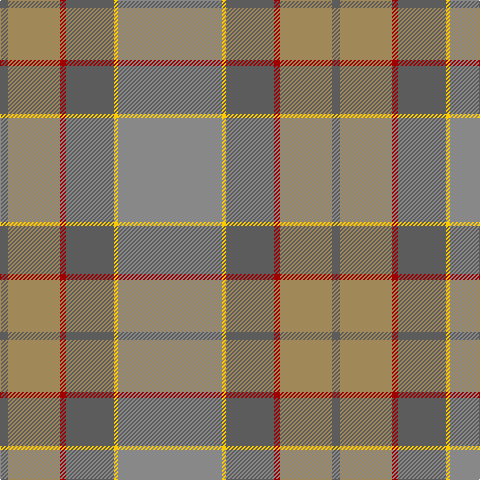

**Bands:** [BYRBYR](/stripes/byrbyr/) · **Stripes:** [N LO R N LY O](/stripes/stripes6/) N LO R N LY O

This was sourced from tartans-authority.  It is a [6 band tartan](/bands/bands6/).

Original link http://www.tartansauthority.com/tartan-ferret/display/11113/

## Thread count
N/8 LT52 DR6 N48 Y4 Na/104

## Palette
Each colour and its ΔE from the base-6 reference it is a variant of.

| Colour | Shade | Base | ΔE (OKLab) |
|---|---|---|---|
| DR | <code style="background-color:#A00000;">#A00000</code> `#A00000` | R <code style="background-color:#CC0000;">#CC0000</code> | 0.09 |
| LT | <code style="background-color:#A08858;">#A08858</code> `#A08858` | Y <code style="background-color:#F2BF00;">#F2BF00</code> | 0.21 |
| N | <code style="background-color:#5C5C5C;">#5C5C5C</code> `#5C5C5C` | B <code style="background-color:#2A418A;">#2A418A</code> | 0.15 |
| Na | <code style="background-color:#888888;">#888888</code> `#888888` | R <code style="background-color:#CC0000;">#CC0000</code> | 0.24 |
| Y | <code style="background-color:#FCCC00;">#FCCC00</code> `#FCCC00` | Y <code style="background-color:#F2BF00;">#F2BF00</code> | 0.04 |

# Sample pattern

## Nearest tartans

The nearest existing variants by ΔTartan distance.

1. [Outlander #1](/setts/s6/y52ly2n24r3lo26n4~x2/) — ΔT 0.59
1. [Rikaco Morning Dew #2](/setts/s8/lr3lb3lr1y25lr15lr5lb4ly2~x2/) — ΔT 1.47
1. [Isle of Cumbrae (Corporate)](/setts/s7/k3y3r3y28n28lb2n2~x2/) — ΔT 1.59
1. [Tricor](/setts/s12/y4lb1y4g6dy6o4y23o4dy6g6y4lb1~x4/) — ΔT 2.07
1. [Jardine](/setts/s8/n9o9y9r1y1o9y1r1~x4/) — ΔT 2.15
1. [Roddy's Highland Spirit (Fashion)](/setts/s10/y30n3y3n3y3n10g10y20m2g5~x2/) — ΔT 2.16
1. [Clyde](/setts/s10/o5n3o22r3n6n17r2n4r2n4~x2/) — ΔT 2.17
1. [Granite City (Fashion)](/setts/s8/k3n3k3n21n21k3n3lr1~x2/) — ΔT 2.18
1. [Cladish](/setts/s8/lo10b4lo54lb32lo2y54lo5y10/) — ΔT 2.21
1. [The Broons (Corporate)](/setts/s9/r3k1y8lo1dy7lo1y19dy25k1~x2/) — ΔT 2.22

## Neighbour map

Every grey dot is one of 14313 variants placed by the first two principal components of the ΔTartan feature space (44% of its variance). Red is this tartan; blue dots are its nearest — click one to open its page.

<svg viewBox="0 0 640 380" role="img" style="max-width:100%;height:auto;border:1px solid #e0e0e0;border-radius:4px;display:block" xmlns="http://www.w3.org/2000/svg"><image href="/nn/cloud.v1.png" width="640" height="380"/><a href="/setts/s6/y52ly2n24r3lo26n4~x2/"><circle cx="424.5" cy="230.1" r="4" fill="#3465a4"><title>Outlander #1</title></circle></a><a href="/setts/s8/lr3lb3lr1y25lr15lr5lb4ly2~x2/"><circle cx="375.0" cy="191.3" r="4" fill="#3465a4"><title>Rikaco Morning Dew #2</title></circle></a><a href="/setts/s7/k3y3r3y28n28lb2n2~x2/"><circle cx="396.4" cy="221.6" r="4" fill="#3465a4"><title>Isle of Cumbrae (Corporate)</title></circle></a><a href="/setts/s12/y4lb1y4g6dy6o4y23o4dy6g6y4lb1~x4/"><circle cx="385.3" cy="190.2" r="4" fill="#3465a4"><title>Tricor</title></circle></a><a href="/setts/s8/n9o9y9r1y1o9y1r1~x4/"><circle cx="357.3" cy="265.6" r="4" fill="#3465a4"><title>Jardine</title></circle></a><a href="/setts/s10/y30n3y3n3y3n10g10y20m2g5~x2/"><circle cx="360.8" cy="238.9" r="4" fill="#3465a4"><title>Roddy's Highland Spirit (Fashion)</title></circle></a><a href="/setts/s10/o5n3o22r3n6n17r2n4r2n4~x2/"><circle cx="338.4" cy="236.4" r="4" fill="#3465a4"><title>Clyde</title></circle></a><a href="/setts/s8/k3n3k3n21n21k3n3lr1~x2/"><circle cx="395.3" cy="224.6" r="4" fill="#3465a4"><title>Granite City (Fashion)</title></circle></a><a href="/setts/s8/lo10b4lo54lb32lo2y54lo5y10/"><circle cx="322.0" cy="175.6" r="4" fill="#3465a4"><title>Cladish</title></circle></a><a href="/setts/s9/r3k1y8lo1dy7lo1y19dy25k1~x2/"><circle cx="375.8" cy="185.1" r="4" fill="#3465a4"><title>The Broons (Corporate)</title></circle></a><circle cx="409.5" cy="220.9" r="5" fill="#c00000"/></svg>

ID: /setts/s6/o52ly2n24r3lo26n4~x2/
