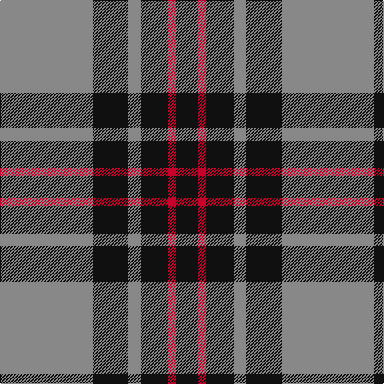

**Bands:** [KRKRKR](/stripes/krkrkr/) · **Stripes:** [K R K O K O](/stripes/stripes6/) K R K O K O

This was sourced from register-of-tartans.  It is a [6 band tartan](/bands/bands6/).

Original link https://www.tartanregister.gov.uk/tartanDetails.aspx?ref=1211

## Attestations

This cloth appears in 2 source records; the oldest owns this page.

- 01/12/2000 — Flynn (register-of-tartans, [record](https://www.tartanregister.gov.uk/tartanDetails.aspx?ref=1211))
- 2000 December — Flynn (Name?) (tartans-authority, [record](http://www.tartansauthority.com/tartan-ferret/display/4056/))

## Register references

External register numbers recorded for this tartan.

- Scottish Register of Tartans: [1211](https://www.tartanregister.gov.uk/tartanDetails.aspx?ref=1211)
- Scottish Tartans Authority (ITI): 4056

## Thread count
N/116 K44 N16 K34 R10 K/28

## Palette
Each colour and its ΔE from the base-6 reference it is a variant of.

| Colour | Shade | Base | ΔE (OKLab) |
|---|---|---|---|
| K | <code style="background-color:#101010;">#101010</code> `#101010` | K <code style="background-color:#000000;">#000000</code> | 0.17 |
| N | <code style="background-color:#888888;">#888888</code> `#888888` | R <code style="background-color:#CC0000;">#CC0000</code> | 0.24 |
| R | <code style="background-color:#C8002C;">#C8002C</code> `#C8002C` | R <code style="background-color:#CC0000;">#CC0000</code> | 0.03 |

# Sample pattern

## Nearest tartans

The nearest existing variants by ΔTartan distance.

1. [MacSween, Black (Personal)](/setts/s6/k2o6k2o6k12r1~x4/) — ΔT 0.57
1. [West Point Military Academy (Mil.)](/setts/s8/k10o1k2o1k4o10ly1o2~x4/) — ΔT 0.79
1. [Korner-Macpherson (Personal)](/setts/s7/y5r3y35k28y4k11y2~x2/) — ΔT 0.85
1. [Bannockbane Grey #3](/setts/s8/k4ly2k13ly1y8y13ly2y4~x2/) — ΔT 0.93
1. [Moffat (1984)](/setts/s7/k39o3k3o3k14o28r3~x2/) — ΔT 1.11
1. [Martin's Own](/setts/s8/k10t1k2t1k4t10g1t2~x4/) — ΔT 1.14
1. [West Point](/setts/s8/k13o1k1o1k4o10ly1o1~x6/) — ΔT 1.15
1. [Nowell/Noel 1951 (Name)](/setts/s8/lr3k24lr6k8w4k8lr35k2~x2/) — ΔT 1.20
1. [Latin](/setts/s6/db3lo9db3lo9db20r3~x2/) — ΔT 1.22
1. [Douglas, Grey (Vestiarium Scoticum)](/setts/s8/k10o1k2o1k4o10k1o2~x4/) — ΔT 1.24

## Neighbour map

Every grey dot is one of 14299 variants placed by the first two principal components of the ΔTartan feature space (44% of its variance). Red is this tartan; blue dots are its nearest — click one to open its page.

<svg viewBox="0 0 640 380" role="img" style="max-width:100%;height:auto;border:1px solid #e0e0e0;border-radius:4px;display:block" xmlns="http://www.w3.org/2000/svg"><image href="/nn/cloud.v1.png" width="640" height="380"/><a href="/setts/s6/k2o6k2o6k12r1~x4/"><circle cx="328.1" cy="223.8" r="4" fill="#3465a4"><title>MacSween, Black (Personal)</title></circle></a><a href="/setts/s8/k10o1k2o1k4o10ly1o2~x4/"><circle cx="309.6" cy="202.1" r="4" fill="#3465a4"><title>West Point Military Academy (Mil.)</title></circle></a><a href="/setts/s7/y5r3y35k28y4k11y2~x2/"><circle cx="347.6" cy="187.8" r="4" fill="#3465a4"><title>Korner-Macpherson (Personal)</title></circle></a><a href="/setts/s8/k4ly2k13ly1y8y13ly2y4~x2/"><circle cx="290.8" cy="199.9" r="4" fill="#3465a4"><title>Bannockbane Grey #3</title></circle></a><a href="/setts/s7/k39o3k3o3k14o28r3~x2/"><circle cx="372.9" cy="198.0" r="4" fill="#3465a4"><title>Moffat (1984)</title></circle></a><a href="/setts/s8/k10t1k2t1k4t10g1t2~x4/"><circle cx="310.1" cy="208.0" r="4" fill="#3465a4"><title>Martin's Own</title></circle></a><a href="/setts/s8/k13o1k1o1k4o10ly1o1~x6/"><circle cx="351.6" cy="182.5" r="4" fill="#3465a4"><title>West Point</title></circle></a><a href="/setts/s8/lr3k24lr6k8w4k8lr35k2~x2/"><circle cx="305.1" cy="169.2" r="4" fill="#3465a4"><title>Nowell/Noel 1951 (Name)</title></circle></a><a href="/setts/s6/db3lo9db3lo9db20r3~x2/"><circle cx="305.7" cy="239.7" r="4" fill="#3465a4"><title>Latin</title></circle></a><a href="/setts/s8/k10o1k2o1k4o10k1o2~x4/"><circle cx="353.6" cy="221.3" r="4" fill="#3465a4"><title>Douglas, Grey (Vestiarium Scoticum)</title></circle></a><circle cx="321.4" cy="214.7" r="5" fill="#c00000"/></svg>

ID: /setts/s6/o58k22o8k17r5k14~x2/
