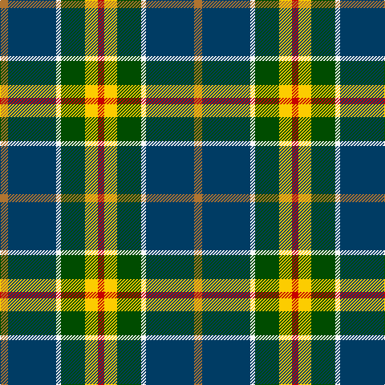

**Bands:** [RYGWBR](/stripes/rygwbr/) · **Stripes:** [R LY DG W DT O](/stripes/stripes6/) R LY DG W DT O

This was sourced from register-of-tartans.  It is a [6 band tartan](/bands/bands6/).

Original link https://www.tartanregister.gov.uk/tartanDetails.aspx?ref=11555

## Register references

External register numbers recorded for this tartan.

- Scottish Register of Tartans: [11555](https://www.tartanregister.gov.uk/tartanDetails.aspx?ref=11555)

## Thread count
LT/10 DB60 W6 G30 Y16 R/8

## Palette
Each colour and its ΔE from the base-6 reference it is a variant of.

| Colour | Shade | Base | ΔE (OKLab) |
|---|---|---|---|
| DB | <code style="background-color:#003C64;">#003C64</code> `#003C64` | B <code style="background-color:#2A418A;">#2A418A</code> | 0.08 |
| G | <code style="background-color:#004C00;">#004C00</code> `#004C00` | G <code style="background-color:#006100;">#006100</code> | 0.07 |
| LT | <code style="background-color:#B07430;">#B07430</code> `#B07430` | R <code style="background-color:#CC0000;">#CC0000</code> | 0.16 |
| R | <code style="background-color:#C80000;">#C80000</code> `#C80000` | R <code style="background-color:#CC0000;">#CC0000</code> | 0.01 |
| W | <code style="background-color:#F8F8F8;">#F8F8F8</code> `#F8F8F8` | W <code style="background-color:#F7F7F7;">#F7F7F7</code> | 0.00 |
| Y | <code style="background-color:#FCCC00;">#FCCC00</code> `#FCCC00` | Y <code style="background-color:#F2BF00;">#F2BF00</code> | 0.04 |

# Sample pattern

## Nearest tartans

The nearest existing variants by ΔTartan distance.

1. [Sirens & Swords](/setts/s6/dt36y20dg6w12k6r3~x2/) — ΔT 0.72
1. [Royal British Legion, The](/setts/s7/r6b2g20k3db8g2b4~x2/) — ΔT 0.78
1. [Turnbull of Thornton (Personal)](/setts/s6/k6r3g30ly10db30w3~x2/) — ΔT 0.83
1. [Ayrshire (District)](/setts/s8/db2r1db10w1y4g8lo1g2~x4/) — ΔT 0.94
1. [Driver (Name)](/setts/s6/g11w11k3ly3dg36lo7~x2/) — ΔT 0.96
1. [State Seal of Utah (Fashion)](/setts/s8/dt48lo25dy15r7lb5dt7k10lb10~x2/) — ΔT 1.04
1. [Hislop (Name)](/setts/s8/w4k2t18g18k18w3k18r3~x2/) — ΔT 1.06
1. [Afternoon Tea / Afternoon Tea](/setts/s6/w15k8m25k72g98ly15/) — ΔT 1.06
1. [Crofters (Personal)](/setts/s7/db20r2g9w6ly4k2g8~x2/) — ΔT 1.07
1. [Vipont](/setts/s7/r4g14k3lp3g12db36w4~x2/) — ΔT 1.11

## Neighbour map

Every grey dot is one of 14299 variants placed by the first two principal components of the ΔTartan feature space (44% of its variance). Red is this tartan; blue dots are its nearest — click one to open its page.

<svg viewBox="0 0 640 380" role="img" style="max-width:100%;height:auto;border:1px solid #e0e0e0;border-radius:4px;display:block" xmlns="http://www.w3.org/2000/svg"><image href="/nn/cloud.v1.png" width="640" height="380"/><a href="/setts/s6/dt36y20dg6w12k6r3~x2/"><circle cx="154.2" cy="162.6" r="4" fill="#3465a4"><title>Sirens &amp; Swords</title></circle></a><a href="/setts/s7/r6b2g20k3db8g2b4~x2/"><circle cx="168.6" cy="164.2" r="4" fill="#3465a4"><title>Royal British Legion, The</title></circle></a><a href="/setts/s6/k6r3g30ly10db30w3~x2/"><circle cx="143.9" cy="173.0" r="4" fill="#3465a4"><title>Turnbull of Thornton (Personal)</title></circle></a><a href="/setts/s8/db2r1db10w1y4g8lo1g2~x4/"><circle cx="152.8" cy="153.2" r="4" fill="#3465a4"><title>Ayrshire (District)</title></circle></a><a href="/setts/s6/g11w11k3ly3dg36lo7~x2/"><circle cx="202.0" cy="154.8" r="4" fill="#3465a4"><title>Driver (Name)</title></circle></a><a href="/setts/s8/dt48lo25dy15r7lb5dt7k10lb10~x2/"><circle cx="157.9" cy="163.0" r="4" fill="#3465a4"><title>State Seal of Utah (Fashion)</title></circle></a><a href="/setts/s8/w4k2t18g18k18w3k18r3~x2/"><circle cx="145.8" cy="175.4" r="4" fill="#3465a4"><title>Hislop (Name)</title></circle></a><a href="/setts/s6/w15k8m25k72g98ly15/"><circle cx="201.5" cy="180.6" r="4" fill="#3465a4"><title>Afternoon Tea / Afternoon Tea</title></circle></a><a href="/setts/s7/db20r2g9w6ly4k2g8~x2/"><circle cx="130.5" cy="163.7" r="4" fill="#3465a4"><title>Crofters (Personal)</title></circle></a><a href="/setts/s7/r4g14k3lp3g12db36w4~x2/"><circle cx="221.1" cy="154.1" r="4" fill="#3465a4"><title>Vipont</title></circle></a><circle cx="172.0" cy="167.9" r="5" fill="#c00000"/></svg>

ID: /setts/s6/o5dt30w3dg15ly8r4~x2/
