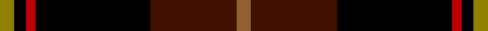

In pattern [GKRKBR](/stripes/gkrkbr/).

This was sourced from weddslist.  It is a [6 stripe tartan](/stripes/stripes6/).

Original link http://www.weddslist.com/cgi-bin/tartans/pg.pl?source=sts

## Thread count
LG/6 K5 R4 K48 DR36 LT/6

## Palette
Each colour and the base-6 reference it is a variant of.

| Colour | Shade | Base |
|---|---|---|
| DR | <code style="background-color:#401000;">#401000</code> `oklch(25.3% 0.079 39.9)` <small>#401000</small> | B <code style="background-color:#2A418A;">#2A418A</code> |
| K | <code style="background-color:#000000;">#000000</code> `oklch(0.0% 0.000 0.0)` <small>#000000</small> | K <code style="background-color:#000000;">#000000</code> |
| LG | <code style="background-color:#908000;">#908000</code> `oklch(59.6% 0.124 100.6)` <small>#908000</small> | G <code style="background-color:#006100;">#006100</code> |
| LT | <code style="background-color:#906030;">#906030</code> `oklch(53.1% 0.089 63.7)` <small>#906030</small> | R <code style="background-color:#CC0000;">#CC0000</code> |
| R | <code style="background-color:#C00000;">#C00000</code> `oklch(50.7% 0.208 29.2)` <small>#C00000</small> | R <code style="background-color:#CC0000;">#CC0000</code> |

# Sample pattern

## Nearest tartans

The nearest existing variants by ΔTartan distance.

1. [Drambuie](/setts/s6/w6r36k48o4k5ly6/) — ΔT 1.37
1. [Drambuie Hunting](/setts/s6/lo6dy36k48r4k5lo6/) — ΔT 1.45
1. [Black Raven](/setts/s7/k62db15dp15o20ly5db5k15~x2/) — ΔT 1.50
1. [Drambuie Dress](/setts/s6/w6dy36k48r4k5ly6/) — ΔT 1.54
1. [MacDonald, Sir John A](/setts/s11/r10k3dg2lb2k22db4k22r4dg4r14lb3~x2/) — ΔT 1.57
1. [Royal Marines Condor](/setts/s7/k5r3k27k37r5g2ly2~x2/) — ΔT 1.60
1. [Drambuie](/setts/s6/w6r36k48lo4k5ly6/) — ΔT 1.62
1. [Joe Strummer Commemorative](/setts/s7/k3dy3y6k12y1dy2dy2~x4/) — ΔT 1.63
1. [York Region Pipe Band](/setts/s11/r10k3g2lb2k22db4k22r4g4r14lb3~x2/) — ΔT 1.63
1. [MacShimsi](/setts/s5/r11r5g5k40ly3~x2/) — ΔT 1.64

## Neighbour map

Every grey dot is one of 14299 variants placed by the first two principal components of the ΔTartan feature space (44% of its variance). Red is this tartan; blue dots are its nearest — click one to open its page.

<svg viewBox="0 0 640 380" role="img" style="max-width:100%;height:auto;border:1px solid #e0e0e0;border-radius:4px;display:block" xmlns="http://www.w3.org/2000/svg"><image href="/nn/cloud.v1.png" width="640" height="380"/><a href="/setts/s6/w6r36k48o4k5ly6/"><circle cx="252.9" cy="164.1" r="4" fill="#3465a4"><title>Drambuie</title></circle></a><a href="/setts/s6/lo6dy36k48r4k5lo6/"><circle cx="300.8" cy="189.9" r="4" fill="#3465a4"><title>Drambuie Hunting</title></circle></a><a href="/setts/s7/k62db15dp15o20ly5db5k15~x2/"><circle cx="290.0" cy="185.8" r="4" fill="#3465a4"><title>Black Raven</title></circle></a><a href="/setts/s6/w6dy36k48r4k5ly6/"><circle cx="266.9" cy="173.8" r="4" fill="#3465a4"><title>Drambuie Dress</title></circle></a><a href="/setts/s11/r10k3dg2lb2k22db4k22r4dg4r14lb3~x2/"><circle cx="244.2" cy="158.8" r="4" fill="#3465a4"><title>MacDonald, Sir John A</title></circle></a><a href="/setts/s7/k5r3k27k37r5g2ly2~x2/"><circle cx="286.5" cy="164.1" r="4" fill="#3465a4"><title>Royal Marines Condor</title></circle></a><a href="/setts/s6/w6r36k48lo4k5ly6/"><circle cx="266.4" cy="166.6" r="4" fill="#3465a4"><title>Drambuie</title></circle></a><a href="/setts/s7/k3dy3y6k12y1dy2dy2~x4/"><circle cx="284.9" cy="206.1" r="4" fill="#3465a4"><title>Joe Strummer Commemorative</title></circle></a><a href="/setts/s11/r10k3g2lb2k22db4k22r4g4r14lb3~x2/"><circle cx="240.8" cy="157.1" r="4" fill="#3465a4"><title>York Region Pipe Band</title></circle></a><a href="/setts/s5/r11r5g5k40ly3~x2/"><circle cx="349.7" cy="179.4" r="4" fill="#3465a4"><title>MacShimsi</title></circle></a><circle cx="286.1" cy="188.1" r="5" fill="#c00000"/></svg>

ID: /setts/s6/o6dr36k48r4k5y6/
