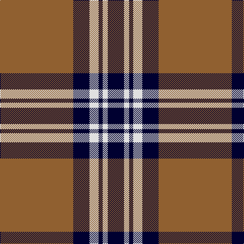

This page is one **sett** — a single exact thread-count. It belongs to the [tartan](/tartans/lt72db16ln9db4ln5db16/)
(the same proportion at any scale), whose colour order is pattern [KWKWKR](/stripes/kwkwkr/).

Sourced from weddslist.  It is a [6 stripe tartan](/stripes/stripes6/).

Original link http://www.weddslist.com/cgi-bin/tartans/pg.pl?source=sts

## Thread count
LT/144 DB32 LN18 DB8 LN10 DB/32

## Palette
Each colour and the base-6 reference it is a variant of.

| Colour | Shade | Base |
|---|---|---|
| DB | <code style="background-color:#000030;">#000030</code> `oklch(14.0% 0.097 264.1)` <small>#000030</small> | K <code style="background-color:#000000;">#000000</code> |
| LN | <code style="background-color:#E0E0E0;">#E0E0E0</code> `oklch(90.7% 0.000 89.9)` <small>#E0E0E0</small> | W <code style="background-color:#F7F7F7;">#F7F7F7</code> |
| LT | <code style="background-color:#906030;">#906030</code> `oklch(53.1% 0.089 63.7)` <small>#906030</small> | R <code style="background-color:#CC0000;">#CC0000</code> |

# Sample pattern

## Nearest tartans

The nearest existing variants by ΔTartan distance, with this tartan at the top so the swatches line up against it.

ΔTartan

Tartan

Sett

—

<a href="/ttd/edit/#slug=o72k16w9k4w5k16~x2">Machair (warp)</a> <a class="nn-out" href="/setts/s6/o72k16w9k4w5k16~x2/" title="open its dictionary page">↗</a>

0.96

<a href="/ttd/edit/#slug=do44lr3do4lb3do4lr44~x2">Wcwm 1166-2</a> <a class="nn-out" href="/setts/s6/do44lr3do4lb3do4lr44~x2/" title="open its dictionary page">↗</a>

1.11

<a href="/ttd/edit/#slug=y5r3y35k28y4k11y2~x2">Korner-Macpherson (Personal)</a> <a class="nn-out" href="/setts/s7/y5r3y35k28y4k11y2~x2/" title="open its dictionary page">↗</a>

1.15

<a href="/ttd/edit/#slug=k4ly18db44k3ly10k4">Stutterheim (Corporate)</a> <a class="nn-out" href="/setts/s6/k4ly18db44k3ly10k4/" title="open its dictionary page">↗</a>

1.16

<a href="/ttd/edit/#slug=k12lr1k2lr6k4lr3k4lr21r4~x2">MacKnight (Name)</a> <a class="nn-out" href="/setts/s9/k12lr1k2lr6k4lr3k4lr21r4~x2/" title="open its dictionary page">↗</a>

1.17

<a href="/ttd/edit/#slug=w5k20w10k1r2~x2">Cornish Flag (District)</a> <a class="nn-out" href="/setts/s5/w5k20w10k1r2~x2/" title="open its dictionary page">↗</a>

1.18

<a href="/ttd/edit/#slug=db19w1db6w1db2w2lo2w1lo18~x4">Highland Park High School (Texas)</a> <a class="nn-out" href="/setts/s9/db19w1db6w1db2w2lo2w1lo18~x4/" title="open its dictionary page">↗</a>

1.19

<a href="/ttd/edit/#slug=w36k8w36k95w4k4r6">Gretna Football Club (Corporate)</a> <a class="nn-out" href="/setts/s7/w36k8w36k95w4k4r6/" title="open its dictionary page">↗</a>

1.21

<a href="/ttd/edit/#slug=dy38w9dy3k9w3~x2">Loch Tummel</a> <a class="nn-out" href="/setts/s5/dy38w9dy3k9w3~x2/" title="open its dictionary page">↗</a>

1.24

<a href="/ttd/edit/#slug=k13o1k1o1k4o10ly1o1~x6">West Point</a> <a class="nn-out" href="/setts/s8/k13o1k1o1k4o10ly1o1~x6/" title="open its dictionary page">↗</a>

1.25

<a href="/ttd/edit/#slug=k43r10w3k3w15db3~x2">Bro-Wened</a> <a class="nn-out" href="/setts/s6/k43r10w3k3w15db3~x2/" title="open its dictionary page">↗</a>

## Neighbour map

Every grey dot is one of 14299 variants placed by the first two principal components of the ΔTartan feature space (44% of its variance). Red is this tartan; blue dots are its nearest — click one to open its page.

<svg viewBox="0 0 640 380" role="img" style="max-width:100%;height:auto;border:1px solid #e0e0e0;border-radius:4px;display:block" xmlns="http://www.w3.org/2000/svg"><image href="/nn/cloud.v1.png" width="640" height="380"/><a href="/setts/s6/do44lr3do4lb3do4lr44~x2/"><circle cx="346.4" cy="178.7" r="4" fill="#3465a4"><title>Wcwm 1166-2</title></circle></a><a href="/setts/s7/y5r3y35k28y4k11y2~x2/"><circle cx="347.6" cy="187.8" r="4" fill="#3465a4"><title>Korner-Macpherson (Personal)</title></circle></a><a href="/setts/s6/k4ly18db44k3ly10k4/"><circle cx="298.4" cy="176.7" r="4" fill="#3465a4"><title>Stutterheim (Corporate)</title></circle></a><a href="/setts/s9/k12lr1k2lr6k4lr3k4lr21r4~x2/"><circle cx="326.0" cy="159.4" r="4" fill="#3465a4"><title>MacKnight (Name)</title></circle></a><a href="/setts/s5/w5k20w10k1r2~x2/"><circle cx="325.2" cy="181.5" r="4" fill="#3465a4"><title>Cornish Flag (District)</title></circle></a><a href="/setts/s9/db19w1db6w1db2w2lo2w1lo18~x4/"><circle cx="315.8" cy="139.8" r="4" fill="#3465a4"><title>Highland Park High School (Texas)</title></circle></a><a href="/setts/s7/w36k8w36k95w4k4r6/"><circle cx="346.4" cy="144.0" r="4" fill="#3465a4"><title>Gretna Football Club (Corporate)</title></circle></a><a href="/setts/s5/dy38w9dy3k9w3~x2/"><circle cx="382.7" cy="192.8" r="4" fill="#3465a4"><title>Loch Tummel</title></circle></a><a href="/setts/s8/k13o1k1o1k4o10ly1o1~x6/"><circle cx="351.6" cy="182.5" r="4" fill="#3465a4"><title>West Point</title></circle></a><a href="/setts/s6/k43r10w3k3w15db3~x2/"><circle cx="317.2" cy="162.1" r="4" fill="#3465a4"><title>Bro-Wened</title></circle></a><circle cx="362.1" cy="168.9" r="5" fill="#c00000"/></svg>

ID: /setts/s6/o72k16w9k4w5k16~x2/
