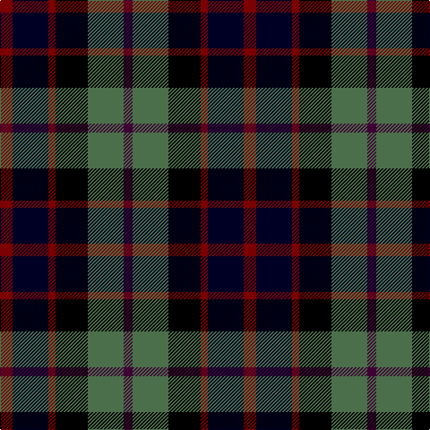

In pattern [BGKRKR](/stripes/bgkrkr/).

This was sourced from register-of-tartans.  It is a [6 stripe tartan](/stripes/stripes6/).

Original link https://www.tartanregister.gov.uk/tartanDetails.aspx?ref=4629

## Register references

External register numbers recorded for this tartan.

- Scottish Register of Tartans: [4629](https://www.tartanregister.gov.uk/tartanDetails.aspx?ref=4629)
- Scottish Tartans Authority (ITI): 4077

## Thread count
DR/14 Ka40 DR8 K36 G40 DP/10

## Palette
Each colour and its ΔE from the base-6 reference it is a variant of.

| Colour | Shade | Base | ΔE (OKLab) |
|---|---|---|---|
| DP | <code style="background-color:#3F0035;">#3F0035</code> `#3F0035` | B <code style="background-color:#2A418A;">#2A418A</code> | 0.20 |
| DR | <code style="background-color:#7A0002;">#7A0002</code> `#7A0002` | R <code style="background-color:#CC0000;">#CC0000</code> | 0.18 |
| G | <code style="background-color:#4B6F4B;">#4B6F4B</code> `#4B6F4B` | G <code style="background-color:#006100;">#006100</code> | 0.11 |
| K | <code style="background-color:#000000;">#000000</code> `#000000` | K <code style="background-color:#000000;">#000000</code> | 0.00 |
| Ka | <code style="background-color:#000024;">#000024</code> `#000024` | K <code style="background-color:#000000;">#000000</code> | 0.14 |

# Sample pattern

## Nearest tartans

The nearest existing variants by ΔTartan distance.

1. [Davidson Double](/setts/s8/dg3lb2k3dg8k8db8r2db3/) — ΔT 1.23
1. [MacNiel of Barra](/setts/s6/lr3db14k12dg12k2ly3~x2/) — ΔT 1.23
1. [MacNiel of Barra](/setts/s6/lr3db14k12dg12k2ly3/) — ΔT 1.23
1. [Leslie Hunting](/setts/s6/r2db8k8lr1dg8k1~x2/) — ΔT 1.24
1. [Leslie Hunting](/setts/s6/r2db8k8lr1dg8k1/) — ΔT 1.24
1. [Hinnigan (Personal)](/setts/s8/o8g4db16g4k14o14db4b3~x2/) — ΔT 1.29
1. [Davidson of Tulloch](/setts/s5/r1db6k3dg6lr1~x2/) — ΔT 1.30
1. [Dalmeny #1](/setts/s5/r4dg15k15db15lb4~x2/) — ΔT 1.31
1. [Selkirk (Personal)](/setts/s5/dp27db4k27g27lo4~x2/) — ΔT 1.32
1. [Tennant](/setts/s7/r1dr7db7k7g7dr7r1~x4/) — ΔT 1.33

## Neighbour map

Every grey dot is one of 14299 variants placed by the first two principal components of the ΔTartan feature space (44% of its variance). Red is this tartan; blue dots are its nearest — click one to open its page.

<svg viewBox="0 0 640 380" role="img" style="max-width:100%;height:auto;border:1px solid #e0e0e0;border-radius:4px;display:block" xmlns="http://www.w3.org/2000/svg"><image href="/nn/cloud.v1.png" width="640" height="380"/><a href="/setts/s8/dg3lb2k3dg8k8db8r2db3/"><circle cx="66.2" cy="244.9" r="4" fill="#3465a4"><title>Davidson Double</title></circle></a><a href="/setts/s6/lr3db14k12dg12k2ly3~x2/"><circle cx="100.4" cy="228.5" r="4" fill="#3465a4"><title>MacNiel of Barra</title></circle></a><a href="/setts/s6/lr3db14k12dg12k2ly3/"><circle cx="100.4" cy="228.5" r="4" fill="#3465a4"><title>MacNiel of Barra</title></circle></a><a href="/setts/s6/r2db8k8lr1dg8k1~x2/"><circle cx="139.2" cy="226.5" r="4" fill="#3465a4"><title>Leslie Hunting</title></circle></a><a href="/setts/s6/r2db8k8lr1dg8k1/"><circle cx="139.2" cy="226.5" r="4" fill="#3465a4"><title>Leslie Hunting</title></circle></a><a href="/setts/s8/o8g4db16g4k14o14db4b3~x2/"><circle cx="84.5" cy="224.1" r="4" fill="#3465a4"><title>Hinnigan (Personal)</title></circle></a><a href="/setts/s5/r1db6k3dg6lr1~x2/"><circle cx="140.2" cy="249.2" r="4" fill="#3465a4"><title>Davidson of Tulloch</title></circle></a><a href="/setts/s5/r4dg15k15db15lb4~x2/"><circle cx="89.8" cy="286.1" r="4" fill="#3465a4"><title>Dalmeny #1</title></circle></a><a href="/setts/s5/dp27db4k27g27lo4~x2/"><circle cx="136.1" cy="243.2" r="4" fill="#3465a4"><title>Selkirk (Personal)</title></circle></a><a href="/setts/s7/r1dr7db7k7g7dr7r1~x4/"><circle cx="121.8" cy="237.6" r="4" fill="#3465a4"><title>Tennant</title></circle></a><circle cx="76.7" cy="251.0" r="5" fill="#c00000"/></svg>

ID: /setts/s6/o7k20o4k18y20dp5~x2/
