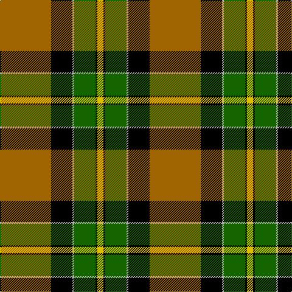

**Bands:** [RKYGKY](/stripes/rkygky/) · **Stripes:** [O K LR G K LY](/stripes/stripes6/) O K LR G K LY

This was sourced from tartans-authority.  It is a [6 band tartan](/bands/bands6/).

Original link http://www.tartansauthority.com/tartan-ferret/display/1884/

## Thread count
DO/84 K35 N3 G35 K3 Y/10

## Palette
Each colour and its ΔE from the base-6 reference it is a variant of.

| Colour | Shade | Base | ΔE (OKLab) |
|---|---|---|---|
| DO | <code style="background-color:#A06400;">#A06400</code> `#A06400` | R <code style="background-color:#CC0000;">#CC0000</code> | 0.15 |
| G | <code style="background-color:#146400;">#146400</code> `#146400` | G <code style="background-color:#006100;">#006100</code> | 0.01 |
| K | <code style="background-color:#000000;">#000000</code> `#000000` | K <code style="background-color:#000000;">#000000</code> | 0.00 |
| N | <code style="background-color:#B0B0B0;">#B0B0B0</code> `#B0B0B0` | Y <code style="background-color:#F2BF00;">#F2BF00</code> | 0.18 |
| Y | <code style="background-color:#DCC000;">#DCC000</code> `#DCC000` | Y <code style="background-color:#F2BF00;">#F2BF00</code> | 0.03 |

# Sample pattern

## Nearest tartans

The nearest existing variants by ΔTartan distance.

1. [Brandon (Manitoba)](/setts/s6/o84k35w3g35k3ly10/) — ΔT 0.09
1. [Brandon, Manitoba](/setts/s6/y83k35w3g35k3ly10/) — ΔT 0.90
1. [Bryan Wedding (Personal)](/setts/s6/dy30ly5t10k10w2k2~x2/) — ΔT 1.31
1. [Clyde Valley HOG](/setts/s8/k54lr6k6lr6o20lo40k6ly3/) — ΔT 1.37
1. [MacLamroc](/setts/s6/ly4k1dg16k16r1w3~x2/) — ΔT 1.41
1. [Pollock](/setts/s7/g3r16w4k6g28r1g3~x2/) — ΔT 1.42
1. [Unidentified 12](/setts/s6/k6r2g17r16k1t2~x2/) — ΔT 1.43
1. [Hamilton of Brandon (Fashion)](/setts/s6/lo16k7w1g7k1ly3~x4/) — ΔT 1.44
1. [Dalveen (Fashion)](/setts/s8/k3g2k21w11g1y21g2y3~x2/) — ΔT 1.50
1. [Loch Ness](/setts/s6/r10w2k10w10dy35k5~x2/) — ΔT 1.61

## Neighbour map

Every grey dot is one of 14313 variants placed by the first two principal components of the ΔTartan feature space (44% of its variance). Red is this tartan; blue dots are its nearest — click one to open its page.

<svg viewBox="0 0 640 380" role="img" style="max-width:100%;height:auto;border:1px solid #e0e0e0;border-radius:4px;display:block" xmlns="http://www.w3.org/2000/svg"><image href="/nn/cloud.v1.png" width="640" height="380"/><a href="/setts/s6/o84k35w3g35k3ly10/"><circle cx="261.0" cy="131.7" r="4" fill="#3465a4"><title>Brandon (Manitoba)</title></circle></a><a href="/setts/s6/y83k35w3g35k3ly10/"><circle cx="250.1" cy="133.6" r="4" fill="#3465a4"><title>Brandon, Manitoba</title></circle></a><a href="/setts/s6/dy30ly5t10k10w2k2~x2/"><circle cx="252.8" cy="161.6" r="4" fill="#3465a4"><title>Bryan Wedding (Personal)</title></circle></a><a href="/setts/s8/k54lr6k6lr6o20lo40k6ly3/"><circle cx="229.3" cy="131.5" r="4" fill="#3465a4"><title>Clyde Valley HOG</title></circle></a><a href="/setts/s6/ly4k1dg16k16r1w3~x2/"><circle cx="212.8" cy="162.8" r="4" fill="#3465a4"><title>MacLamroc</title></circle></a><a href="/setts/s7/g3r16w4k6g28r1g3~x2/"><circle cx="322.6" cy="141.7" r="4" fill="#3465a4"><title>Pollock</title></circle></a><a href="/setts/s6/k6r2g17r16k1t2~x2/"><circle cx="235.5" cy="170.6" r="4" fill="#3465a4"><title>Unidentified 12</title></circle></a><a href="/setts/s6/lo16k7w1g7k1ly3~x4/"><circle cx="216.1" cy="162.9" r="4" fill="#3465a4"><title>Hamilton of Brandon (Fashion)</title></circle></a><a href="/setts/s8/k3g2k21w11g1y21g2y3~x2/"><circle cx="198.4" cy="130.8" r="4" fill="#3465a4"><title>Dalveen (Fashion)</title></circle></a><a href="/setts/s6/r10w2k10w10dy35k5~x2/"><circle cx="253.3" cy="169.3" r="4" fill="#3465a4"><title>Loch Ness</title></circle></a><circle cx="263.5" cy="133.2" r="5" fill="#c00000"/></svg>

ID: /setts/s6/o84k35lr3g35k3ly10/
